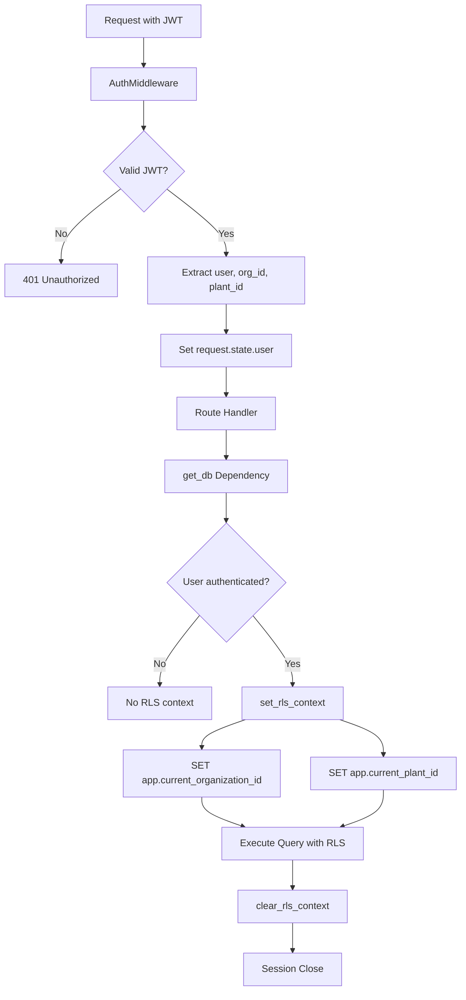

# Row-Level Security (RLS) Implementation Findings
**Date**: 2025-11-09  
**Project**: Unison Manufacturing ERP  
**Thoroughness**: Very Thorough Analysis

---

## Executive Summary

This document provides a comprehensive analysis of the Row-Level Security (RLS) implementation requirements for the Unison Manufacturing ERP system. The analysis covers all database tables, existing RLS infrastructure, multi-tenancy patterns, authentication flow, and architectural recommendations.

**Key Findings**:
- ✅ **Existing RLS Infrastructure**: Partial implementation already exists in `/database/migrations/versions/002_create_rls_policies.py`
- ✅ **Multi-Tenancy Pattern**: Two-level isolation (organization_id + optional plant_id)
- ✅ **Authentication Flow**: JWT-based with middleware extracting tenant context
- ⚠️ **Coverage Gap**: Only 7 tables covered in existing migration, but **47+ tables** need RLS policies
- ⚠️ **User Model Gap**: User table missing `organization_id` and `plant_id` fields

---

## 1. Database Models Inventory

### 1.1 All Database Tables (47 Tables Total)

#### **Multi-Tenant Tables (Require RLS)** - 44 tables

**Organization-Level Hierarchy**:
1. `organizations` - Top-level tenant boundary (self-referential RLS)
2. `plants` - Filtered by organization_id
3. `departments` - Filtered by plant_id (inherits organization through FK)

**Material Management Module**:
4. `material_category` - organization_id
5. `material` - organization_id + plant_id
6. `material_costing` - organization_id + plant_id
7. `cost_layer` - organization_id + plant_id
8. `storage_location` - organization_id + plant_id
9. `inventory` - organization_id + plant_id
10. `inventory_transaction` - organization_id + plant_id

**Production Planning Module**:
11. `work_center` - organization_id + plant_id
12. `work_order` - organization_id + plant_id
13. `work_order_operation` - organization_id + plant_id
14. `work_order_material` - (inherits through work_order FK)
15. `rework_config` - organization_id + plant_id
16. `work_center_shift` - (inherits through work_center FK)
17. `operation_scheduling_config` - organization_id + plant_id

**BOM Module**:
18. `bom_header` - organization_id + plant_id
19. `bom_line` - (inherits through bom_header FK)

**Machine & Equipment Module**:
20. `machine` - organization_id + plant_id
21. `machine_status_history` - (inherits through machine FK)

**Maintenance Module**:
22. `pm_schedule` - organization_id + plant_id
23. `pm_work_order` - organization_id + plant_id
24. `downtime_event` - organization_id + plant_id

**Shift Management Module**:
25. `shift` - organization_id + plant_id
26. `shift_handover` - organization_id + plant_id
27. `shift_performance` - organization_id + plant_id

**Quality Management Module**:
28. `ncr` - organization_id + plant_id
29. `inspection_plan` - organization_id + plant_id
30. `inspection_log` - organization_id + plant_id

**Project Management Module**:
31. `projects` - organization_id + plant_id

**Lane Scheduling Module**:
32. `lanes` - plant_id (inherits organization through FK)
33. `lane_assignments` - organization_id + plant_id

**Time-Series Data (TimescaleDB Hypertables)**:
34. `production_logs` - organization_id + plant_id

**RLS Infrastructure**:
35. `rls_audit_log` - organization_id + plant_id (for RLS context change auditing)

#### **Shared/Global Tables (No RLS Required)** - 3 tables

36. `unit_of_measure` - Global reference data
37. `currency` - Global reference data
38. `exchange_rate` - Global reference data

#### **User Management** - 1 table

39. `users` - **CRITICAL**: Missing organization_id and plant_id fields

---

## 2. Existing RLS Implementation

### 2.1 Location
- **File**: `/Users/vivek/jet/unison/database/migrations/versions/002_create_rls_policies.py`
- **Status**: Partial implementation (7 tables)
- **Created**: 2025-11-08

### 2.2 Current Coverage

```python
TENANT_TABLES = [
    'users',
    'organizations',
    'plants',
    'materials',
    'work_orders',
    'production_lines',
    'inventory_transactions',
]
```

**Gap Analysis**: Only 7 tables covered, missing 37+ tables that need RLS.

### 2.3 RLS Policy Pattern

**Organization Isolation Policy** (Applied to all tenant tables):
```sql
CREATE POLICY {table_name}_org_isolation ON {table_name}
FOR ALL
USING (
    organization_id = current_setting('app.current_organization_id', true)::int
);
```

**Plant Isolation Policy** (Applied when plant_id column exists):
```sql
CREATE POLICY {table_name}_plant_isolation ON {table_name}
FOR ALL
USING (
    plant_id IS NULL OR
    plant_id = current_setting('app.current_plant_id', true)::int
);
```

### 2.4 RLS Helper Functions

**Policy Verification Function**:
```sql
CREATE OR REPLACE FUNCTION verify_rls_policies()
RETURNS TABLE(table_name TEXT, rls_enabled BOOLEAN, policy_count INTEGER)
```

### 2.5 RLS Audit Logging

**Audit Log Table**: `rls_audit_log`
- Tracks organization_id and plant_id context changes
- Records user_id, session_id, ip_address
- JSONB metadata for extensibility
- Indexed on organization_id and created_at

---

## 3. Multi-Tenancy Architecture

### 3.1 Tenant Hierarchy

```
Organization (Tenant)
└── Plants (Sub-tenants)
    └── Departments
        └── Users, Machines, Lanes, etc.
```

### 3.2 Tenant Isolation Levels

| Level | Field | Description | Example |
|-------|-------|-------------|---------|
| **L1: Organization** | `organization_id` | Primary tenant boundary | Company A vs Company B |
| **L2: Plant** | `plant_id` | Sub-tenant boundary | Factory 1 vs Factory 2 |
| **L3: Department** | `plant_id` (FK) | Inherits isolation | Production vs Quality |

### 3.3 Session Context Variables

PostgreSQL session variables used for RLS enforcement:

| Variable | Type | Required | Usage |
|----------|------|----------|-------|
| `app.current_organization_id` | INTEGER | ✅ Yes | Primary tenant filter |
| `app.current_plant_id` | INTEGER | ❌ Optional | Sub-tenant filter (NULL = all plants) |
| `app.current_user_id` | INTEGER | ❌ Optional | Audit trail tracking |

---

## 4. Authentication & Authorization Flow

### 4.1 JWT Token Structure

**Token Payload** (from `/backend/app/infrastructure/security/jwt_handler.py`):
```python
{
    "sub": user_id,           # Subject (user ID)
    "email": user_email,
    "organization_id": int,   # Tenant ID
    "plant_id": int | None,   # Sub-tenant ID (optional)
    "type": "access",         # Token type
    "exp": timestamp,         # Expiration
    "iat": timestamp          # Issued at
}
```

### 4.2 Middleware Stack (Execution Order)

1. **RequestIDMiddleware** - Adds X-Request-ID header
2. **AuthMiddleware** - Extracts JWT and sets `request.state.user`
3. **RateLimitMiddleware** - Rate limiting per user/IP
4. **CORSMiddleware** - CORS headers
5. **Route Handler** - Endpoint execution

### 4.3 RLS Context Setting Flow



### 4.4 Key Files

| Component | File Path | Responsibility |
|-----------|-----------|----------------|
| **Auth Middleware** | `/backend/app/presentation/middleware/auth_middleware.py` | JWT validation, request.state.user |
| **JWT Handler** | `/backend/app/infrastructure/security/jwt_handler.py` | Token creation/validation |
| **Database Session** | `/backend/app/core/database.py` | RLS context management |
| **RLS Helper** | `/backend/app/infrastructure/database/rls.py` | set_rls_context, clear_rls_context |
| **Dependencies** | `/backend/app/infrastructure/security/dependencies.py` | get_current_user, get_user_context |

---

## 5. RLS Context Management

### 5.1 set_rls_context Function

**File**: `/backend/app/infrastructure/database/rls.py`

```python
def set_rls_context(
    db: Session, 
    organization_id: int, 
    plant_id: Optional[int] = None, 
    user_id: Optional[int] = None
) -> None:
    """Set RLS context variables in PostgreSQL session"""
    if not settings.RLS_ENABLED:
        return
    
    db.execute(text("SET LOCAL app.current_organization_id = :org_id"), 
               {"org_id": organization_id})
    
    if plant_id is not None:
        db.execute(text("SET LOCAL app.current_plant_id = :plant_id"), 
                   {"plant_id": plant_id})
    
    if user_id is not None:
        db.execute(text("SET LOCAL app.current_user_id = :user_id"), 
                   {"user_id": user_id})
```

### 5.2 clear_rls_context Function

```python
def clear_rls_context(db: Session) -> None:
    """Clear RLS context variables from PostgreSQL session"""
    if not settings.RLS_ENABLED:
        return
    
    db.execute(text("RESET app.current_organization_id"))
    db.execute(text("RESET app.current_plant_id"))
    db.execute(text("RESET app.current_user_id"))
```

### 5.3 get_db Dependency (Auto RLS Context)

**File**: `/backend/app/core/database.py`

```python
def get_db(request: Request = None) -> Generator[Session, None, None]:
    """Database session with automatic RLS context management"""
    db = SessionLocal()
    rls_context_set = False
    
    try:
        # Set RLS context if user is authenticated
        if request and hasattr(request, 'state') and hasattr(request.state, 'user'):
            user = request.state.user
            org_id = user.get('organization_id')
            plant_id = user.get('plant_id')
            
            if org_id is not None:
                set_rls_context(db, organization_id=org_id, plant_id=plant_id)
                rls_context_set = True
        
        yield db
    finally:
        if rls_context_set:
            clear_rls_context(db)
        db.close()
```

---

## 6. Configuration

### 6.1 Settings

**File**: `/backend/app/core/config.py`

```python
class Settings(BaseSettings):
    # Row-Level Security (RLS) Configuration
    RLS_ENABLED: bool = True
    RLS_AUDIT_LOG_ENABLED: bool = True
    
    # JWT Configuration
    SECRET_KEY: str = "dev-secret-key-change-in-production-min-32-chars-required"
    ALGORITHM: str = "HS256"
    ACCESS_TOKEN_EXPIRE_MINUTES: int = 30
```

### 6.2 Database Connection

```python
DATABASE_URL = f"postgresql://{POSTGRES_USER}:{POSTGRES_PASSWORD}@{POSTGRES_SERVER}:{POSTGRES_PORT}/{POSTGRES_DB}"
```

---

## 7. Tables Requiring RLS Policies

### 7.1 Organization-Only Tables (organization_id only)

| Table | Column | Notes |
|-------|--------|-------|
| `material_category` | organization_id | Category hierarchy per org |

### 7.2 Organization + Plant Tables (organization_id + plant_id)

| Table | Columns | FK Inheritance | Notes |
|-------|---------|----------------|-------|
| `material` | org_id, plant_id | - | Core material master |
| `material_costing` | org_id, plant_id | - | Costing per material |
| `cost_layer` | org_id, plant_id | - | FIFO/LIFO layers |
| `storage_location` | org_id, plant_id | - | Warehouse locations |
| `inventory` | org_id, plant_id | - | Stock levels |
| `inventory_transaction` | org_id, plant_id | - | Audit trail |
| `work_center` | org_id, plant_id | - | Production resources |
| `work_order` | org_id, plant_id | - | Production orders |
| `work_order_operation` | org_id, plant_id | - | Operation routing |
| `rework_config` | org_id, plant_id | - | Rework settings |
| `operation_scheduling_config` | org_id, plant_id | - | Scheduling config |
| `bom_header` | org_id, plant_id | - | Bill of materials |
| `machine` | org_id, plant_id | - | Equipment master |
| `pm_schedule` | org_id, plant_id | - | PM schedules |
| `pm_work_order` | org_id, plant_id | - | PM tasks |
| `downtime_event` | org_id, plant_id | - | Downtime tracking |
| `shift` | org_id, plant_id | - | Shift patterns |
| `shift_handover` | org_id, plant_id | - | Shift notes |
| `shift_performance` | org_id, plant_id | - | Shift metrics |
| `ncr` | org_id, plant_id | - | Quality NCRs |
| `inspection_plan` | org_id, plant_id | - | Inspection config |
| `inspection_log` | org_id, plant_id | - | Inspection results |
| `projects` | org_id, plant_id | - | Project tracking |
| `lane_assignments` | org_id, plant_id | - | Lane scheduling |
| `production_logs` | org_id, plant_id | - | TimescaleDB hypertable |

### 7.3 Plant-Only Tables (plant_id only, inherits org via FK)

| Table | Column | Parent FK | Notes |
|-------|--------|-----------|-------|
| `plants` | plant_id | organizations.id | Self-filter via organization_id |
| `departments` | plant_id | plants.id | Inherits org from plant |
| `lanes` | plant_id | plants.id | Inherits org from plant |

### 7.4 Inherited Tables (via FK relationship)

| Table | Inherits From | Parent Columns | Notes |
|-------|---------------|----------------|-------|
| `work_order_material` | work_order | org_id, plant_id | Apply policy via FK |
| `work_center_shift` | work_center | org_id, plant_id | Apply policy via FK |
| `bom_line` | bom_header | org_id, plant_id | Apply policy via FK |
| `machine_status_history` | machine | org_id, plant_id | Apply policy via FK |

### 7.5 Special Cases

| Table | Type | RLS Strategy |
|-------|------|--------------|
| `organizations` | Top-level tenant | Self-referential: `id = current_setting('app.current_organization_id')::int` |
| `users` | **Missing tenant fields** | **REQUIRES SCHEMA CHANGE**: Add organization_id, plant_id |
| `rls_audit_log` | Audit log | Filter by organization_id for audit queries |

---

## 8. Critical Gaps & Issues

### 8.1 User Model Missing Tenant Fields

**Problem**: The `users` table does not have `organization_id` or `plant_id` columns.

**File**: `/backend/app/infrastructure/persistence/models.py`

```python
class UserModel(Base):
    __tablename__ = "users"
    
    id = Column(Integer, primary_key=True, index=True)
    email = Column(String, unique=True, index=True, nullable=False)
    username = Column(String, unique=True, index=True, nullable=False)
    hashed_password = Column(String, nullable=False)
    is_active = Column(Boolean, default=True)
    is_superuser = Column(Boolean, default=False)
    # ❌ MISSING: organization_id
    # ❌ MISSING: plant_id
```

**Impact**:
- Cannot enforce RLS on users table
- Cannot properly scope user queries by tenant
- JWT contains organization_id/plant_id but database doesn't store them

**Required Changes**:
1. Add `organization_id INTEGER NOT NULL` to users table
2. Add `plant_id INTEGER NULL` to users table (optional, allows cross-plant users)
3. Add foreign keys to organizations and plants tables
4. Create migration to add columns
5. Update UserModel and User entity
6. Update user registration/creation logic

### 8.2 Incomplete RLS Coverage

**Problem**: Only 7 tables have RLS policies, but 44 tables need them.

**Missing Tables** (37 tables):
- All Material Management tables (material_category, material_costing, cost_layer, inventory, storage_location)
- All BOM tables (bom_header, bom_line)
- All Machine tables (machine, machine_status_history)
- All Maintenance tables (pm_schedule, pm_work_order, downtime_event)
- All Shift tables (shift, shift_handover, shift_performance)
- All Quality tables (ncr, inspection_plan, inspection_log)
- All Project tables (projects)
- All Lane tables (lanes, lane_assignments)
- All Operation tables (work_order_operation, work_order_material, work_center_shift, operation_scheduling_config)
- TimescaleDB tables (production_logs)

### 8.3 Existing Migration Has Wrong Table Names

**Problem**: The `002_create_rls_policies.py` migration references tables that don't exist:
- `production_lines` (should be `lanes` or `work_center`)
- `materials` (should be `material`)
- `work_orders` (should be `work_order`)
- `inventory_transactions` (should be `inventory_transaction`)

---

## 9. Existing Policy Examples

### 9.1 From Manual SQL Archives

**NCR Policy** (`backend/migrations/manual_sql_archive/005_create_quality_tables.sql`):
```sql
ALTER TABLE ncr ENABLE ROW LEVEL SECURITY;

CREATE POLICY ncr_isolation_policy ON ncr
FOR ALL
USING (
    organization_id = current_setting('app.current_organization_id', true)::int
    AND (
        plant_id IS NULL 
        OR plant_id = current_setting('app.current_plant_id', true)::int
    )
);
```

**Machine Policy** (`backend/migrations/manual_sql_archive/004_create_machine_tables.sql`):
```sql
ALTER TABLE machine ENABLE ROW LEVEL SECURITY;

CREATE POLICY machine_rls_policy ON machine
FOR ALL
USING (
    organization_id = current_setting('app.current_organization_id', true)::int
);
```

**Shift Policy** (`backend/migrations/manual_sql_archive/004_shift_management_schema.sql`):
```sql
CREATE POLICY shift_tenant_isolation ON shift
FOR ALL
USING (
    organization_id = current_setting('app.current_organization_id', true)::int
);
```

### 9.2 Pattern Summary

**Standard Two-Level Policy**:
1. Organization-level isolation (always required)
2. Plant-level isolation (optional, allows NULL for cross-plant records)

**Policy Naming Convention**:
- `{table_name}_org_isolation` - Organization policy
- `{table_name}_plant_isolation` - Plant policy
- `{table_name}_isolation_policy` - Combined policy (older pattern)

---

## 10. Architectural Recommendations

### 10.1 RLS Policy Architecture

**Recommended Approach**: Two separate policies per table (organization + plant)

**Advantages**:
- Clear separation of concerns
- Easier to debug and test
- Can disable plant-level filtering independently
- Better performance (PostgreSQL can optimize separate policies)

**Example**:
```sql
-- Policy 1: Organization isolation (mandatory)
CREATE POLICY material_org_isolation ON material
FOR ALL
USING (organization_id = current_setting('app.current_organization_id', true)::int);

-- Policy 2: Plant isolation (optional)
CREATE POLICY material_plant_isolation ON material
FOR ALL
USING (
    plant_id IS NULL 
    OR plant_id = current_setting('app.current_plant_id', true)::int
);
```

### 10.2 Migration Strategy

**Phase 1: Foundation** (High Priority)
1. Fix user table schema (add organization_id, plant_id)
2. Update existing `002_create_rls_policies.py` to use correct table names
3. Add RLS helper functions (already exists)

**Phase 2: Core Tables** (High Priority)
1. Organizations, Plants, Departments
2. Work Orders, Work Centers
3. Materials, Inventory

**Phase 3: Extended Tables** (Medium Priority)
1. BOM, Machine, Maintenance
2. Quality, Shift Management
3. Projects, Lanes

**Phase 4: Audit & Verification** (Medium Priority)
1. RLS audit logging
2. Policy verification queries
3. Integration tests

**Phase 5: Optimization** (Low Priority)
1. Performance tuning
2. Index optimization for RLS queries
3. Monitoring and alerts

### 10.3 Testing Strategy

**Unit Tests**:
- Test RLS context setting/clearing
- Test JWT extraction
- Test policy syntax

**Integration Tests**:
- Test cross-tenant data isolation
- Test NULL plant_id handling
- Test superuser bypass (if needed)

**Security Tests**:
- Attempt cross-tenant access
- Test SQL injection with RLS
- Test session variable manipulation

---

## 11. Implementation Checklist

### 11.1 Schema Changes

- [ ] Add `organization_id INTEGER NOT NULL` to `users` table
- [ ] Add `plant_id INTEGER NULL` to `users` table
- [ ] Add foreign keys: `users.organization_id -> organizations.id`
- [ ] Add foreign keys: `users.plant_id -> plants.id`
- [ ] Create migration for user table changes
- [ ] Update UserModel in `/backend/app/infrastructure/persistence/models.py`
- [ ] Update User entity in `/backend/app/domain/entities/user.py`

### 11.2 RLS Policy Creation

- [ ] Fix existing `002_create_rls_policies.py` table names
- [ ] Create policies for all 44 tenant tables
- [ ] Enable RLS on all tenant tables
- [ ] Create special policy for `organizations` (self-referential)
- [ ] Create special policy for `users` (after schema fix)
- [ ] Test inherited FK policies (bom_line, work_order_material, etc.)

### 11.3 Testing & Verification

- [ ] Write unit tests for RLS context functions
- [ ] Write integration tests for cross-tenant isolation
- [ ] Write security tests for policy bypass attempts
- [ ] Create `verify_rls_policies()` function usage examples
- [ ] Document RLS testing procedures

### 11.4 Documentation

- [ ] Update authentication docs with RLS flow
- [ ] Document RLS policy patterns
- [ ] Create troubleshooting guide
- [ ] Document performance considerations

### 11.5 Monitoring & Observability

- [ ] Enable RLS audit logging
- [ ] Create RLS policy violation alerts
- [ ] Add RLS metrics to dashboards
- [ ] Create RLS context debugging tools

---

## 12. Security Considerations

### 12.1 Superuser Bypass

**Current Behavior**: RLS policies apply to all users, including superusers.

**Options**:
1. **Keep strict RLS** (Recommended): Even superusers must set context
2. **Add bypass for superusers**: Create `USING (true)` policies for specific roles

**Recommendation**: Keep strict RLS. Use service accounts with proper context for admin operations.

### 12.2 NULL Handling

**Current Pattern**: `plant_id IS NULL OR plant_id = current_setting(...)`

**Implication**:
- Records with `plant_id = NULL` are visible to all users in that organization
- Good for: Cross-plant shared data (e.g., master materials, organization configs)
- Risk: Accidental NULL values expose data across plants

**Recommendation**: 
- Enforce NOT NULL for plant_id where appropriate
- Use NULL intentionally for cross-plant records
- Document which tables allow NULL plant_id

### 12.3 Session Variable Injection

**Risk**: SQL injection via session variable manipulation

**Mitigation** (Already in place):
- `current_setting(..., true)` - Missing variable returns NULL (safe)
- Integer casting `::int` - Prevents non-numeric injection
- Middleware validation - JWT signature verification

### 12.4 Performance Impact

**Considerations**:
- RLS policies add WHERE clause to every query
- Two policies = two AND conditions
- Potential performance impact on large tables

**Mitigation**:
- Index on (organization_id, plant_id) for all tenant tables ✅ Already done
- Use EXPLAIN ANALYZE to verify index usage
- Monitor slow queries in production

---

## 13. File Locations Reference

### 13.1 Core RLS Files

| File | Location | Purpose |
|------|----------|---------|
| **RLS Migration** | `/database/migrations/versions/002_create_rls_policies.py` | Main RLS policy creation |
| **RLS Helper** | `/backend/app/infrastructure/database/rls.py` | Context management functions |
| **Database Session** | `/backend/app/core/database.py` | Auto RLS context in get_db |
| **Auth Middleware** | `/backend/app/presentation/middleware/auth_middleware.py` | JWT extraction |
| **JWT Handler** | `/backend/app/infrastructure/security/jwt_handler.py` | Token creation/validation |
| **Config** | `/backend/app/core/config.py` | RLS_ENABLED setting |

### 13.2 Model Files

| Module | Location | Tables |
|--------|----------|--------|
| **User** | `/backend/app/infrastructure/persistence/models.py` | users |
| **Organization** | `/backend/app/models/organization.py` | organizations |
| **Plant** | `/backend/app/models/plant.py` | plants |
| **Department** | `/backend/app/models/department.py` | departments |
| **Material** | `/backend/app/models/material.py` | material, material_category, unit_of_measure |
| **Work Order** | `/backend/app/models/work_order.py` | work_order, work_center, work_order_operation, work_order_material, rework_config |
| **BOM** | `/backend/app/models/bom.py` | bom_header, bom_line |
| **Machine** | `/backend/app/models/machine.py` | machine, machine_status_history |
| **Maintenance** | `/backend/app/models/maintenance.py` | pm_schedule, pm_work_order, downtime_event |
| **Shift** | `/backend/app/models/shift.py` | shift, shift_handover, shift_performance |
| **Quality NCR** | `/backend/app/models/ncr.py` | ncr |
| **Quality Inspection** | `/backend/app/models/inspection.py` | inspection_plan, inspection_log |
| **Project** | `/backend/app/models/project.py` | projects |
| **Lane** | `/backend/app/models/lane.py` | lanes, lane_assignments |
| **Production Log** | `/backend/app/models/production_log.py` | production_logs |
| **Inventory** | `/backend/app/models/inventory.py` | storage_location, inventory, inventory_transaction |
| **Costing** | `/backend/app/models/costing.py` | material_costing, cost_layer |
| **Currency** | `/backend/app/models/currency.py` | currency, exchange_rate |
| **Work Center Shift** | `/backend/app/models/work_center_shift.py` | work_center_shift |
| **Operation Config** | `/backend/app/models/operation_config.py` | operation_scheduling_config |

### 13.3 Manual SQL Archives (Examples)

| File | Location | Contains |
|------|----------|----------|
| **Quality Tables** | `/backend/migrations/manual_sql_archive/005_create_quality_tables.sql` | NCR, Inspection RLS examples |
| **Machine Tables** | `/backend/migrations/manual_sql_archive/004_create_machine_tables.sql` | Machine RLS examples |
| **Shift Tables** | `/backend/migrations/manual_sql_archive/004_shift_management_schema.sql` | Shift RLS examples |

---

## 14. Next Steps

### 14.1 Immediate Actions (Priority 1)

1. **Fix User Table Schema**
   - Create migration to add `organization_id` and `plant_id` to users
   - Update UserModel and User entity
   - Update user registration/creation endpoints

2. **Update Existing RLS Migration**
   - Fix table name mismatches (materials -> material, etc.)
   - Add missing core tables (work_center, bom_header, machine, etc.)
   - Test migration in development environment

3. **Create Comprehensive RLS Migration**
   - Generate policies for all 44 tenant tables
   - Include helper functions and audit log
   - Add verification queries

### 14.2 Short-Term Actions (Priority 2)

4. **Integration Testing**
   - Write RLS isolation tests
   - Test cross-tenant access attempts
   - Verify NULL plant_id behavior

5. **Performance Testing**
   - EXPLAIN ANALYZE on key queries
   - Verify index usage with RLS policies
   - Benchmark with and without RLS

6. **Documentation**
   - Create RLS developer guide
   - Document debugging procedures
   - Update API authentication docs

### 14.3 Long-Term Actions (Priority 3)

7. **Monitoring & Observability**
   - Enable RLS audit logging
   - Create dashboards for RLS metrics
   - Set up alerts for policy violations

8. **Optimization**
   - Analyze slow queries with RLS
   - Optimize indexes for RLS patterns
   - Consider partitioning for large tables

---

## 15. Conclusion

The Unison Manufacturing ERP has a solid foundation for Row-Level Security with existing infrastructure in place:

**Strengths**:
- ✅ Clear two-level tenant hierarchy (organization + plant)
- ✅ JWT-based authentication with tenant context
- ✅ Automatic RLS context management in database sessions
- ✅ RLS helper functions and audit logging
- ✅ Existing policy examples in manual SQL archives

**Gaps**:
- ⚠️ User table missing tenant fields (critical)
- ⚠️ Only 7 of 44 tables have RLS policies (major gap)
- ⚠️ Table name mismatches in existing migration
- ⚠️ No comprehensive testing strategy

**Recommended Approach**:
1. Fix user table schema (critical blocker)
2. Update existing migration with correct table names
3. Generate RLS policies for all 44 tenant tables
4. Comprehensive integration testing
5. Performance optimization and monitoring

With these changes, the system will have enterprise-grade multi-tenant data isolation using PostgreSQL native RLS capabilities.

---

**Document Version**: 1.0  
**Last Updated**: 2025-11-09  
**Author**: Claude Code Analysis  
**Status**: Ready for RLS Policy Architecture Design
