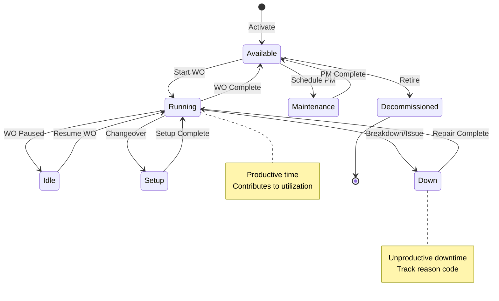

# Functional Requirements Document - Equipment Management
# Unison Manufacturing ERP

**Version**: 4.0
**Date**: 2025-11-10
**Domain**: Equipment, Machines, OEE, Utilization

---

### 2.5 Manufacturing KPI Rules

**Rule**: KPIs calculated daily for each lane.

#### OEE (Overall Equipment Effectiveness)

**Formula**: `OEE = Availability × Performance × Quality`

**Components**:
- **Availability** = (Planned Time - Downtime) / Planned Time
  - Planned Time = 8 hours (480 minutes) for standard shift
  - Downtime = Breaks + Changeovers + Machine failures
  - Example: 480 - 30 = 450 minutes operating / 480 = 93.75%

- **Performance** = (Ideal Cycle Time × Total Units Produced) / Operating Time
  - Ideal Cycle Time = How long one unit SHOULD take (from lane config)
  - Example: 2 min/unit × 200 units = 400 min ideal / 450 min actual = 88.89%

- **Quality** = Good Units / Total Units Produced
  - Good Units = Total - Rejected
  - Example: (200 - 5) / 200 = 97.5%

- **OEE** = 0.9375 × 0.8889 × 0.975 = **81.2%**

**Interpretation**:
- OEE > 85%: World-class
- OEE 70-85%: Good
- OEE 60-70%: Fair
- OEE < 60%: Poor (investigate)

#### First Pass Yield (FPY)

**Formula**: `FPY = (Units Produced - Units Rejected) / Units Produced`

**Example**:
- Produced: 100 units
- Rejected: 5 units
- FPY = (100 - 5) / 100 = 95%

**Interpretation**:
- FPY > 99%: Excellent
- FPY 95-99%: Good
- FPY 90-95%: Fair
- FPY < 90%: Poor (quality issues)

### 2.12 Equipment & Machine Management Rules

**Rule**: Each plant tracks machines/equipment with real-time status and utilization metrics.

**Machine Status States**:



**Status Transition Rules**:
1. **Available → Running**: Requires work order assignment
2. **Running → Idle**: Automatic when work order paused
3. **Running → Down**: Requires downtime reason code
4. **Down → Running**: Requires repair completion note
5. **Running → Setup**: Track setup time separately from production time
6. **Available → Maintenance**: Only if no active work orders

**Machine Utilization Calculation**:

**Formula**: `Utilization % = (Productive Time / Available Time) × 100`

**Time Categories**:
- **Available Time**: Total shift time - Planned maintenance - Scheduled breaks
- **Productive Time**: Time in "Running" status (producing units)
- **Non-Productive Time**: Idle + Setup + Down time

**Example**:
```
8-hour shift (480 minutes):
- Planned maintenance: 30 min
- Breaks: 30 min
- Available time: 480 - 30 - 30 = 420 min

Actual usage:
- Running: 320 min
- Setup: 40 min
- Down: 30 min
- Idle: 30 min

Utilization = 320 / 420 = 76.2%
```

**Machine Capacity Rules**:
- Each machine has rated capacity (units per hour)
- Capacity varies by product/operation (configurable)
- System calculates: Theoretical capacity = Rated capacity × Available hours
- Actual vs theoretical capacity = Performance metric

**Behavior**:
- **On WO Start**: Machine status → Running, log start time
- **On WO Pause**: Machine status → Idle, calculate run time
- **On Breakdown**: Machine status → Down, create downtime event, require reason
- **On Day End**: Calculate daily utilization, update KPI dashboard


---

## See Also

- [FRD_MAINTENANCE.md](FRD_MAINTENANCE.md) - Preventive maintenance schedules
- [FRD_WORK_ORDERS.md](FRD_WORK_ORDERS.md) - Work order assignment to machines
- [FRD_SHIFTS.md](FRD_SHIFTS.md) - Shift-based OEE tracking
- [FRD_INDEX.md](FRD_INDEX.md) - Complete FRD index

---

**Document Status**: Active
**Last Updated**: 2025-11-10
**Line Count**: ~150 lines
