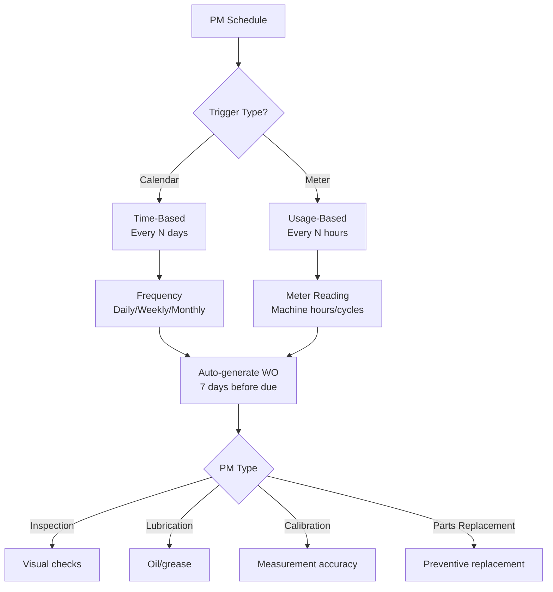
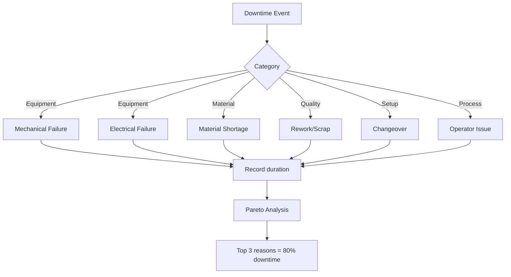
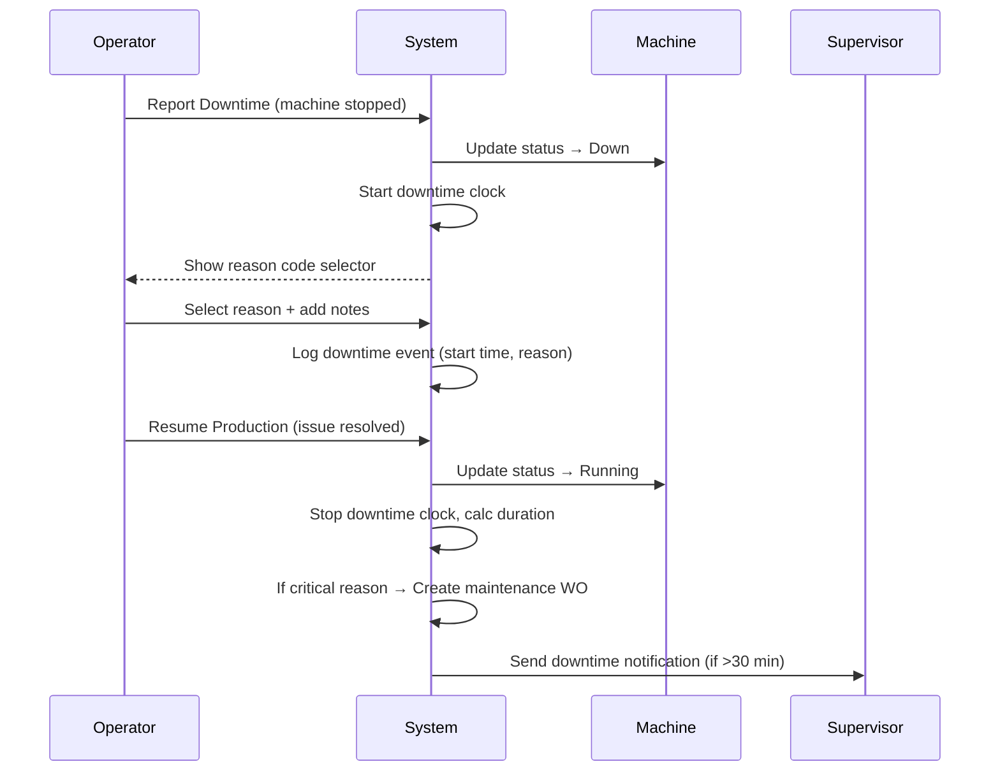

# Functional Requirements Document - Maintenance Management
# Unison Manufacturing ERP

**Version**: 4.0
**Date**: 2025-11-10
**Domain**: Preventive Maintenance, Downtime, MTBF/MTTR

---


**Rule**: Equipment requires scheduled maintenance to prevent breakdowns.

**PM Schedule Types**:



**PM Schedule Definitions**:
- **Machine**: Which equipment
- **PM Type**: Inspection, Lubrication, Calibration, Parts Replacement
- **Frequency**: Calendar-based (every N days/weeks/months) OR Meter-based (every N hours/cycles)
- **Lead Time**: Days before due to generate PM work order (default: 7 days)
- **Task Checklist**: List of tasks to complete (checkboxes)
- **Estimated Duration**: How long PM takes (hours)
- **Assigned Technician**: Who performs PM

**PM Work Order Auto-Generation Logic**:

```
Check daily at 6:00 AM:
FOR each active PM schedule:
  IF schedule type = calendar:
    IF (today + lead_time) >= next_due_date:
      Create PM work order
      Set next_due_date = current_due_date + frequency
  
  IF schedule type = meter:
    Read machine current_meter_value
    IF current_meter_value >= (last_pm_meter_value + frequency - threshold):
      Create PM work order
      Set last_pm_meter_value = current_meter_value
```

**PM Work Order Behavior**:
- Status: Auto-created as "Planned"
- Type: "Preventive Maintenance" (distinct from production WOs)
- Priority: Normal (unless overdue, then High)
- Cannot be deleted (only cancelled for audit trail)
- Completion requires: Checklist items checked, completion notes
- On completion: Update machine last_pm_date, reset meter counter

**PM Compliance Calculation**:

**Formula**: `PM Compliance % = (Completed PM WOs / Total PM WOs Due) × 100`

**Target**: ≥ 90% compliance rate

**Example**:
```
Month: November 2025
Total PM schedules: 40
PM WOs generated: 40
PM WOs completed on time: 36
PM WOs overdue: 4

PM Compliance = 36 / 40 = 90%
```

### 2.15 Downtime Tracking & Analysis Rules

**Rule**: All machine downtime must be logged with reason codes for Pareto analysis.

**Downtime Reason Taxonomy** (Configurable per organization):



**Downtime Logging Flow**:



**Downtime Metrics**:

**MTBF (Mean Time Between Failures)**:
```
MTBF = Total Operating Time / Number of Failures
Example: 320 hours / 4 failures = 80 hours MTBF
```

**MTTR (Mean Time To Repair)**:
```
MTTR = Total Repair Time / Number of Repairs
Example: 12 hours / 4 repairs = 3 hours MTTR
```

**Downtime by Category** (Pareto Chart):
```
Reason                  | Occurrences | Total Minutes | % of Total
------------------------|-------------|---------------|------------
Material Shortage       | 12          | 480           | 35%
Mechanical Failure      | 8           | 360           | 26%
Setup/Changeover        | 15          | 300           | 22%
Operator Issue          | 6           | 120           | 9%
Electrical Failure      | 3           | 80            | 6%
Other                   | 2           | 30            | 2%
```

**Behavior**:
- **On Downtime Start**: Require reason code (cannot proceed without selection)

---

## See Also

- [FRD_EQUIPMENT.md](FRD_EQUIPMENT.md) - Equipment and machine status
- [FRD_WORKFLOWS.md](FRD_WORKFLOWS.md) - Maintenance notification workflows
- [FRD_API_CONTRACTS.md](FRD_API_CONTRACTS.md) - Maintenance API endpoints
- [FRD_INDEX.md](FRD_INDEX.md) - Complete FRD index

---

**Document Status**: Active
**Last Updated**: 2025-11-10
**Line Count**: ~180 lines
