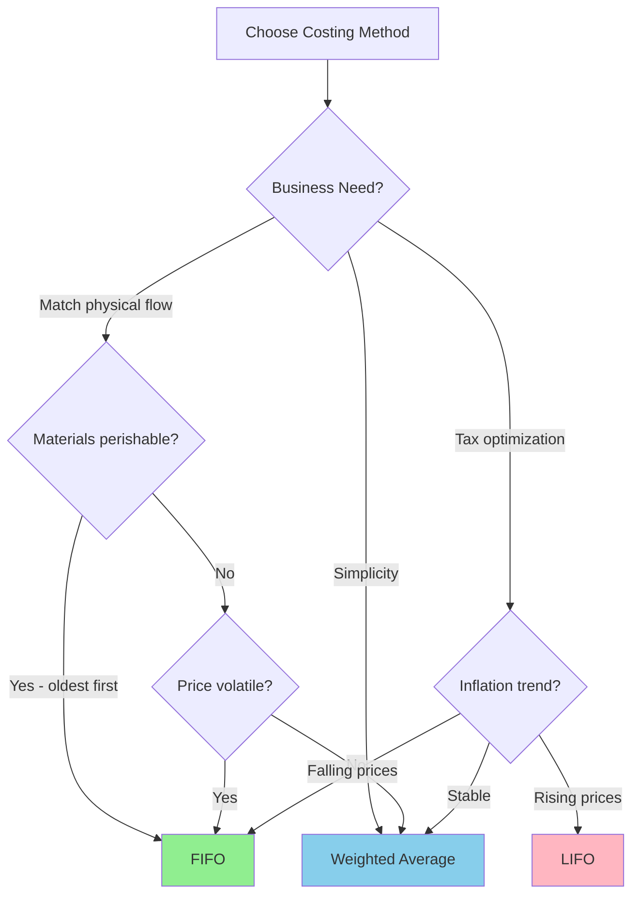
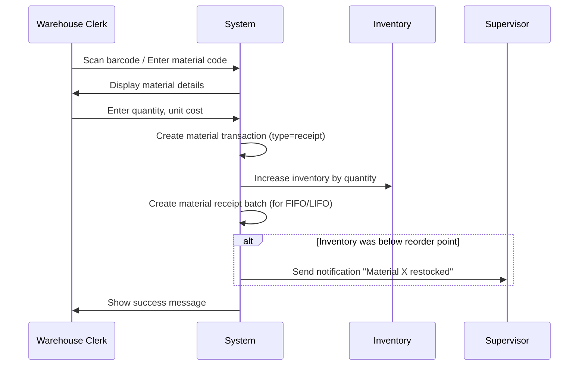

# Functional Requirements Document - Material Management
# Unison Manufacturing ERP

**Version**: 4.0
**Date**: 2025-11-10
**Domain**: Materials, Inventory, Costing

---

## Material Costing Rules

**Rule**: Organizations must choose ONE costing method for all materials.

**Costing Methods**:
1. **FIFO** (First In, First Out): Oldest inventory issued first
2. **LIFO** (Last In, First Out): Newest inventory issued first
3. **Weighted Average**: Average cost across all inventory

**Behavior**:
- **On Material Receipt**: Record quantity, unit cost, receipt date
- **On Material Issue**: Calculate cost based on organization's chosen method
  - FIFO: Use oldest batch's cost first, then next oldest
  - LIFO: Use newest batch's cost first, then next newest
  - Average: Use current weighted average cost
- **On Inventory Update**: Recalculate weighted average (if using Average method)

**Example (FIFO)**:
```
Receipts:
- Jan 1: 100 units @ $10/unit
- Jan 15: 50 units @ $12/unit

Issue:
- Jan 20: 120 units

Cost Calculation:
- First 100 units @ $10 = $1,000
- Next 20 units @ $12 = $240
- Total cost: $1,240

Remaining Inventory:
- 30 units @ $12/unit
```

### Costing Method Selection Decision Tree



**Decision Criteria**:
- **FIFO**: Best for perishable goods, rising prices (lower COGS)
- **LIFO**: Best for tax savings in inflationary periods (higher COGS)
- **Weighted Average**: Best for commodities, simplicity, stable pricing

---

## Material Receipt Workflow



**Steps**:
1. Warehouse clerk scans barcode on packing slip (or types material code)
2. System shows material name, description, current inventory
3. Clerk enters: Quantity received, unit cost, PO number (optional)
4. System validates: Quantity > 0, Unit cost > 0
5. System creates material transaction record
6. System increases inventory quantity
7. System records receipt batch (date, quantity, unit cost) for costing
8. If inventory was below reorder point → Send alert to supervisor
9. Show success: "Received 100 units of Steel Plate"

**Validation Rules**:
- Quantity must be positive number
- Unit cost must be positive number
- Material must be active (not archived)
- Warehouse location must exist

---

## Material Validation Rules

### On Create/Update
- Material Code: Required, unique per organization, 3-50 characters, alphanumeric + hyphens
- Name: Required, 3-255 characters
- Unit of Measure: Required, must be from standard list (kg, pcs, meter, liter, etc.)
- Standard Cost: Optional, if provided must be ≥ 0
- Min/Max Stock Levels: If provided, must satisfy: Min < Reorder Point < Max
- Category: Optional, if provided must exist

### On Issue Transaction
- Quantity: Required, must be > 0
- Quantity must be ≤ Available quantity (on-hand - reserved)
- Work Order: If provided, must exist and be in "in_progress" status

---

## Material API Endpoints

### GET /api/v1/materials

**Description**: List all materials

**Auth**: Required (JWT)

**Query Params**:
- `category_id` (optional): Filter by category
- `search` (optional): Search by name or code
- `page` (optional): Page number (default 1)
- `per_page` (optional): Items per page (default 50, max 100)

**Response 200**:
```json
{
  "materials": [
    {
      "id": 123,
      "material_code": "MTL-001",
      "name": "Steel Plate 10mm",
      "category_id": 5,
      "category_name": "Raw Materials - Steel",
      "unit_of_measure": "kg",
      "standard_cost": 150.00,
      "barcode_url": "https://minio.../barcode-123.png",
      "custom_fields": {
        "heat_treatment_required": true,
        "certification_type": "ISO"
      }
    }
  ],
  "total": 245,
  "page": 1,
  "per_page": 50
}
```

### POST /api/v1/materials

**Description**: Create new material

**Auth**: Required (role: admin or materials_write)

**Request Body**:
```json
{
  "material_code": "MTL-002",
  "name": "Aluminum Sheet 5mm",
  "description": "5052 aluminum alloy",
  "category_id": 6,
  "unit_of_measure": "kg",
  "standard_cost": 200.00,
  "minimum_stock_level": 500,
  "maximum_stock_level": 2000,
  "reorder_point": 1000,
  "custom_fields": {
    "supplier_lead_time": 30
  }
}
```

**Response 201**: (same as GET single material)

**Response 400**: Validation errors
```json
{
  "error": "Validation failed",
  "details": [
    {"field": "material_code", "message": "Material code MTL-002 already exists"}
  ]
}
```

---

## See Also

- [FRD_WORK_ORDERS.md](FRD_WORK_ORDERS.md) - Material usage in work orders
- [FRD_TRACEABILITY.md](FRD_TRACEABILITY.md) - Lot tracking and genealogy
- [FRD_WORKFLOWS.md](FRD_WORKFLOWS.md) - SAP integration for materials
- [FRD_INDEX.md](FRD_INDEX.md) - Complete FRD index

---

**Document Status**: Active
**Last Updated**: 2025-11-10
**Line Count**: ~180 lines
