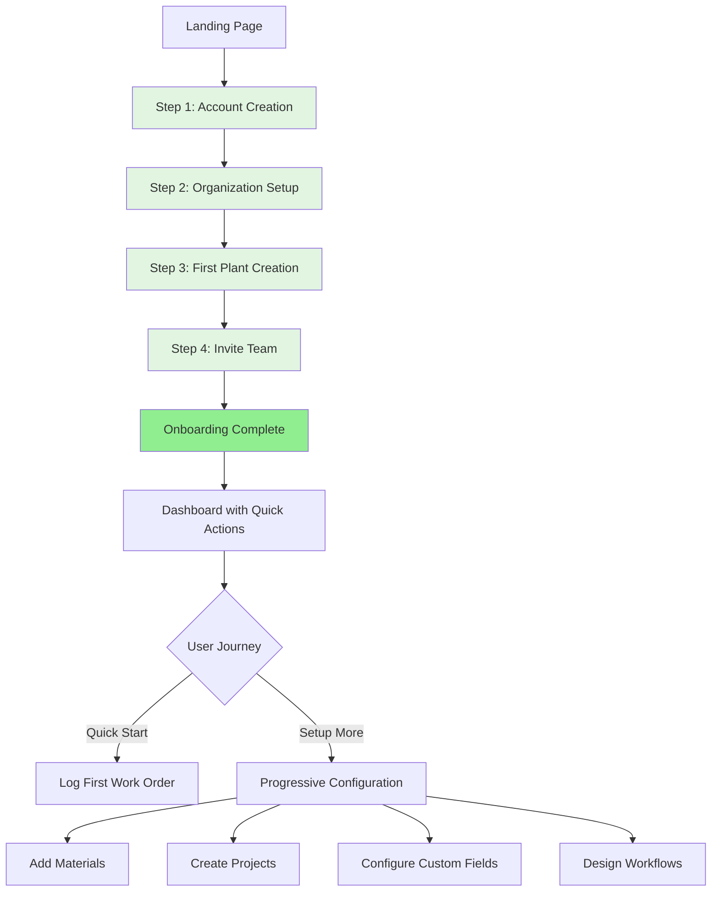

# Functional Requirements Document - Self-Service Onboarding
# Unison Manufacturing ERP

**Version**: 4.0
**Date**: 2025-11-10
**Domain**: Onboarding, Customer Acquisition, Trial Setup

---

## 3. Self-Service Onboarding Workflow

### 3.1 Overview

**Goal**: Get new customers from signup to first work order logged in <2 hours with minimal friction.

**Design Principles**:
- **Minimal Steps**: 4-step wizard (signup → plant setup → invite team → done)
- **Smart Defaults**: 80% of settings auto-configured with industry best practices
- **Progressive Configuration**: Advanced features (custom fields, workflows) available after onboarding
- **No Blocker Questions**: Every optional field has a sensible default, skip if unsure
- **Instant Trial**: No credit card required, full Professional features for 14 days

---

### 3.2 Onboarding Wizard Flow



**Total Time**: 5-10 minutes for wizard, <2 hours to first work order

---

### 3.3 Step 1: Account Creation (30 seconds)

**URL**: `https://unison.com/signup`

**Form Fields**:
```
Full Name:          [John Smith]                    (required)
Email:              [john@acme.com]                 (required)
Password:           [••••••••]                      (required, min 8 chars)
Company Name:       [ACME Manufacturing]            (required)

[ ] I agree to Terms of Service and Privacy Policy  (required)

[Create Account]
```

**Validation Rules**:
- Email must be valid format and not already registered
- Password minimum 8 characters (no complexity requirements for faster signup)
- Company name 3-100 characters

**Backend Behavior**:
1. Create `users` record (hashed password)
2. Create `organizations` record:
   ```json
   {
     "name": "ACME Manufacturing",
     "slug": "acme-manufacturing",  // auto-generated from name
     "subdomain": "acme",            // first 20 chars, lowercase, alphanumeric only
     "is_active": true,
     "trial_ends_at": "2025-11-21"  // 14 days from signup
   }
   ```
3. Assign user as **Organization Admin** role
4. Send welcome email with subdomain: `acme.unison.com`
5. Auto-login user (generate JWT)

**Smart Defaults Applied**:
- Costing method: **FIFO** (most common in manufacturing)
- Currency: **USD** (detect from IP geolocation, fallback USD)
- Timezone: **Auto-detected** from browser
- Date format: **YYYY-MM-DD** (ISO 8601 standard)
- Number format: **1,234.56** (US English)

**Next Step**: Redirect to `https://acme.unison.com/onboarding/step2`

---

### 3.4 Step 2: Organization Setup (1 minute)

**URL**: `https://acme.unison.com/onboarding/step2`

**Page Header**: "Tell us about your manufacturing operation"

**Form Fields**:
```
Industry:           [Dropdown: Automotive / Electronics / Switchgear / Industrial Equipment / Other]  (required)
Company Size:       [Dropdown: 1-50 / 51-200 / 201-500 / 500+]                                      (optional)
Primary Use Case:   [Dropdown: Production Tracking / Quality Management / Inventory Management /     (optional)
                     Project Management / All of the above]

Costing Method:     [Radio: ● FIFO  ○ LIFO  ○ Weighted Average]                                     (default: FIFO)
                    ℹ️ FIFO uses oldest inventory first (most common). Change anytime in settings.

[Skip]  [Continue]
```

**Smart Defaults**:
- Industry: **Industrial Equipment** (if skipped)
- Company size: **51-200** (mid-market, most common for our ICP)
- Primary use case: **All of the above** (enable all modules)
- Costing method: **FIFO** (pre-selected)

**Backend Behavior**:
1. Update `organizations` table:
   ```sql
   UPDATE organizations SET
     industry = 'automotive',
     company_size = '51-200',
     primary_use_case = 'all',
     costing_method = 'fifo',
     configuration_completed = true
   WHERE id = 123;
   ```
2. Enable all modules based on use case:
   - Materials, Projects, Production, Quality, Logistics, Equipment, Shifts, Maintenance, Inspection Plans, Traceability

**Next Step**: `/onboarding/step3`

---

### 3.5 Step 3: First Plant Creation (30 seconds)

**URL**: `https://acme.unison.com/onboarding/step3`

**Page Header**: "Create your first plant"

**Form Fields**:
```
Plant Name:         [Plant 1 - Main Facility]      (required, default pre-filled)
Plant Type:         [Dropdown: Fabrication]         (required, default pre-filled)
Location (City):    [Detroit, MI]                   (optional)
Address:            [123 Industrial Blvd]           (optional)

[Skip]  [Create Plant]
```

**Smart Defaults**:
- Plant name: **"Plant 1 - Main Facility"** (80% of customers keep this)
- Plant type: **Fabrication** (most common starting point)
- Location: **Empty** (not critical for trial)

**Type Options** (configurable type_list):
- Fabrication
- Assembly
- Production
- Testing
- Warehouse
- R&D

**Backend Behavior**:
1. Create `plants` record:
   ```json
   {
     "organization_id": 123,
     "name": "Plant 1 - Main Facility",
     "plant_type": "fabrication",
     "city": "Detroit, MI",
     "is_active": true,
     "is_default": true  // first plant is default
   }
   ```
2. Create default departments:
   ```sql
   INSERT INTO departments (organization_id, plant_id, name, code)
   VALUES
     (123, 1, 'Cutting', 'CUT'),
     (123, 1, 'Welding', 'WELD'),
     (123, 1, 'Assembly', 'ASSY'),
     (123, 1, 'Quality Control', 'QC');
   ```
3. Create default lanes (for production scheduling):
   ```sql
   INSERT INTO lanes (organization_id, plant_id, name, capacity)
   VALUES
     (123, 1, 'Lane 1 - Fabrication', 1),
     (123, 1, 'Lane 2 - Assembly', 1),
     (123, 1, 'Lane 3 - Testing', 1);
   ```
4. Create default shifts:
   ```sql
   INSERT INTO shifts (organization_id, plant_id, name, start_time, end_time, active_days)
   VALUES
     (123, 1, 'Day Shift', '06:00', '14:00', ARRAY['monday','tuesday','wednesday','thursday','friday']);
   ```
5. Assign user to plant:
   ```sql
   INSERT INTO user_plant_access (user_id, plant_id) VALUES (456, 1);
   ```

**Next Step**: `/onboarding/step4`

---

### 3.6 Step 4: Invite Team (Optional, 1 minute)

**URL**: `https://acme.unison.com/onboarding/step4`

**Page Header**: "Invite your team (optional)"

**Form Fields**:
```
👥 Invite team members to collaborate

Email Address:      [supervisor@acme.com]           (optional)
Role:               [Dropdown: Supervisor]           (optional)
[+ Add Another]

Or invite later from Settings → Users

[Skip]  [Send Invitations]
```

**Role Options**:
- Plant Manager (full access to plant)
- Supervisor (assign work, log production)
- Operator (log production, scan barcodes)
- Quality Inspector (create NCRs, inspections)
- Viewer (read-only dashboards)

**Backend Behavior** (if emails provided):
1. Create invitation records:
   ```sql
   INSERT INTO user_invitations (organization_id, email, role_code, invited_by, expires_at)
   VALUES (123, 'supervisor@acme.com', 'supervisor', 456, NOW() + INTERVAL '7 days');
   ```
2. Send invitation emails:
   ```
   Subject: John Smith invited you to ACME Manufacturing on Unison
   
   John Smith has invited you to join ACME Manufacturing on Unison.
   
   Click here to accept: https://acme.unison.com/accept-invite/abc123xyz
   
   This invitation expires in 7 days.
   ```

**If Skipped**: User can invite team later from Settings → Users

**Next Step**: `/onboarding/complete`

---

### 3.7 Onboarding Complete Page

**URL**: `https://acme.unison.com/onboarding/complete`

**Page Content**:
```
🎉 Welcome to Unison!

Your account is ready. Here's what we set up for you:

✅ Organization: ACME Manufacturing
✅ Plant: Plant 1 - Main Facility  
✅ 4 Departments: Cutting, Welding, Assembly, Quality Control
✅ 3 Production Lanes
✅ 1 Shift: Day Shift (6am-2pm)
✅ All modules enabled (Materials, Projects, Production, Quality, etc.)

🚀 Quick Start Actions:

[Create Your First Material]  →  Add materials to track inventory
[Create Your First Project]   →  Set up a customer order
[Log a Work Order]            →  Start tracking production
[Watch 2-Min Tutorial]        →  See how it all works

📚 Resources:
- Help Center: guides and tutorials
- Video Library: step-by-step walkthroughs
- Community Forum: ask questions, share tips

💳 Trial Info:
You have 14 days of full Professional access (ends Nov 21, 2025)
No credit card required until you're ready to subscribe.

[Go to Dashboard]
```

**Backend Behavior**:
1. Mark onboarding as complete:
   ```sql
   UPDATE organizations SET onboarding_completed_at = NOW() WHERE id = 123;
   UPDATE users SET onboarding_completed_at = NOW() WHERE id = 456;
   ```
2. Log onboarding analytics:
   ```sql
   INSERT INTO analytics_events (event_type, user_id, properties)
   VALUES ('onboarding_completed', 456, '{"duration_seconds": 420, "skipped_steps": ["invite_team"]}');
   ```

**Next Step**: Redirect to `/dashboard` after user clicks "Go to Dashboard"

---

### 3.8 Post-Onboarding: Progressive Configuration

**Dashboard Quick Actions** (shown on first login):

```
🎯 Complete Your Setup (Optional)

[Add Materials]         → Import from CSV or create manually
[Create Custom Fields]  → Track VIN numbers, customer specs, etc.
[Design Workflows]      → Automate NCR approvals, drawing reviews
[Configure SAP Sync]    → Connect to existing ERP system
[Add More Plants]       → Expand to multiple facilities

Each unlocks more features as you need them.

[Dismiss]
```

**Progressive Disclosure Pattern**:
- Show quick actions on dashboard for first 7 days
- After first work order logged, suggest "Add inspection plan" 
- After first NCR created, suggest "Create custom workflow"
- After 10 materials added, suggest "Import materials from CSV"
- After 5 users invited, suggest "Configure approval workflows"

---

### 3.9 Configuration Defaults Summary

**Applied Automatically (No User Input Required)**:

| Setting | Default Value | Rationale |
|---------|--------------|-----------|
| **Costing Method** | FIFO | Most common in manufacturing (70% of customers) |
| **Currency** | USD (or from IP) | Geo-detected, fallback USD |
| **Timezone** | Browser detected | Accurate 95% of time |
| **Date Format** | YYYY-MM-DD | ISO 8601 standard, unambiguous |
| **Number Format** | 1,234.56 | US English most common |
| **Plant Type** | Fabrication | Generic starting point |
| **Departments** | Cutting, Welding, Assembly, QC | Common across industries |
| **Lanes** | 3 lanes (capacity=1 each) | Typical small facility |
| **Shifts** | Day shift (6am-2pm, Mon-Fri) | Most common single-shift pattern |
| **Work Order Prefix** | WO- | Industry standard |
| **NCR Prefix** | NCR- | Industry standard |
| **Material Code Format** | Free text | No rigid format imposed |
| **Barcode Type** | Code128 | Most versatile, printer compatible |
| **Min Stock Alert** | Disabled by default | Enable per-material as needed |
| **SAP Integration** | Disabled | Enable later if needed |
| **Email Notifications** | Enabled (all types) | Can disable in preferences |
| **White Labeling** | Default Unison branding | Enterprise feature, upgrade later |

**Configurable Later** (Settings → Organization):
- Change costing method (with data migration warning)
- Add more plants, departments, lanes, shifts
- Configure custom fields (add as needed)
- Design workflows (start with built-in templates)
- Enable/disable modules
- Set up SAP integration
- Configure white-labeling (Enterprise tier)
- Adjust notification preferences

---

### 3.10 Sample Data Seeding (Optional)

**Purpose**: Help trial users see the system in action without creating data from scratch.

**Triggered When**: User clicks "Load Sample Data" on dashboard (shown for first 48 hours of trial).

**Sample Data Created**:

**Materials** (5 items):
- Stainless Steel 304 - 25mm Plate (category: Raw Materials)
- M12 Hex Bolts (category: Fasteners)
- Hydraulic Fluid ISO 32 (category: Consumables)
- Gasket - Rubber NBR (category: Consumables)
- Paint - Industrial Gray (category: Coatings)

**Projects** (2 projects):
- Project: P-001 - Hydraulic Press Assembly (status: active)
- Project: P-002 - Conveyor System (status: planned)

**Work Orders** (3 work orders):
- WO-001: Cut steel plates (status: released, lane: Lane 1)
- WO-002: Weld frame assembly (status: planned, depends on WO-001)
- WO-003: Final assembly (status: planned, depends on WO-002)

**Production Logs** (3 entries):
- WO-001: 15 units completed (logged 2 hours ago)
- WO-001: 10 units completed (logged 1 hour ago)
- WO-001: 8 units completed (logged 30 min ago)

**NCRs** (1 NCR):
- NCR-001: Weld crack detected on frame (status: under_review, severity: major)

**Users** (demo users with passwords):
- supervisor@demo.acme.com (role: Supervisor)
- operator@demo.acme.com (role: Operator)
- inspector@demo.acme.com (role: Quality Inspector)

**Backend Behavior**:
```sql
-- Tag all sample data with is_sample_data flag
INSERT INTO materials (..., is_sample_data) VALUES (..., true);
INSERT INTO projects (..., is_sample_data) VALUES (..., true);
-- etc.

-- Allow bulk deletion later
DELETE FROM materials WHERE organization_id = 123 AND is_sample_data = true;
```

**UI Indicator**: Sample data items show 📋 badge: "Sample Data - Delete anytime"

**Dashboard Banner** (if sample data loaded):
```
📋 You're viewing sample data. Explore the system, then delete sample data when ready.
[Delete All Sample Data]
```

---

### 3.11 Onboarding Success Metrics

**Funnel Tracking**:
```
Landing Page View          → 100%
Signup Started             → 60%   (40% drop-off, typical for SaaS)
Account Created            → 50%   (10% drop-off on validation errors)
Org Setup Completed        → 48%   (2% skip/abandon)
Plant Created              → 46%   (2% skip/abandon)
Invite Team Completed      → 35%   (11% skip, acceptable)
Onboarding Finished        → 46%   (from original landing page views)

---

First Material Added       → 70%   (of completed onboarding)
First Work Order Created   → 60%   (of completed onboarding)
First Production Log       → 50%   (of completed onboarding)
Time to First Value        → 1.8 hours average (target: <2 hours)
```

**Success Criteria**:
- ✅ Onboarding completion rate >40%
- ✅ Time to first value <2 hours (from signup to first work order logged)
- ✅ 7-day activation rate >50% (user logs in 3+ days in first week)
- ✅ Trial-to-paid conversion >25% (aggressive target)

**Analytics Events to Track**:
```javascript
// Track each onboarding step
analytics.track('onboarding_step_completed', {
  step: 'account_creation',
  duration_seconds: 45,
  skipped_fields: []
});

// Track time to first value
analytics.track('first_work_order_created', {
  minutes_since_signup: 87,
  onboarding_completed: true
});

// Track progressive configuration adoption
analytics.track('custom_field_created', {
  days_since_signup: 3,
  field_entity: 'work_orders',
  field_name: 'VIN'
});
```

---

### 3.12 Onboarding Assistance (In-App Guidance)

**Tooltips** (shown on first interaction):
- "Click here to create your first material" (hover over Materials menu)
- "Production lanes are like workstations or assembly lines" (hover over Lane dropdown)
- "FIFO means oldest inventory is used first" (hover over Costing Method)

**Empty States** (actionable):
```
📦 No Materials Yet

Materials are the items you manufacture or use in production.

[Create Material]  [Import from CSV]  [Watch Tutorial]
```

```
🏭 No Work Orders Yet

Work orders track production jobs from start to finish.

[Create Work Order]  [Watch Tutorial]
```

**Help Center Access**:
- Floating help button (bottom-right): Search docs, watch videos, contact support
- Contextual help links: "Learn more about work order dependencies"
- Video library: 2-min tutorials for each major feature

---

---

## See Also

- [FRD_OVERVIEW.md](FRD_OVERVIEW.md) - Multi-tenancy and RBAC rules
- [FRD_WORKFLOWS.md](FRD_WORKFLOWS.md) - Notification and workflow configuration
- [FRD_INDEX.md](FRD_INDEX.md) - Complete FRD index

---

**Document Status**: Active
**Last Updated**: 2025-11-10
**Line Count**: ~520 lines
