# Functional Requirements Document (FRD)
# Unison Manufacturing ERP - Behavioral Specifications

**Version**: 4.0 (Added Self-Service Onboarding)  
**Date**: 2025-11-08  
**Owner**: Product + Engineering

---

## 1. Purpose

This document specifies **HOW THE SYSTEM BEHAVES** from a functional perspective. It defines:
- Business rules (when X happens, system does Y)
- Workflows and processes
- Data relationships
- Validation rules
- API contracts (inputs/outputs, not implementation)
- UI behavior (what user sees, not how it's rendered)

**Out of Scope**: Technical implementation, code, database schemas, infrastructure (see Architecture Doc).

---

## 2. Business Rules

### 2.1 Material Costing Rules

**Rule**: Organizations must choose ONE costing method for all materials.

**Costing Methods**:
1. **FIFO** (First In, First Out): Oldest inventory issued first
2. **LIFO** (Last In, First Out): Newest inventory issued first
3. **Weighted Average**: Average cost across all inventory

**Behavior**:
- **On Material Receipt**: Record quantity, unit cost, receipt date
- **On Material Issue**: Calculate cost based on organization's chosen method
  - FIFO: Use oldest batch's cost first, then next oldest
  - LIFO: Use newest batch's cost first, then next newest
  - Average: Use current weighted average cost
- **On Inventory Update**: Recalculate weighted average (if using Average method)

**Example (FIFO)**:
```
Receipts:
- Jan 1: 100 units @ $10/unit
- Jan 15: 50 units @ $12/unit

Issue:
- Jan 20: 120 units

Cost Calculation:
- First 100 units @ $10 = $1,000
- Next 20 units @ $12 = $240
- Total cost: $1,240

Remaining Inventory:
- 30 units @ $12/unit
```

### 2.2 Work Order Dependency Rules

**Costing Method Selection**:


**Decision Criteria**:
- **FIFO**: Best for perishable goods, rising prices (lower COGS)
- **LIFO**: Best for tax savings in inflationary periods (higher COGS)
- **Weighted Average**: Best for commodities, simplicity, stable pricing

### 2.2 Work Order Dependency Rules

**Rule**: Work orders can depend on other work orders.

**Dependency Types**:
1. **Finish-to-Start**: WO-B cannot start until WO-A completes
2. **Start-to-Start**: WO-B cannot start until WO-A starts
3. **Finish-to-Finish**: WO-B cannot finish until WO-A finishes

**Behavior**:
- **On WO Start Attempt**: Check all dependencies
  - If any blocking dependency not met → Show error "Waiting for WO-XXX to {complete/start}"
  - If all dependencies met → Allow start
- **On Dependency Status Change**: Notify dependent work orders
  - WO-A completes → Check if any WO-Bs can now start → Send notifications

**Example**:


- WO-002 cannot start until WO-001 is complete
- WO-003 cannot start until WO-002 is complete
- WO-004 can start as soon as WO-001 starts (doesn't need to wait for completion)

### 2.3 NCR Disposition Rules

**Lane Assignment Sequence**:


### 2.3 NCR Disposition Rules

**Rule**: Each NCR must have a disposition that triggers specific actions.

**Disposition Types** (configurable per organization):


**Behavior per Disposition**:

1. **Rework**:
   - Create new work order (type = "rework")
   - Link to original work order
   - Copy material requirements
   - Assign to supervisor
   - Track rework cost separately

2. **Scrap**:
   - Create material transaction (type = "scrap", quantity = negative)
   - Decrease inventory
   - Record scrap cost on NCR
   - Update work order cost

3. **Use-as-is**:
   - Send notification to customer (if configured)
   - Require customer approval (if configured)
   - Create deviation document
   - Proceed with delivery

4. **Return to Supplier**:
   - Create return shipment
   - Link to supplier
   - Send return notification to supplier
   - Track return cost for chargebacks

### 2.4 Work Order Costing Rules

**Disposition Decision Tree** (Conditional Routing):


### 2.4 Work Order Costing Rules

**Rule**: Work orders accumulate actual costs as work progresses.

**Cost Components**:
1. **Material Cost** = Sum of all material issues to this work order (calculated by costing method)
2. **Labor Cost** = Sum of (hours worked × worker hourly rate)
3. **Overhead** = Labor Cost × Organization's overhead rate (e.g., 150%)
4. **Total Cost** = Material + Labor + Overhead

**Behavior**:
- **On Material Issue**: Add material cost to WO actual_material_cost
- **On Production Log**: Add (hours × rate) to WO actual_labor_cost
- **On WO Complete**: Calculate final total cost, compare to standard cost
- **Variance**: Actual Cost - Standard Cost (positive = over budget, negative = under budget)

**Example**:
```
Work Order WO-123: Fabricate 10 units of Product X

Material Issues:
- 20kg Steel @ $10/kg = $200
- 5 units Hardware @ $5/unit = $25
Material Cost Total: $225

Labor:
- Operator A: 4 hours @ $25/hour = $100
- Operator B: 2 hours @ $30/hour = $60
Labor Cost Total: $160

Overhead:
- 150% of Labor = $160 × 1.5 = $240

Total Actual Cost: $225 + $160 + $240 = $625
Cost per Unit: $625 / 10 = $62.50/unit
```

### 2.5 Manufacturing KPI Rules

**Rule**: KPIs calculated daily for each lane.

#### OEE (Overall Equipment Effectiveness)

**Formula**: `OEE = Availability × Performance × Quality`

**Components**:
- **Availability** = (Planned Time - Downtime) / Planned Time
  - Planned Time = 8 hours (480 minutes) for standard shift
  - Downtime = Breaks + Changeovers + Machine failures
  - Example: 480 - 30 = 450 minutes operating / 480 = 93.75%

- **Performance** = (Ideal Cycle Time × Total Units Produced) / Operating Time
  - Ideal Cycle Time = How long one unit SHOULD take (from lane config)
  - Example: 2 min/unit × 200 units = 400 min ideal / 450 min actual = 88.89%

- **Quality** = Good Units / Total Units Produced
  - Good Units = Total - Rejected
  - Example: (200 - 5) / 200 = 97.5%

- **OEE** = 0.9375 × 0.8889 × 0.975 = **81.2%**

**Interpretation**:
- OEE > 85%: World-class
- OEE 70-85%: Good
- OEE 60-70%: Fair
- OEE < 60%: Poor (investigate)

#### First Pass Yield (FPY)

**Formula**: `FPY = (Units Produced - Units Rejected) / Units Produced`

**Example**:
- Produced: 100 units
- Rejected: 5 units
- FPY = (100 - 5) / 100 = 95%

**Interpretation**:
- FPY > 99%: Excellent
- FPY 95-99%: Good
- FPY 90-95%: Fair
- FPY < 90%: Poor (quality issues)

---

### 2.6 Multi-Tenancy Isolation Rules

**Rule**: Each organization's data is completely isolated at the database level using Row-Level Security (RLS).

**Isolation Mechanisms**:

1. **Subdomain Routing**:
   - Each organization gets unique subdomain: `{org_slug}.unison.com`
   - System extracts `org_slug` from subdomain on each request
   - Validates organization exists and is active
   - If invalid subdomain → Show "Organization not found" page

2. **Row-Level Security (RLS) Enforcement**:
   - Every database query automatically filters by `organization_id`
   - RLS policies enforced at PostgreSQL level (not application layer)
   - Impossible to query data from other organizations even with SQL injection
   - Example: `SELECT * FROM materials` → PostgreSQL auto-adds `WHERE organization_id = current_org_id`

3. **Plant Switching Behavior**:
   - User can belong to multiple plants within same organization
   - Plant selection stored in session (JWT claim: `current_plant_id`)
   - User clicks plant dropdown → System updates JWT → Refreshes page
   - All queries filter by both `organization_id` AND `current_plant_id`
   - Switch time requirement: <2 seconds

4. **Cross-Tenant Prevention**:
   - Foreign key relationships enforce same `organization_id`
   - Example: Cannot assign Material from Org A to Work Order from Org B
   - Database constraint prevents data mixing even if application has bug
   - All joins require matching `organization_id`

**User Access Rules**:
- User belongs to ONE organization only (cannot switch organizations)
- User can access MULTIPLE plants within their organization
- Admin users see all plants, regular users see assigned plants only
- Plant-level permissions evaluated after organization-level access

**Example Flow**:
```
Request: GET https://acme.unison.com/api/materials
1. Extract org_slug = "acme"
2. Lookup Organization where slug = "acme" → org_id = 123
3. Extract JWT → current_plant_id = 5
4. Query: SELECT * FROM materials WHERE organization_id = 123 AND plant_id = 5
5. PostgreSQL RLS auto-enforces organization_id = 123 (double protection)
```

### 2.7 White-Labeling Behavior Rules

**Rule**: Organizations can customize branding elements to match their corporate identity.

**Customizable Elements**:

1. **Logo**:
   - Uploaded as image file (PNG, JPG, SVG)
   - Max file size: 2MB
   - Displayed in: Navigation bar (top-left), login page, email templates
   - Fallback: Unison default logo if not configured

2. **Color Scheme**:
   - Primary color (hex code): Used for buttons, links, active states
   - Secondary color (hex code): Used for highlights, badges
   - Accent color (hex code): Used for warnings, alerts
   - Applied via CSS variables: `--color-primary`, `--color-secondary`, `--color-accent`

3. **Favicon**:
   - Uploaded as .ico or .png file (16x16, 32x32, 64x64)
   - Shown in browser tab
   - Fallback: Unison default favicon

4. **Email Templates**:
   - Organization logo inserted in email header
   - Primary color used for email buttons and headers
   - Organization name used in email footer
   - Example: "This notification was sent by {Organization Name}"

**Application Hierarchy**:
```
1. Check organization settings for branding elements
2. If found → Apply organization branding
3. If not found → Apply Unison default branding
4. No cascading (no plant-level branding overrides)
```

**Caching Behavior**:
- Branding elements cached for 1 hour
- On branding update → Invalidate cache
- Users see new branding after next page refresh (no forced logout)

**Validation Rules**:
- Logo aspect ratio: Must be between 1:4 and 4:1 (reject extreme ratios)
- Color codes: Must be valid 6-digit hex codes (e.g., #FF5733)
- File types: Only PNG, JPG, SVG, ICO accepted

### 2.8 Project & BOM Management Rules

**Rule**: Projects organize related work orders and track Bill of Materials (BOM) hierarchy.

**Project Lifecycle States**:


**State Behaviors**:
1. **Draft**: Project being planned, can edit all fields, cannot create work orders
2. **Active**: Production in progress, can create work orders, materials can be issued
3. **On Hold**: Temporarily paused, cannot start new work orders, existing WOs can finish
4. **Completed**: All work orders closed, project locked, cannot create new WOs
5. **Cancelled**: Project terminated, all WOs cancelled, materials unreserved
6. **Archived**: Historical record, read-only access

**BOM Hierarchy Rules**:

**Structure**: Multi-level BOM (parent-child relationships)
- **Level 0**: Finished product (e.g., "Complete Assembly")
- **Level 1**: Sub-assemblies (e.g., "Frame", "Motor Housing")
- **Level 2**: Components (e.g., "Steel Plate", "Bolts")
- **Level 3+**: Raw materials

**BOM Explosion**:
- When work order created from project → System "explodes" BOM
- Calculates total material requirements at all levels
- Example: To make 10 assemblies (each needs 2 frames, each frame needs 4 plates)
  - Material requirement: 10 × 2 × 4 = 80 plates
- Reserved quantity = BOM quantity × Work order quantity

**BOM Validation**:
- Circular dependencies not allowed (A contains B, B contains A → Error)
- Total BOM depth ≤ 10 levels (prevent infinite recursion)
- Each child must have quantity > 0
- Unit of measure must be compatible (cannot add "liters" to "pieces")

**Project-to-Work-Order Flow**:
```
1. Project Manager creates Project
2. Uploads BOM (CSV or manual entry)
3. Activates Project
4. Creates Work Order from Project
5. System generates material requirements from BOM
6. Materials reserved automatically
7. Work Order released → Production begins
```

### 2.9 SAP Integration Sync Rules

**Rule**: Unison syncs specific entities with SAP ERP bi-directionally on scheduled intervals.

**Sync Trigger Conditions**:

1. **Scheduled Sync** (Primary):
   - Runs every 15 minutes for critical entities
   - Runs every 4 hours for non-critical entities
   - Critical: Materials, Work Orders, Inventory
   - Non-critical: Projects, BOMs, Suppliers

2. **Event-Driven Sync** (Optional):
   - Work order completed → Immediate sync to SAP
   - Material received → Immediate sync to SAP
   - NCR disposition approved → Immediate sync to SAP

3. **Manual Sync**:
   - Admin can trigger "Sync Now" button
   - Syncs all pending changes immediately

**Data Mapping Rules**:

**Materials** (Unison → SAP):
```
Unison Field          → SAP Field
material_code         → MATNR (Material Number)
name                  → MAKTX (Material Description)
standard_cost         → STPRS (Standard Price)
unit_of_measure       → MEINS (Base Unit of Measure)
```

**Work Orders** (Unison → SAP Production Orders):
```
Unison Field          → SAP Field
work_order_number     → AUFNR (Order Number)
quantity_ordered      → GAMNG (Total Order Quantity)
quantity_completed    → GMNGA (Confirmed Yield)
actual_material_cost  → Material actual costs
actual_labor_cost     → Activity actual costs
```

**Conflict Resolution Logic**:

1. **Last Write Wins** (Default):
   - If Unison updated at 10:00 AM, SAP updated at 10:05 AM
   - SAP wins (newer timestamp)
   - Unison data overwritten on next sync

2. **Field-Level Merge** (For specific entities):
   - Inventory quantity: SAP is source of truth (always sync from SAP to Unison)
   - Work order status: Unison is source of truth (always sync from Unison to SAP)
   - Material master data: SAP is source of truth

3. **Error Handling**:
   - If sync fails (SAP offline, validation error):
     - Mark entity as "sync_pending"
     - Retry on next sync cycle (exponential backoff: 15min, 1hr, 4hr)
     - After 3 failed retries → Send alert to admin
     - Admin must manually resolve conflict

**Sync Status Indicator**:
- Green checkmark: Successfully synced
- Yellow clock: Pending sync
- Red X: Sync failed (requires attention)

**Mock Adapter Behavior** (MVP Phase):
- Simulates SAP responses with 200ms delay
- Returns success for all operations
- Does NOT persist data (logs only)
- Allows testing integration flows without real SAP

### 2.10 RBAC Permission Evaluation Rules

**Rule**: User permissions evaluated hierarchically using Role-Based Access Control (RBAC) with resource-level granularity.

**Permission Check Algorithm**:


**Role Hierarchy** (Highest to Lowest):
1. **System Admin**: All permissions, all organizations
2. **Organization Admin**: All permissions within organization
3. **Plant Manager**: All permissions within assigned plants
4. **Department Head**: Department-level permissions
5. **Supervisor**: Work order and production management
6. **Operator**: Production logging only
7. **QC Inspector**: Quality management only
8. **Viewer**: Read-only access

**Permission Inheritance**:
- Higher roles inherit all permissions from lower roles
- Example: Plant Manager has all Supervisor permissions + more
- Cannot remove inherited permissions (only add new ones)

**Permission Format**: `{resource}:{action}`
- Examples: `materials:read`, `work_orders:write`, `ncr:approve`
- Wildcard supported: `materials:*` (all material actions)

**Resource-Level Access Rules**:

1. **Organization-Scoped**:
   - User can only access resources in their organization
   - Even if role has permission, cross-org access denied
   - Example: User in Org A cannot see materials from Org B

2. **Plant-Scoped**:
   - User can only access resources in assigned plants
   - Admin users can access all plants in their organization
   - Example: Supervisor assigned to Plant 1 cannot manage Plant 2 work orders

3. **User-Scoped** (Limited cases):
   - Users can only edit their own profile
   - Users can only view their own production logs
   - Exception: Managers can view subordinates' logs

**Permission Caching**:
- User permissions cached in JWT (expires in 8 hours)
- On role change → Invalidate all user sessions → Force re-login
- Permission changes take effect immediately for new logins
- Existing sessions use cached permissions until expiry

**Example Evaluation**:
```
Request: PUT /api/work-orders/123/start
User: john@acme.com (Role: Supervisor, Plant: Plant 1)

Check 1: User active? → Yes
Check 2: Organization match? → Work order org = Acme, User org = Acme → Yes
Check 3: Plant access? → Work order plant = Plant 1, User plants = [Plant 1] → Yes
Check 4: Permission? → Supervisor role has work_orders:write → Yes
Check 5: Resource ownership? → Same org, same plant → Yes
Result: ALLOW
```

---

## 3. Self-Service Onboarding Workflow

### 3.1 Overview

**Goal**: Get new customers from signup to first work order logged in <2 hours with minimal friction.

**Design Principles**:
- **Minimal Steps**: 4-step wizard (signup → plant setup → invite team → done)
- **Smart Defaults**: 80% of settings auto-configured with industry best practices
- **Progressive Configuration**: Advanced features (custom fields, workflows) available after onboarding
- **No Blocker Questions**: Every optional field has a sensible default, skip if unsure
- **Instant Trial**: No credit card required, full Professional features for 14 days

---

### 3.2 Onboarding Wizard Flow


**Total Time**: 5-10 minutes for wizard, <2 hours to first work order

---

### 3.3 Step 1: Account Creation (30 seconds)

**URL**: `https://unison.com/signup`

**Form Fields**:
```
Full Name:          [John Smith]                    (required)
Email:              [john@acme.com]                 (required)
Password:           [••••••••]                      (required, min 8 chars)
Company Name:       [ACME Manufacturing]            (required)

[ ] I agree to Terms of Service and Privacy Policy  (required)

[Create Account]
```

**Validation Rules**:
- Email must be valid format and not already registered
- Password minimum 8 characters (no complexity requirements for faster signup)
- Company name 3-100 characters

**Backend Behavior**:
1. Create `users` record (hashed password)
2. Create `organizations` record:
   ```json
   {
     "name": "ACME Manufacturing",
     "slug": "acme-manufacturing",  // auto-generated from name
     "subdomain": "acme",            // first 20 chars, lowercase, alphanumeric only
     "is_active": true,
     "trial_ends_at": "2025-11-21"  // 14 days from signup
   }
   ```
3. Assign user as **Organization Admin** role
4. Send welcome email with subdomain: `acme.unison.com`
5. Auto-login user (generate JWT)

**Smart Defaults Applied**:
- Costing method: **FIFO** (most common in manufacturing)
- Currency: **USD** (detect from IP geolocation, fallback USD)
- Timezone: **Auto-detected** from browser
- Date format: **YYYY-MM-DD** (ISO 8601 standard)
- Number format: **1,234.56** (US English)

**Next Step**: Redirect to `https://acme.unison.com/onboarding/step2`

---

### 3.4 Step 2: Organization Setup (1 minute)

**URL**: `https://acme.unison.com/onboarding/step2`

**Page Header**: "Tell us about your manufacturing operation"

**Form Fields**:
```
Industry:           [Dropdown: Automotive / Electronics / Switchgear / Industrial Equipment / Other]  (required)
Company Size:       [Dropdown: 1-50 / 51-200 / 201-500 / 500+]                                      (optional)
Primary Use Case:   [Dropdown: Production Tracking / Quality Management / Inventory Management /     (optional)
                     Project Management / All of the above]

Costing Method:     [Radio: ● FIFO  ○ LIFO  ○ Weighted Average]                                     (default: FIFO)
                    ℹ️ FIFO uses oldest inventory first (most common). Change anytime in settings.

[Skip]  [Continue]
```

**Smart Defaults**:
- Industry: **Industrial Equipment** (if skipped)
- Company size: **51-200** (mid-market, most common for our ICP)
- Primary use case: **All of the above** (enable all modules)
- Costing method: **FIFO** (pre-selected)

**Backend Behavior**:
1. Update `organizations` table:
   ```sql
   UPDATE organizations SET
     industry = 'automotive',
     company_size = '51-200',
     primary_use_case = 'all',
     costing_method = 'fifo',
     configuration_completed = true
   WHERE id = 123;
   ```
2. Enable all modules based on use case:
   - Materials, Projects, Production, Quality, Logistics, Equipment, Shifts, Maintenance, Inspection Plans, Traceability

**Next Step**: `/onboarding/step3`

---

### 3.5 Step 3: First Plant Creation (30 seconds)

**URL**: `https://acme.unison.com/onboarding/step3`

**Page Header**: "Create your first plant"

**Form Fields**:
```
Plant Name:         [Plant 1 - Main Facility]      (required, default pre-filled)
Plant Type:         [Dropdown: Fabrication]         (required, default pre-filled)
Location (City):    [Detroit, MI]                   (optional)
Address:            [123 Industrial Blvd]           (optional)

[Skip]  [Create Plant]
```

**Smart Defaults**:
- Plant name: **"Plant 1 - Main Facility"** (80% of customers keep this)
- Plant type: **Fabrication** (most common starting point)
- Location: **Empty** (not critical for trial)

**Type Options** (configurable type_list):
- Fabrication
- Assembly
- Production
- Testing
- Warehouse
- R&D

**Backend Behavior**:
1. Create `plants` record:
   ```json
   {
     "organization_id": 123,
     "name": "Plant 1 - Main Facility",
     "plant_type": "fabrication",
     "city": "Detroit, MI",
     "is_active": true,
     "is_default": true  // first plant is default
   }
   ```
2. Create default departments:
   ```sql
   INSERT INTO departments (organization_id, plant_id, name, code)
   VALUES
     (123, 1, 'Cutting', 'CUT'),
     (123, 1, 'Welding', 'WELD'),
     (123, 1, 'Assembly', 'ASSY'),
     (123, 1, 'Quality Control', 'QC');
   ```
3. Create default lanes (for production scheduling):
   ```sql
   INSERT INTO lanes (organization_id, plant_id, name, capacity)
   VALUES
     (123, 1, 'Lane 1 - Fabrication', 1),
     (123, 1, 'Lane 2 - Assembly', 1),
     (123, 1, 'Lane 3 - Testing', 1);
   ```
4. Create default shifts:
   ```sql
   INSERT INTO shifts (organization_id, plant_id, name, start_time, end_time, active_days)
   VALUES
     (123, 1, 'Day Shift', '06:00', '14:00', ARRAY['monday','tuesday','wednesday','thursday','friday']);
   ```
5. Assign user to plant:
   ```sql
   INSERT INTO user_plant_access (user_id, plant_id) VALUES (456, 1);
   ```

**Next Step**: `/onboarding/step4`

---

### 3.6 Step 4: Invite Team (Optional, 1 minute)

**URL**: `https://acme.unison.com/onboarding/step4`

**Page Header**: "Invite your team (optional)"

**Form Fields**:
```
👥 Invite team members to collaborate

Email Address:      [supervisor@acme.com]           (optional)
Role:               [Dropdown: Supervisor]           (optional)
[+ Add Another]

Or invite later from Settings → Users

[Skip]  [Send Invitations]
```

**Role Options**:
- Plant Manager (full access to plant)
- Supervisor (assign work, log production)
- Operator (log production, scan barcodes)
- Quality Inspector (create NCRs, inspections)
- Viewer (read-only dashboards)

**Backend Behavior** (if emails provided):
1. Create invitation records:
   ```sql
   INSERT INTO user_invitations (organization_id, email, role_code, invited_by, expires_at)
   VALUES (123, 'supervisor@acme.com', 'supervisor', 456, NOW() + INTERVAL '7 days');
   ```
2. Send invitation emails:
   ```
   Subject: John Smith invited you to ACME Manufacturing on Unison
   
   John Smith has invited you to join ACME Manufacturing on Unison.
   
   Click here to accept: https://acme.unison.com/accept-invite/abc123xyz
   
   This invitation expires in 7 days.
   ```

**If Skipped**: User can invite team later from Settings → Users

**Next Step**: `/onboarding/complete`

---

### 3.7 Onboarding Complete Page

**URL**: `https://acme.unison.com/onboarding/complete`

**Page Content**:
```
🎉 Welcome to Unison!

Your account is ready. Here's what we set up for you:

✅ Organization: ACME Manufacturing
✅ Plant: Plant 1 - Main Facility  
✅ 4 Departments: Cutting, Welding, Assembly, Quality Control
✅ 3 Production Lanes
✅ 1 Shift: Day Shift (6am-2pm)
✅ All modules enabled (Materials, Projects, Production, Quality, etc.)

🚀 Quick Start Actions:

[Create Your First Material]  →  Add materials to track inventory
[Create Your First Project]   →  Set up a customer order
[Log a Work Order]            →  Start tracking production
[Watch 2-Min Tutorial]        →  See how it all works

📚 Resources:
- Help Center: guides and tutorials
- Video Library: step-by-step walkthroughs
- Community Forum: ask questions, share tips

💳 Trial Info:
You have 14 days of full Professional access (ends Nov 21, 2025)
No credit card required until you're ready to subscribe.

[Go to Dashboard]
```

**Backend Behavior**:
1. Mark onboarding as complete:
   ```sql
   UPDATE organizations SET onboarding_completed_at = NOW() WHERE id = 123;
   UPDATE users SET onboarding_completed_at = NOW() WHERE id = 456;
   ```
2. Log onboarding analytics:
   ```sql
   INSERT INTO analytics_events (event_type, user_id, properties)
   VALUES ('onboarding_completed', 456, '{"duration_seconds": 420, "skipped_steps": ["invite_team"]}');
   ```

**Next Step**: Redirect to `/dashboard` after user clicks "Go to Dashboard"

---

### 3.8 Post-Onboarding: Progressive Configuration

**Dashboard Quick Actions** (shown on first login):

```
🎯 Complete Your Setup (Optional)

[Add Materials]         → Import from CSV or create manually
[Create Custom Fields]  → Track VIN numbers, customer specs, etc.
[Design Workflows]      → Automate NCR approvals, drawing reviews
[Configure SAP Sync]    → Connect to existing ERP system
[Add More Plants]       → Expand to multiple facilities

Each unlocks more features as you need them.

[Dismiss]
```

**Progressive Disclosure Pattern**:
- Show quick actions on dashboard for first 7 days
- After first work order logged, suggest "Add inspection plan" 
- After first NCR created, suggest "Create custom workflow"
- After 10 materials added, suggest "Import materials from CSV"
- After 5 users invited, suggest "Configure approval workflows"

---

### 3.9 Configuration Defaults Summary

**Applied Automatically (No User Input Required)**:

| Setting | Default Value | Rationale |
|---------|--------------|-----------|
| **Costing Method** | FIFO | Most common in manufacturing (70% of customers) |
| **Currency** | USD (or from IP) | Geo-detected, fallback USD |
| **Timezone** | Browser detected | Accurate 95% of time |
| **Date Format** | YYYY-MM-DD | ISO 8601 standard, unambiguous |
| **Number Format** | 1,234.56 | US English most common |
| **Plant Type** | Fabrication | Generic starting point |
| **Departments** | Cutting, Welding, Assembly, QC | Common across industries |
| **Lanes** | 3 lanes (capacity=1 each) | Typical small facility |
| **Shifts** | Day shift (6am-2pm, Mon-Fri) | Most common single-shift pattern |
| **Work Order Prefix** | WO- | Industry standard |
| **NCR Prefix** | NCR- | Industry standard |
| **Material Code Format** | Free text | No rigid format imposed |
| **Barcode Type** | Code128 | Most versatile, printer compatible |
| **Min Stock Alert** | Disabled by default | Enable per-material as needed |
| **SAP Integration** | Disabled | Enable later if needed |
| **Email Notifications** | Enabled (all types) | Can disable in preferences |
| **White Labeling** | Default Unison branding | Enterprise feature, upgrade later |

**Configurable Later** (Settings → Organization):
- Change costing method (with data migration warning)
- Add more plants, departments, lanes, shifts
- Configure custom fields (add as needed)
- Design workflows (start with built-in templates)
- Enable/disable modules
- Set up SAP integration
- Configure white-labeling (Enterprise tier)
- Adjust notification preferences

---

### 3.10 Sample Data Seeding (Optional)

**Purpose**: Help trial users see the system in action without creating data from scratch.

**Triggered When**: User clicks "Load Sample Data" on dashboard (shown for first 48 hours of trial).

**Sample Data Created**:

**Materials** (5 items):
- Stainless Steel 304 - 25mm Plate (category: Raw Materials)
- M12 Hex Bolts (category: Fasteners)
- Hydraulic Fluid ISO 32 (category: Consumables)
- Gasket - Rubber NBR (category: Consumables)
- Paint - Industrial Gray (category: Coatings)

**Projects** (2 projects):
- Project: P-001 - Hydraulic Press Assembly (status: active)
- Project: P-002 - Conveyor System (status: planned)

**Work Orders** (3 work orders):
- WO-001: Cut steel plates (status: released, lane: Lane 1)
- WO-002: Weld frame assembly (status: planned, depends on WO-001)
- WO-003: Final assembly (status: planned, depends on WO-002)

**Production Logs** (3 entries):
- WO-001: 15 units completed (logged 2 hours ago)
- WO-001: 10 units completed (logged 1 hour ago)
- WO-001: 8 units completed (logged 30 min ago)

**NCRs** (1 NCR):
- NCR-001: Weld crack detected on frame (status: under_review, severity: major)

**Users** (demo users with passwords):
- supervisor@demo.acme.com (role: Supervisor)
- operator@demo.acme.com (role: Operator)
- inspector@demo.acme.com (role: Quality Inspector)

**Backend Behavior**:
```sql
-- Tag all sample data with is_sample_data flag
INSERT INTO materials (..., is_sample_data) VALUES (..., true);
INSERT INTO projects (..., is_sample_data) VALUES (..., true);
-- etc.

-- Allow bulk deletion later
DELETE FROM materials WHERE organization_id = 123 AND is_sample_data = true;
```

**UI Indicator**: Sample data items show 📋 badge: "Sample Data - Delete anytime"

**Dashboard Banner** (if sample data loaded):
```
📋 You're viewing sample data. Explore the system, then delete sample data when ready.
[Delete All Sample Data]
```

---

### 3.11 Onboarding Success Metrics

**Funnel Tracking**:
```
Landing Page View          → 100%
Signup Started             → 60%   (40% drop-off, typical for SaaS)
Account Created            → 50%   (10% drop-off on validation errors)
Org Setup Completed        → 48%   (2% skip/abandon)
Plant Created              → 46%   (2% skip/abandon)
Invite Team Completed      → 35%   (11% skip, acceptable)
Onboarding Finished        → 46%   (from original landing page views)

---

First Material Added       → 70%   (of completed onboarding)
First Work Order Created   → 60%   (of completed onboarding)
First Production Log       → 50%   (of completed onboarding)
Time to First Value        → 1.8 hours average (target: <2 hours)
```

**Success Criteria**:
- ✅ Onboarding completion rate >40%
- ✅ Time to first value <2 hours (from signup to first work order logged)
- ✅ 7-day activation rate >50% (user logs in 3+ days in first week)
- ✅ Trial-to-paid conversion >25% (aggressive target)

**Analytics Events to Track**:
```javascript
// Track each onboarding step
analytics.track('onboarding_step_completed', {
  step: 'account_creation',
  duration_seconds: 45,
  skipped_fields: []
});

// Track time to first value
analytics.track('first_work_order_created', {
  minutes_since_signup: 87,
  onboarding_completed: true
});

// Track progressive configuration adoption
analytics.track('custom_field_created', {
  days_since_signup: 3,
  field_entity: 'work_orders',
  field_name: 'VIN'
});
```

---

### 3.12 Onboarding Assistance (In-App Guidance)

**Tooltips** (shown on first interaction):
- "Click here to create your first material" (hover over Materials menu)
- "Production lanes are like workstations or assembly lines" (hover over Lane dropdown)
- "FIFO means oldest inventory is used first" (hover over Costing Method)

**Empty States** (actionable):
```
📦 No Materials Yet

Materials are the items you manufacture or use in production.

[Create Material]  [Import from CSV]  [Watch Tutorial]
```

```
🏭 No Work Orders Yet

Work orders track production jobs from start to finish.

[Create Work Order]  [Watch Tutorial]
```

**Help Center Access**:
- Floating help button (bottom-right): Search docs, watch videos, contact support
- Contextual help links: "Learn more about work order dependencies"
- Video library: 2-min tutorials for each major feature

---

## 4. Workflows

### 2.11 Notification Trigger Rules

**Rule**: System sends notifications on specific events via email and in-app channels.

**Notification Triggers**:

| Event | Recipients | Delivery Method | Urgency |
|-------|-----------|-----------------|---------|
| Work Order Created | Assigned Supervisor | Email + In-app | Normal |
| Work Order Started | Supervisor + Plant Manager | In-app | Normal |
| Work Order Completed | Supervisor + Plant Manager | Email + In-app | Normal |
| NCR Created | QC Manager | Email + In-app | High |
| NCR Critical Severity | Plant Manager + Dept Head | Email + SMS | Critical |
| Material Below Reorder Point | Procurement + Supervisor | Email | High |
| Drawing Awaiting Approval | Assigned Approver | Email | Normal |
| Workflow Escalation (>24hrs) | Manager's Manager | Email | High |
| Production Target Missed | Supervisor + Plant Manager | Email + In-app | High |
| Shipment Delivered | Plant Manager + Customer | Email | Normal |

**Notification Delivery Rules**:


**User Preference Management**:
- Users can enable/disable each channel per notification type
- Default: Email ON, In-App ON, SMS OFF (except Critical)
- Critical notifications cannot be fully disabled (always in-app)

**Retry Logic**:
- Email failed → Retry 3 times (1min, 5min, 15min intervals)
- After 3 failures → Mark as "failed", alert admin
- In-app never fails (stored in database)
- SMS failed → Log error, no retry (too expensive)

**Batch Processing**:
- Low urgency notifications batched (sent every hour)
- Normal/High urgency sent immediately
- Critical sent immediately via all enabled channels


### 2.12 Equipment & Machine Management Rules

**Rule**: Each plant tracks machines/equipment with real-time status and utilization metrics.

**Machine Status States**:


**Status Transition Rules**:
1. **Available → Running**: Requires work order assignment
2. **Running → Idle**: Automatic when work order paused
3. **Running → Down**: Requires downtime reason code
4. **Down → Running**: Requires repair completion note
5. **Running → Setup**: Track setup time separately from production time
6. **Available → Maintenance**: Only if no active work orders

**Machine Utilization Calculation**:

**Formula**: `Utilization % = (Productive Time / Available Time) × 100`

**Time Categories**:
- **Available Time**: Total shift time - Planned maintenance - Scheduled breaks
- **Productive Time**: Time in "Running" status (producing units)
- **Non-Productive Time**: Idle + Setup + Down time

**Example**:
```
8-hour shift (480 minutes):
- Planned maintenance: 30 min
- Breaks: 30 min
- Available time: 480 - 30 - 30 = 420 min

Actual usage:
- Running: 320 min
- Setup: 40 min
- Down: 30 min
- Idle: 30 min

Utilization = 320 / 420 = 76.2%
```

**Machine Capacity Rules**:
- Each machine has rated capacity (units per hour)
- Capacity varies by product/operation (configurable)
- System calculates: Theoretical capacity = Rated capacity × Available hours
- Actual vs theoretical capacity = Performance metric

**Behavior**:
- **On WO Start**: Machine status → Running, log start time
- **On WO Pause**: Machine status → Idle, calculate run time
- **On Breakdown**: Machine status → Down, create downtime event, require reason
- **On Day End**: Calculate daily utilization, update KPI dashboard

### 2.13 Shift Management Rules

**Rule**: Multi-shift plants define shift patterns and track performance per shift.

**Shift Pattern Types**:


**Shift Definition Fields**:
- Shift Name (e.g., "Day Shift", "Night Shift", "A Shift")
- Start Time (e.g., 06:00)
- End Time (e.g., 14:00)
- Break Duration (e.g., 30 minutes)
- Days Active (Mon-Sun selection)
- Production Target (units per shift)
- OEE Target (percentage)

**Shift Performance Calculation**:

**Metrics per Shift**:
1. **Actual Production** = Sum of units completed during shift hours
2. **Target Attainment** = (Actual / Target) × 100
3. **Shift OEE** = OEE calculated only for shift hours
4. **Shift Downtime** = Total downtime minutes during shift
5. **Shift Quality** = (Good units / Total units) during shift

**Shift Handover Behavior**:


**Handover Rules**:
- Outgoing shift must log handover notes (required)
- Handover notes include: WIP status, issues, blocked work orders
- Incoming shift must acknowledge handover (mark as read)
- System auto-generates performance summary at shift end
- Supervisor receives email with shift metrics

**Shift Comparison Reports**:
- Compare same shift across different days (e.g., all Day Shifts this week)
- Compare different shifts on same day (Day vs Night)
- Identify lowest-performing shift for targeted improvement
- Track shift target attainment trends

**Behavior**:
- **On Shift Start**: System identifies current shift from clock time
- **On Production Log**: Tag log with current shift_id
- **On Shift End**: Auto-calculate shift KPIs, send notifications
- **On Report View**: Filter/group by shift automatically

### 2.14 Preventive Maintenance Rules

**Rule**: Equipment requires scheduled maintenance to prevent breakdowns.

**PM Schedule Types**:


**PM Schedule Definitions**:
- **Machine**: Which equipment
- **PM Type**: Inspection, Lubrication, Calibration, Parts Replacement
- **Frequency**: Calendar-based (every N days/weeks/months) OR Meter-based (every N hours/cycles)
- **Lead Time**: Days before due to generate PM work order (default: 7 days)
- **Task Checklist**: List of tasks to complete (checkboxes)
- **Estimated Duration**: How long PM takes (hours)
- **Assigned Technician**: Who performs PM

**PM Work Order Auto-Generation Logic**:

```
Check daily at 6:00 AM:
FOR each active PM schedule:
  IF schedule type = calendar:
    IF (today + lead_time) >= next_due_date:
      Create PM work order
      Set next_due_date = current_due_date + frequency
  
  IF schedule type = meter:
    Read machine current_meter_value
    IF current_meter_value >= (last_pm_meter_value + frequency - threshold):
      Create PM work order
      Set last_pm_meter_value = current_meter_value
```

**PM Work Order Behavior**:
- Status: Auto-created as "Planned"
- Type: "Preventive Maintenance" (distinct from production WOs)
- Priority: Normal (unless overdue, then High)
- Cannot be deleted (only cancelled for audit trail)
- Completion requires: Checklist items checked, completion notes
- On completion: Update machine last_pm_date, reset meter counter

**PM Compliance Calculation**:

**Formula**: `PM Compliance % = (Completed PM WOs / Total PM WOs Due) × 100`

**Target**: ≥ 90% compliance rate

**Example**:
```
Month: November 2025
Total PM schedules: 40
PM WOs generated: 40
PM WOs completed on time: 36
PM WOs overdue: 4

PM Compliance = 36 / 40 = 90%
```

### 2.15 Downtime Tracking & Analysis Rules

**Rule**: All machine downtime must be logged with reason codes for Pareto analysis.

**Downtime Reason Taxonomy** (Configurable per organization):


**Downtime Logging Flow**:

```mermaid
sequenceDiagram
    participant OP as Operator
    participant SYS as System
    participant MACH as Machine
    participant SUP as Supervisor
    
    OP->>SYS: Report Downtime (machine stopped)
    SYS->>MACH: Update status → Down
    SYS->>SYS: Start downtime clock
    SYS-->>OP: Show reason code selector
    OP->>SYS: Select reason + add notes
    SYS->>SYS: Log downtime event (start time, reason)
    
    OP->>SYS: Resume Production (issue resolved)
    SYS->>MACH: Update status → Running
    SYS->>SYS: Stop downtime clock, calc duration
    SYS->>SYS: If critical reason → Create maintenance WO
    SYS->>SUP: Send downtime notification (if >30 min)
```



**Downtime Metrics**:

**MTBF (Mean Time Between Failures)**:
```
MTBF = Total Operating Time / Number of Failures
Example: 320 hours / 4 failures = 80 hours MTBF
```

**MTTR (Mean Time To Repair)**:
```
MTTR = Total Repair Time / Number of Repairs
Example: 12 hours / 4 repairs = 3 hours MTTR
```

**Downtime by Category** (Pareto Chart):
```
Reason                  | Occurrences | Total Minutes | % of Total
------------------------|-------------|---------------|------------
Material Shortage       | 12          | 480           | 35%
Mechanical Failure      | 8           | 360           | 26%
Setup/Changeover        | 15          | 300           | 22%
Operator Issue          | 6           | 120           | 9%
Electrical Failure      | 3           | 80            | 6%
Other                   | 2           | 30            | 2%
```

**Behavior**:
- **On Downtime Start**: Require reason code (cannot proceed without selection)
- **On Downtime > 30 minutes**: Auto-escalate to supervisor
- **On Critical Failure**: Auto-create maintenance work order
- **Daily Report**: Send downtime summary to plant manager
- **Weekly Analysis**: Pareto chart showing top downtime reasons

### 2.16 Inspection Plan Rules

**Rule**: Products require in-process quality checks at defined inspection points.

**Inspection Plan Structure**:

```mermaid
graph TD
    A[Product Inspection Plan] --> B[Inspection Point 1<br/>First Piece]
    A --> C[Inspection Point 2<br/>Every 50 units]
    A --> D[Inspection Point 3<br/>Final Inspection]
    
    B --> E[Characteristics]
    C --> E
    D --> E
    
    E --> F[Char 1: Dimension<br/>Tolerance: ±0.5mm]
    E --> G[Char 2: Weight<br/>Tolerance: ±5g]
    E --> H[Char 3: Surface Finish<br/>Visual Check]
    
    F --> I[Measurement Method<br/>Caliper]
    G --> J[Measurement Method<br/>Scale]
    H --> K[Measurement Method<br/>Visual]
```



**Inspection Characteristics**:
- **Name**: (e.g., "Shaft Diameter", "Weld Strength", "Color Match")
- **Type**: Dimensional, Weight, Visual, Functional Test
- **Specification**: Target value (e.g., 25mm, 500g, "Pass/Fail")
- **Tolerance**: ±range (e.g., ±0.1mm) or Pass/Fail
- **Measurement Method**: Tool/procedure (e.g., "Micrometer", "Visual comparison to sample")
- **Upper Spec Limit (USL)**: Maximum acceptable value
- **Lower Spec Limit (LSL)**: Minimum acceptable value

**Inspection Frequency Types**:
1. **First Piece**: Inspect first unit of production run
2. **Periodic**: Every N units (e.g., every 50 units)
3. **Sampling**: Statistical sampling plan (AQL-based)
4. **Final**: 100% inspection at end

**Sampling Plan Logic** (AQL-based):

```
Given:
- Lot size: 500 units
- AQL (Acceptable Quality Limit): 1.5%
- Inspection Level: II (normal)

Lookup ISO 2859-1 table:
- Sample size: 50 units
- Accept number: 3
- Reject number: 4

Rule:
- Randomly select 50 units from lot
- If defects ≤ 3 → Accept lot
- If defects ≥ 4 → Reject lot (100% inspection required)
```

**Inspection Logging Flow**:


**Statistical Process Control (SPC)**:

**Cp/Cpk Calculation** (Process Capability):
```
Cp = (USL - LSL) / (6 × σ)
Cpk = min[(USL - μ) / (3 × σ), (μ - LSL) / (3 × σ)]

Where:
- USL/LSL = Upper/Lower Spec Limits
- μ = Process mean
- σ = Process standard deviation

Interpretation:
- Cpk ≥ 1.67: Excellent (5σ capable)
- Cpk ≥ 1.33: Good (4σ capable)
- Cpk ≥ 1.00: Marginal (3σ capable)
- Cpk < 1.00: Poor (process improvement required)
```

**Control Chart Rules** (Auto-generate alerts):
- Point outside control limits (±3σ) → Alert
- 7+ consecutive points above/below center line → Trend alert
- 2 out of 3 points > 2σ from center → Warning alert

**Behavior**:
- **On Inspection Due**: Notify inspector via mobile app
- **On Failed Inspection**: Auto-create NCR, pause work order
- **On Control Limit Violation**: Alert quality manager
- **Daily**: Calculate Cp/Cpk for critical characteristics
- **Weekly**: Review control charts, identify trends

### 2.17 Serial Number & Lot Traceability Rules

**Rule**: Critical products require complete forward and backward traceability.

**Traceability Modes**:


**Lot Tracking Rules**:

**Lot Number Format** (Configurable):
- Pattern: `{Material Code}-{YYYYMMDD}-{Sequence}`
- Example: `STL001-20251106-001`
- Auto-generated on material receipt
- Unique per organization

**Lot Assignment Behavior**:


**Lot Genealogy Recording**:
- **Material Issue**: Record which lot(s) issued to which work order
- **Production Complete**: Generate finished goods lot number
- **Genealogy Link**: Map input lots → work order → output lot
- **Multi-Level**: Track through multiple production stages

**Serial Number Tracking Rules**:

**Serial Number Format** (Configurable):
- Pattern: `{Product Code}-{YYMM}-{Sequence}`
- Example: `PUMP-2511-00001`
- Auto-generated when work order completes
- Can also be scanned from physical label

**Serial Assignment Methods**:
1. **Auto-Generate**: System assigns sequential numbers
2. **Manual Entry**: Operator scans existing serial from label
3. **Pre-Assigned**: Serials assigned before production starts

**Serial Genealogy Recording**:

```
Work Order WO-123: Produce 5 pumps

Input Materials (with lots):
- Motor: Lot MOT-20251101-001 (serials: MOT-001, MOT-002, MOT-003, MOT-004, MOT-005)
- Housing: Lot HSG-20251102-001
- Gasket: Lot GSK-20251103-001

Output (finished goods with serials):
- PUMP-2511-00001 (used: MOT-001, HSG-20251102-001, GSK-20251103-001)
- PUMP-2511-00002 (used: MOT-002, HSG-20251102-001, GSK-20251103-001)
- PUMP-2511-00003 (used: MOT-003, HSG-20251102-001, GSK-20251103-001)
- PUMP-2511-00004 (used: MOT-004, HSG-20251102-001, GSK-20251103-001)
- PUMP-2511-00005 (used: MOT-005, HSG-20251102-001, GSK-20251103-001)

Genealogy links stored for forward/backward tracing
```

**Traceability Queries**:

**Forward Trace** (Recall scenario):
```
Input: Defective material lot HSG-20251102-001
Query: Which finished products contain this lot?
Output: All PUMP serials that used this housing lot
Action: Contact customers who received these pumps
```

**Backward Trace** (Customer complaint):
```
Input: Customer complaint about PUMP-2511-00003
Query: Which material lots were used in this pump?
Output: 
- Motor: MOT-20251101-001 (serial MOT-003)
- Housing: HSG-20251102-001
- Gasket: GSK-20251103-001
Action: Investigate supplier quality for these lots
```

**Recall Report Generation**:
- Input: Material lot number OR finished goods lot/serial
- Output: Complete list of affected customers with:
  - Customer name, address
  - Products shipped (serial numbers)
  - Ship date
  - Contact information
- Export: CSV, PDF for rapid recall response

**Behavior**:
- **On Material Receipt**: Generate lot number, record in genealogy
- **On Material Issue**: Link lot to work order
- **On Production Complete**: Generate finished goods lot/serials
- **On Serial Scan**: Instant genealogy lookup
- **On Recall Query**: Generate affected customers list in <1 minute

---

## 3. Workflows

### 3.1 NCR Approval Workflow (Standard Template)


**States**:
1. **Draft**: Inspector editing (can add photos, change severity)
2. **Submitted**: Waiting for QC Manager review
3. **Under Review**: QC Manager analyzing
4. **Rejected**: Sent back to inspector (requires comment)
5. **Approved**: Waiting for Plant Manager to assign resolver
6. **In Progress**: Resolver working on fix
7. **Resolved**: Fix completed, awaiting verification
8. **Verified**: QC confirmed fix
9. **Closed**: Final state

**Transitions**:
- **Submit**: Inspector → QC Manager (auto-email notification)
- **Accept**: QC Manager → Dept Head (if severity ≥ Major)
- **Reject**: Any approver → Inspector (requires comment)
- **Approve**: Dept Head → Plant Manager (auto-email)
- **Assign**: Plant Manager selects resolver → Resolver (auto-email)
- **Resolve**: Resolver marks complete (requires description of fix)
- **Verify**: QC Inspector confirms (in-person check)
- **Close**: Automatic (no further action required)

**Escalations**:
- If Under Review > 24 hours → Email Plant Manager
- If In Progress > 72 hours → Email Dept Head

**Conditional Routing**:
- If severity = Critical → Skip Dept Head, go straight to Plant Manager
- If severity = Minor → QC Manager can approve directly (no Dept Head)

### 3.2 Material Receipt Flow

```mermaid
sequenceDiagram
    participant WH as Warehouse Clerk
    participant SYS as System
    participant INV as Inventory
    participant SUP as Supervisor
    
    WH->>SYS: Scan barcode / Enter material code
    SYS->>WH: Display material details
    WH->>SYS: Enter quantity, unit cost
    SYS->>SYS: Create material transaction (type=receipt)
    SYS->>INV: Increase inventory by quantity
    SYS->>SYS: Create material receipt batch (for FIFO/LIFO)
    alt Inventory was below reorder point
        SYS->>SUP: Send notification "Material X restocked"
    end
    SYS->>WH: Show success message
```

**Steps**:
1. Warehouse clerk scans barcode on packing slip (or types material code)
2. System shows material name, description, current inventory
3. Clerk enters: Quantity received, unit cost, PO number (optional)
4. System validates: Quantity > 0, Unit cost > 0
5. System creates material transaction record
6. System increases inventory quantity
7. System records receipt batch (date, quantity, unit cost) for costing
8. If inventory was below reorder point → Send alert to supervisor
9. Show success: "Received 100 units of Steel Plate"

**Validation Rules**:
- Quantity must be positive number
- Unit cost must be positive number
- Material must be active (not archived)
- Warehouse location must exist

### 3.3 Production Logging Flow (Mobile PWA)

```mermaid
sequenceDiagram
    participant OP as Operator (Mobile)
    participant SYS as System
    participant INV as Inventory
    participant WO as Work Order
    
    OP->>SYS: Scan work order QR code
    SYS->>OP: Display WO details (operation, materials)
    OP->>SYS: Enter qty completed, hours worked
    SYS->>SYS: Create production log
    SYS->>WO: Update qty completed
    SYS->>SYS: Issue materials (auto)
    SYS->>INV: Decrease inventory
    SYS->>WO: Add material cost
    SYS->>WO: Add labor cost (hours × rate)
    SYS->>OP: Show success + current WO status
```

**Steps**:
1. Operator opens mobile PWA
2. Scans work order QR code (or selects from "My Work Orders")
3. System shows: WO number, product, operation, materials required
4. Operator enters:
   - Quantity completed (this session)
   - Hours worked (this session)
   - Notes (optional)
5. System validates:
   - Quantity > 0
   - Quantity ≤ (Quantity ordered - Quantity already completed)
   - Hours > 0
6. System creates production log record
7. System updates work order: Qty completed += entered quantity
8. System automatically issues materials:
   - Calculate material needed (based on BOM ratio)
   - Example: If BOM says 2kg steel per unit, and operator completed 10 units → Issue 20kg
   - Create material transaction (type = issue, reference = WO)
   - Decrease inventory
   - Add material cost to WO
9. System calculates labor cost: Hours × Operator's hourly rate
10. System adds labor cost to WO
11. Show success: "Logged 10 units, 2 hours. WO is 50% complete."

**Offline Behavior** (if no internet):
- Save to local queue (IndexedDB)
- Show "Queued for sync" message
- When internet returns → Auto-sync in background
- If conflict (someone else logged production while offline) → Show user both versions, let user decide

**Validation Rules**:
- Quantity must be positive integer
- Quantity cannot exceed (Ordered - Already completed)
- Hours must be positive number ≤ 24 (sanity check)
- Work order must be in "in_progress" status

### 3.4 Drawing Approval Flow

```mermaid
graph LR
    A[Engineer<br/>Upload Drawing] --> B[Project Manager<br/>Review]
    B -->|Approve| C[Customer<br/>Review]
    B -->|Request Changes| A
    C -->|Approve| D[Released<br/>for Construction]
    C -->|Request Changes| A
    D --> E[Archived]
```

**Steps**:
1. **Engineer Uploads**:
   - Uploads drawing file (PDF, DWG, DXF)
   - Enters: Drawing number, revision, description
   - Submits for review
   
2. **Project Manager Reviews**:
   - Receives email notification
   - Views drawing (inline PDF viewer)
   - Options: Approve, Request Changes (requires comment)
   - If approved → Routes to customer

3. **Customer Reviews** (if configured):
   - Customer receives email with link
   - Views drawing (read-only)
   - Options: Approve, Request Changes
   - If approved → Drawing marked "Released for Construction"

4. **Engineer Revises** (if changes requested):
   - Uploads new version (increments revision number)
   - Process repeats

5. **Released**:
   - Drawing locked (no further edits)
   - Production can begin
   - Drawing appears in "Approved Drawings" report

**Revision Control**:
- Each upload creates new version
- Revision number auto-increments (Rev A, Rev B, ...)
- Old versions remain accessible (audit trail)
- Can compare versions (visual diff highlights changes)

**Notifications**:
- Email on each state change
- Escalate to manager if project manager doesn't review in 48 hours

---

### 3.5 Shipment Creation & Tracking Flow

```mermaid
sequenceDiagram
    participant PM as Plant Manager
    participant SYS as System
    participant BC as Barcode Service
    participant WH as Warehouse
    participant CUST as Customer
    
    PM->>SYS: Create Shipment (WO list, destination)
    SYS->>SYS: Validate: All WOs completed
    SYS->>BC: Generate shipment barcode
    BC-->>SYS: Return barcode URL
    SYS->>SYS: Create shipment record (status=pending)
    SYS-->>PM: Display shipment details + barcode
    
    PM->>SYS: Mark as "Shipped" (carrier, tracking #)
    SYS->>WH: Decrease inventory (finished goods)
    SYS->>CUST: Send shipment notification email
    SYS->>SYS: Update shipment status=shipped
    
    CUST->>SYS: Scan barcode / Enter tracking code
    SYS-->>CUST: Show shipment status + contents
    
    WH->>SYS: Mark as "Delivered"
    SYS->>PM: Send delivery confirmation
    SYS->>SYS: Update shipment status=delivered
```

**Steps**:

1. **Create Shipment**:
   - Plant Manager selects completed work orders to ship
   - Enters destination address, customer info
   - System validates: All work orders must be in "completed" status
   - System generates unique shipment number (e.g., SHIP-2025-001)
   - System generates barcode (QR code with shipment URL)

2. **Pack & Ship**:
   - Warehouse prints shipment barcode (attached to packing slip)
   - Physical items packed for shipping
   - Plant Manager marks shipment as "Shipped"
   - Enters: Carrier name, tracking number, ship date
   - System decreases finished goods inventory
   - System sends email to customer with tracking details

3. **Track Shipment**:
   - Customer scans barcode or visits tracking URL
   - System shows: Shipment status, contents list, estimated delivery
   - Status updates: Pending → Shipped → In Transit → Delivered

4. **Receive & Confirm**:
   - Customer receives shipment
   - Warehouse marks as "Delivered" (or customer confirms online)
   - System sends delivery confirmation to plant manager
   - Shipment closed

**Shipment Status States**:

```mermaid
stateDiagram-v2
    [*] --> Pending: Create
    Pending --> Shipped: Mark shipped
    Shipped --> InTransit: Carrier update
    InTransit --> Delivered: Confirm delivery
    Delivered --> [*]
    Pending --> Cancelled: Cancel order
    Shipped --> Returned: Customer returns
    Returned --> [*]
    
    note right of Pending
        Awaiting shipment
        Can edit contents
    end note
    
    note right of Shipped
        Cannot edit contents
        Inventory decreased
    end note
```

**Barcode Lifecycle**:
1. **Generation**: Created when shipment created (stored in MinIO)
2. **Printing**: Downloaded as PNG/PDF for packing slip
3. **Scanning**: Customer or warehouse scans to view/update status
4. **Tracking**: Barcode contains shipment ID for instant lookup
5. **Archival**: Remains accessible for 7 years (audit trail)

**Validation Rules**:
- Cannot ship work order that is not completed
- Destination address required
- Carrier and tracking number required when marking "Shipped"
- Cannot edit shipment contents after status = "Shipped"
- Cannot delete shipment (can only cancel)

**Notifications**:
- Customer receives email when status changes to "Shipped"
- Plant manager receives email when status changes to "Delivered"
- If shipment not delivered in 14 days → Alert plant manager


### 3.6 Visual Production Scheduling Workflow (Gantt Chart)

**Purpose**: Interactive Gantt chart for visual production scheduling with drag-and-drop rescheduling.

```mermaid
sequenceDiagram
    participant SUP as Supervisor
    participant GANTT as Gantt Chart UI
    participant SYS as System
    participant WO as Work Orders
    participant LANE as Lanes
    
    SUP->>GANTT: Open Production Schedule view
    GANTT->>SYS: GET /api/work-orders?status=planned,released,in_progress
    SYS-->>GANTT: Return WO list with dates, lanes
    GANTT->>GANTT: Render Gantt chart (frappe-gantt)
    
    SUP->>GANTT: Drag WO-002 to different date
    GANTT->>SYS: Validate: Lane available? Dependencies ok?
    alt Validation passes
        SYS->>WO: Update planned_start_date, planned_end_date
        SYS-->>GANTT: Show success (green highlight)
    else Validation fails
        SYS-->>GANTT: Show error (red highlight + message)
        GANTT->>GANTT: Revert to original position
    end
    
    SUP->>GANTT: Click "Save Schedule"
    GANTT->>SYS: Persist all changes
    SYS->>WO: Update all modified work orders
    SYS-->>SUP: Show confirmation
```

**Gantt Chart Layout**:

```
Y-Axis (Lanes):
├── Lane 1 (CNC Machining)
├── Lane 2 (Welding)
├── Lane 3 (Assembly)
└── Lane 4 (Packaging)

X-Axis (Time):
├── Week 1 (Nov 6-12)
├── Week 2 (Nov 13-19)
└── Week 3 (Nov 20-26)

Bars:
- Each bar = One work order
- Bar width = Duration (start date to end date)
- Bar position = Lane (Y) + Date (X)
- Bar color = Status (blue=planned, yellow=in_progress, green=completed, red=delayed)
```

**Gantt Interactions**:

1. **Drag Horizontally** (Reschedule):
   - User drags bar left/right to new dates
   - System validates: Lane has capacity for new dates
   - System validates: Dependencies still satisfied
   - If valid → Update planned dates
   - If invalid → Show error + revert

2. **Drag Vertically** (Reassign Lane):
   - User drags bar to different lane
   - System validates: New lane has capacity
   - System validates: New lane can handle this operation
   - If valid → Reassign to new lane
   - If invalid → Show error + revert

3. **Resize Bar** (Change Duration):
   - User drags bar edge to extend/shrink duration
   - System recalculates: Planned end date based on new duration
   - System validates: New end date doesn't conflict with dependent WOs
   - If valid → Update duration
   - If invalid → Show error + revert

4. **Click Bar** (View Details):
   - Show popup with: WO number, product, quantity, status, assigned operator
   - Options: Start WO, View logs, View materials

**Dependency Visualization**:

```mermaid
gantt
    title Production Schedule with Dependencies
    dateFormat  YYYY-MM-DD
    section Lane 1
    WO-001 Cut Steel           :done, wo1, 2025-11-06, 2d
    WO-004 Cut Aluminum        :active, wo4, 2025-11-08, 1d
    section Lane 2
    WO-002 Weld Frame          :wo2, after wo1, 2d
    section Lane 3
    WO-003 Assemble            :wo3, after wo2, 3d
    section Lane 4
    WO-005 Package             :wo5, after wo3, 1d
```

**Dependency Lines**: Draw arrows between dependent work orders
- **Finish-to-Start**: Arrow from end of WO-001 to start of WO-002
- **Start-to-Start**: Arrow from start of WO-001 to start of WO-004
- **Finish-to-Finish**: Arrow from end to end

**Conflict Detection Rules**:

```mermaid
graph TD
    A[User Reschedules WO] --> B{Lane Capacity Check}
    B -->|Overloaded| C[Show Warning:<br/>"Lane at 120% capacity"]
    B -->|OK| D{Dependency Check}
    D -->|Violated| E[Show Error:<br/>"Must complete WO-001 first"]
    D -->|OK| F{Date Feasibility Check}
    F -->|Too Soon| G[Show Warning:<br/>"Materials not available until Nov 10"]
    F -->|OK| H[Allow Rescheduling]
    
    C --> I{User Action}
    I -->|Force| H
    I -->|Cancel| J[Revert to Original]
    
    E --> J
    G --> I
```

**Conflict Types**:
1. **Lane Overload**: Multiple WOs assigned to same lane at same time
   - Visual: Red highlight on lane label
   - Warning: "Lane 2: 3 WOs scheduled simultaneously (capacity: 2)"
   - Action: User must reschedule or reassign to different lane

2. **Dependency Violation**: Dependent WO scheduled before prerequisite WO completes
   - Visual: Red X on dependency arrow
   - Error: "WO-002 cannot start before WO-001 completes"
   - Action: System prevents save, user must fix

3. **Material Shortage**: WO scheduled before materials available
   - Visual: Orange exclamation mark on bar
   - Warning: "Steel delivery expected Nov 10 (WO scheduled Nov 8)"
   - Action: User can proceed with warning (risk noted)

**View Modes**:

```mermaid
graph LR
    A[View Mode Selector] --> B[Day View<br/>24-hour timeline]
    A --> C[Week View<br/>7-day timeline]
    A --> D[Month View<br/>30-day timeline]
    
    B --> E[Zoom In:<br/>Hour-by-hour detail]
    C --> F[Default View:<br/>Best for weekly planning]
    D --> G[Zoom Out:<br/>Long-range planning]
```

**Filters**:
- **By Plant**: Show only WOs for selected plant
- **By Lane**: Show specific lanes only
- **By Status**: Filter planned/released/in_progress
- **By Product**: Show WOs for specific product
- **By Date Range**: Custom date range selector

**Color Coding**:
- **Blue**: Planned (not started)
- **Yellow**: In Progress (actively producing)
- **Green**: Completed (all units done)
- **Red**: Delayed (past due date, not complete)
- **Gray**: On Hold / Paused

**Batch Operations**:
- **Select Multiple**: Shift+Click to select multiple WOs
- **Bulk Reschedule**: Move selected WOs by X days
- **Bulk Reassign**: Move selected WOs to different lane
- **Bulk Dependency**: Add same dependency to multiple WOs

**Auto-Scheduling** (Optional Feature):
- System calculates optimal schedule based on:
  - Lane capacity
  - Dependencies
  - Material availability
  - Due dates (priority)
- Algorithm: Earliest Due Date (EDD) scheduling
- User can review and adjust before accepting

**Technology Implementation** (frappe-gantt):
```javascript
// React component structure
<GanttChart
  tasks={workOrders}
  onTaskChange={handleReschedule}
  onProgressChange={handleProgressUpdate}
  onClick={handleTaskClick}
  viewMode="Week"
/>

// Task format
{
  id: "WO-001",
  name: "Cut Steel Plates",
  start: "2025-11-06",
  end: "2025-11-08",
  progress: 50, // 50% complete
  dependencies: [], // WO IDs this depends on
  custom_class: "lane-1 status-in-progress"
}
```

**Validation Rules**:
- Cannot schedule WO before today's date (past scheduling blocked)
- Cannot schedule WO before material expected delivery date (warning only)
- Cannot violate dependencies (hard block)
- Cannot assign to lane that doesn't support operation (hard block)
- Can overload lane capacity (warning only, allows flexibility)

**Notifications**:
- **On Conflict Created**: Alert supervisor via in-app notification
- **On Schedule Change**: Email assigned operator with new dates
- **On Auto-Schedule**: Show summary of changes before applying

**Performance**:
- Render 500 work orders in <2 seconds
- Smooth drag-and-drop (60 FPS)
- Real-time conflict detection (<100ms)
- Debounced save (auto-save 2 seconds after last change)

---

## 4. Data Relationships

### 4.1 Entity Relationship Diagram

```mermaid
erDiagram
    Organization ||--o{ Plant : has
    Organization ||--o{ User : has
    Plant ||--o{ Department : has
    Plant ||--o{ Lane : has
    Plant ||--o{ MaterialInventory : tracks
    
    Project ||--o{ WorkOrder : generates
    Project ||--o{ ProjectBOM : has
    Project ||--o{ RDADrawing : has
    
    WorkOrder ||--o{ WorkOrderOperation : has
    WorkOrder ||--o{ ProductionLog : tracks
    WorkOrder ||--o{ ManpowerAllocation : allocates
    WorkOrder }o--|| Lane : assigned_to
    WorkOrder }o--o{ WorkOrder : depends_on
    
    Material ||--o{ MaterialInventory : stored_at
    Material ||--o{ MaterialTransaction : tracks
    Material ||--o{ ProjectBOM : used_in
    
    NCRReport }o--|| WorkOrder : found_in
    NCRReport ||--o{ NCRPhoto : has
    NCRReport }o--|| User : assigned_to
    
    Workflow ||--o{ WorkflowState : defines
    WorkflowState ||--o{ WorkflowTransition : allows
    WorkflowInstance }o--|| WorkflowState : current_state
```

**Key Relationships**:

- **One Organization** → **Many Plants** (1:N)
- **One Plant** → **Many Lanes** (1:N)
- **One Project** → **Many Work Orders** (1:N)
- **One Work Order** → **Many Production Logs** (1:N)
- **One Work Order** → **One Lane** (N:1, at a time)
- **Work Orders** → **Work Orders** (N:M, dependencies)
- **One Material** → **Many Inventory Records** (1:N, one per plant/location)
- **One NCR** → **Many Photos** (1:N)
- **One Workflow** → **Many States** → **Many Transitions** (1:N:M)

### 4.2 Work Order Lifecycle

```mermaid
stateDiagram-v2
    [*] --> Planned: Create
    Planned --> Released: Release
    Released --> InProgress: Start
    InProgress --> Paused: Pause
    Paused --> InProgress: Resume
    InProgress --> Completed: Complete
    Completed --> [*]
    Planned --> Cancelled: Cancel
    Released --> Cancelled: Cancel
    
    note right of Planned
        Can edit all fields
    end note
    
    note right of Released
        Materials reserved
        Can't edit qty
    end note
    
    note right of InProgress
        Production logging active
        Materials issuing
    end note
```

**State Transitions**:
- **Planned**: Draft state, can edit all fields
- **Released**: Locked for production, materials reserved, assigned to lane
- **In Progress**: Work started, operators logging production
- **Paused**: Temporarily stopped (waiting for materials, equipment issue, etc.)
- **Completed**: All operations finished, qty completed = qty ordered
- **Cancelled**: Terminated (order cancelled, no longer needed)

**Rules**:
- Can only start if status = Released
- Can only complete if qty completed = qty ordered
- Cannot delete (can only cancel for audit trail)
- Once completed, fields locked (cannot edit)

---

## 5. Validation Rules

### 5.1 Material Validation

**On Create/Update**:
- Material Code: Required, unique per organization, 3-50 characters, alphanumeric + hyphens
- Name: Required, 3-255 characters
- Unit of Measure: Required, must be from standard list (kg, pcs, meter, liter, etc.)
- Standard Cost: Optional, if provided must be ≥ 0
- Min/Max Stock Levels: If provided, must satisfy: Min < Reorder Point < Max
- Category: Optional, if provided must exist

**On Issue Transaction**:
- Quantity: Required, must be > 0
- Quantity must be ≤ Available quantity (on-hand - reserved)
- Work Order: If provided, must exist and be in "in_progress" status

### 5.2 Work Order Validation

**On Create**:
- Work Order Number: Required, unique per organization, auto-generated if not provided
- Project: Required, must exist and be active
- Plant: Required, must exist and belong to organization
- Quantity Ordered: Required, must be positive integer
- Operations: Optional, if provided each must have unique operation number (10, 20, 30...)

**On Start**:
- Status must be "released"
- All dependencies must be satisfied
- Lane must be assigned
- Materials must be available (reserved quantity ≤ on-hand quantity)

**On Production Log**:
- Quantity completed this log: > 0, ≤ (Ordered - Already completed)
- Hours: > 0, ≤ 24 (sanity check)

**On Complete**:
- Quantity completed must = Quantity ordered
- All operations must be complete

### 5.3 NCR Validation

**On Create**:
- NCR Number: Auto-generated, unique
- NCR Type: Required, must be from organization's configured list
- Severity: Required, must be from: Minor, Major, Critical
- Description: Required, 10-5000 characters
- Work Order or Project: At least one must be provided (where was defect found?)
- Photos: Optional, max 10 photos, max 10MB per photo

**On Disposition**:
- Disposition Type: Required, must be from organization's configured list
- If disposition = Rework → Rework cost must be provided
- If disposition = Scrap → Scrap quantity must be provided

### 5.4 Custom Field Validation

**On Custom Field Definition**:
- Field Code: Required, unique per (organization, entity type), 3-50 chars, alphanumeric + underscores
- Field Label: Required, 3-255 chars
- Field Type: Required, must be from: text, number, date, boolean, dropdown, multiselect, file
- If Field Type = dropdown/multiselect → Options list required (min 2 options)
- If Field Type = number → Can specify min/max value
- If Field Type = text → Can specify min/max length, regex pattern

**On Custom Field Value**:
- Validate according to field definition rules
- If required = true → Value must be provided
- If type = number → Value must be numeric, within min/max
- If type = dropdown → Value must be in options list
- If type = multiselect → All values must be in options list

---

## 6. API Contracts

**Custom Field Configuration Flow**:

```mermaid
sequenceDiagram
    participant ADMIN as Admin
    participant SYS as System
    participant CACHE as Cache
    participant FORM as Dynamic Form
    participant USER as End User
    
    ADMIN->>SYS: Create Custom Field Definition
    ADMIN->>SYS: Define: entity=Material, code=heat_treatment, type=boolean
    SYS->>SYS: Validate field definition
    SYS->>CACHE: Invalidate form schema cache
    SYS-->>ADMIN: Success
    
    USER->>FORM: Open Material Form
    FORM->>SYS: GET /api/custom-fields?entity=Material
    SYS-->>FORM: Return field definitions
    FORM->>FORM: Render: Standard fields + Custom fields
    FORM-->>USER: Show form with "Heat Treatment" checkbox
    
    USER->>FORM: Enter data + check "Heat Treatment"
    FORM->>SYS: POST /api/materials with custom_fields
    SYS->>SYS: Validate custom field values
    SYS->>SYS: Store in material record
    SYS-->>USER: Material created
```

---

## 6. API Contracts

### 6.1 Material Endpoints

**GET /api/v1/materials**
- **Description**: List all materials
- **Auth**: Required (JWT)
- **Query Params**:
  - `category_id` (optional): Filter by category
  - `search` (optional): Search by name or code
  - `page` (optional): Page number (default 1)
  - `per_page` (optional): Items per page (default 50, max 100)
- **Response 200**:
```json
{
  "materials": [
    {
      "id": 123,
      "material_code": "MTL-001",
      "name": "Steel Plate 10mm",
      "category_id": 5,
      "category_name": "Raw Materials - Steel",
      "unit_of_measure": "kg",
      "standard_cost": 150.00,
      "barcode_url": "https://minio.../barcode-123.png",
      "custom_fields": {
        "heat_treatment_required": true,
        "certification_type": "ISO"
      }
    }
  ],
  "total": 245,
  "page": 1,
  "per_page": 50
}
```

**POST /api/v1/materials**
- **Description**: Create new material
- **Auth**: Required (role: admin or materials_write)
- **Request Body**:
```json
{
  "material_code": "MTL-002",
  "name": "Aluminum Sheet 5mm",
  "description": "5052 aluminum alloy",
  "category_id": 6,
  "unit_of_measure": "kg",
  "standard_cost": 200.00,
  "minimum_stock_level": 500,
  "maximum_stock_level": 2000,
  "reorder_point": 1000,
  "custom_fields": {
    "supplier_lead_time": 30
  }
}
```
- **Response 201**: (same as GET single material)
- **Response 400**: Validation errors
```json
{
  "error": "Validation failed",
  "details": [
    {"field": "material_code", "message": "Material code MTL-002 already exists"}
  ]
}
```

### 6.2 Work Order Endpoints

**POST /api/v1/work-orders/{id}/start**
- **Description**: Start work order
- **Auth**: Required (role: supervisor or operator)
- **Path Params**: `id` - Work order ID
- **Request Body**: (empty, or optional note)
- **Response 200**:
```json
{
  "id": 456,
  "work_order_number": "WO-2025-001",
  "status": "in_progress",
  "started_at": "2025-11-06T10:00:00Z",
  "started_by": {"id": 23, "name": "John Doe"}
}
```
- **Response 400**: Cannot start (dependencies not met)
```json
{
  "error": "Cannot start work order",
  "reason": "Waiting for WO-2024-999 to complete"
}
```

**POST /api/v1/production-logs**
- **Description**: Log production progress
- **Auth**: Required (role: operator)
- **Request Body**:
```json
{
  "work_order_id": 456,
  "operation_id": 12,
  "quantity_completed": 50,
  "hours_worked": 4.5,
  "notes": "All units passed inspection"
}
```
- **Response 201**:
```json
{
  "id": 789,
  "work_order_id": 456,
  "work_order_number": "WO-2025-001",
  "quantity_completed": 50,
  "cumulative_completed": 150,
  "quantity_ordered": 200,
  "progress_percent": 75,
  "material_cost_added": 540.00,
  "labor_cost_added": 112.50,
  "logged_at": "2025-11-06T14:30:00Z"
}
```

### 6.3 NCR Endpoints

**POST /api/v1/ncr-reports**
- **Description**: Create NCR with photos
- **Auth**: Required (role: inspector)
- **Request Body** (multipart/form-data):
```
ncr_type_id: 3
severity: major
description: Cracks found on welded joint...
work_order_id: 456
photos[]: (file binary)
photos[]: (file binary)
```
- **Response 201**:
```json
{
  "id": 234,
  "ncr_number": "NCR-2025-042",
  "ncr_type": "Process Deviation",
  "severity": "major",
  "status": "submitted",
  "work_order_number": "WO-2025-001",
  "photos": [
    {"id": 1, "url": "https://minio.../ncr-234-photo-1.jpg"},
    {"id": 2, "url": "https://minio.../ncr-234-photo-2.jpg"}
  ],
  "current_assignee": {"id": 45, "name": "QC Manager"},
  "created_at": "2025-11-06T15:00:00Z"
}
```

### 6.4 Workflow Endpoints

**POST /api/v1/workflows/{entity_type}/{entity_id}/transition/{transition_code}**
- **Description**: Execute workflow transition
- **Auth**: Required (must be assigned user)
- **Path Params**:
  - `entity_type`: "ncr_report", "rda_drawing", "work_order", etc.
  - `entity_id`: Entity ID
  - `transition_code`: "approve", "reject", "assign", etc.
- **Request Body**:
```json
{
  "comment": "Root cause identified, approved for disposition"
}
```
- **Response 200**:
```json
{
  "previous_state": "submitted",
  "current_state": "approved",
  "current_assignee": {"id": 67, "name": "Plant Manager"},
  "performed_by": {"id": 45, "name": "QC Manager"},
  "performed_at": "2025-11-06T16:00:00Z"
}
```
- **Response 403**: Not authorized
```json
{
  "error": "Not authorized",
  "reason": "This task is assigned to QC Manager, not you"
}
```


### 6.5 Equipment Management Endpoints

**GET /api/v1/machines**
- **Description**: List all machines/equipment
- **Auth**: Required (JWT)
- **Query Params**:
  - `plant_id` (optional): Filter by plant
  - `status` (optional): Filter by status (available, running, down, maintenance)
  - `search` (optional): Search by name or code
- **Response 200**:
```json
{
  "machines": [
    {
      "id": 15,
      "machine_code": "CNC-001",
      "name": "CNC Lathe Machine",
      "plant_id": 3,
      "plant_name": "Fabrication Plant",
      "status": "running",
      "current_work_order": {
        "id": 456,
        "work_order_number": "WO-2025-001"
      },
      "capacity_units_per_hour": 50,
      "utilization_percent": 76.2,
      "last_maintenance_date": "2025-10-15",
      "next_maintenance_due": "2025-11-15"
    }
  ],
  "total": 24
}
```

**PUT /api/v1/machines/{id}/status**
- **Description**: Update machine status
- **Auth**: Required (role: operator or supervisor)
- **Request Body**:
```json
{
  "status": "down",
  "reason_code": "mechanical_failure",
  "notes": "Hydraulic pump failed, maintenance called"
}
```
- **Response 200**:
```json
{
  "id": 15,
  "machine_code": "CNC-001",
  "status": "down",
  "downtime_started_at": "2025-11-06T14:30:00Z",
  "downtime_reason": "Mechanical Failure"
}
```

**GET /api/v1/machines/{id}/utilization**
- **Description**: Get machine utilization metrics
- **Auth**: Required
- **Query Params**:
  - `start_date`: Start of date range (required)
  - `end_date`: End of date range (required)
- **Response 200**:
```json
{
  "machine_id": 15,
  "machine_name": "CNC Lathe Machine",
  "period": {
    "start": "2025-11-01",
    "end": "2025-11-06"
  },
  "metrics": {
    "available_time_minutes": 2400,
    "productive_time_minutes": 1830,
    "utilization_percent": 76.25,
    "downtime_minutes": 360,
    "setup_time_minutes": 210
  },
  "downtime_breakdown": [
    {"reason": "Mechanical Failure", "minutes": 180, "occurrences": 2},
    {"reason": "Material Shortage", "minutes": 120, "occurrences": 3},
    {"reason": "Setup/Changeover", "minutes": 60, "occurrences": 1}
  ]
}
```

### 6.6 Shift Management Endpoints

**GET /api/v1/shifts**
- **Description**: List shift patterns
- **Auth**: Required
- **Query Params**:
  - `plant_id` (optional): Filter by plant
  - `active_only` (optional): Show only active shifts
- **Response 200**:
```json
{
  "shifts": [
    {
      "id": 5,
      "name": "Day Shift",
      "start_time": "06:00",
      "end_time": "14:00",
      "break_duration_minutes": 30,
      "active_days": ["monday", "tuesday", "wednesday", "thursday", "friday"],
      "production_target_units": 400,
      "oee_target_percent": 85
    },
    {
      "id": 6,
      "name": "Night Shift",
      "start_time": "22:00",
      "end_time": "06:00",
      "break_duration_minutes": 30,
      "active_days": ["sunday", "monday", "tuesday", "wednesday", "thursday"],
      "production_target_units": 350,
      "oee_target_percent": 80
    }
  ]
}
```

**POST /api/v1/shift-handovers**
- **Description**: Log shift handover notes
- **Auth**: Required (role: operator or supervisor)
- **Request Body**:
```json
{
  "shift_id": 5,
  "date": "2025-11-06",
  "handover_notes": "WO-001 is 75% complete, waiting for aluminum delivery for WO-002. Machine CNC-003 has minor vibration issue.",
  "wip_work_orders": [
    {"work_order_id": 456, "status": "in_progress", "percent_complete": 75}
  ],
  "issues": [
    {"machine_id": 18, "description": "Minor vibration in spindle"}
  ]
}
```
- **Response 201**:
```json
{
  "id": 123,
  "shift_id": 5,
  "shift_name": "Day Shift",
  "date": "2025-11-06",
  "logged_by": {"id": 23, "name": "John Supervisor"},
  "handover_notes": "WO-001 is 75% complete...",
  "acknowledged_by": null,
  "acknowledged_at": null
}
```

**GET /api/v1/shift-performance**
- **Description**: Get shift performance metrics
- **Auth**: Required
- **Query Params**:
  - `shift_id`: Shift ID (required)
  - `date`: Date (required)
- **Response 200**:
```json
{
  "shift_id": 5,
  "shift_name": "Day Shift",
  "date": "2025-11-06",
  "metrics": {
    "target_units": 400,
    "actual_units": 385,
    "target_attainment_percent": 96.25,
    "oee_percent": 81.5,
    "downtime_minutes": 45,
    "quality_fpy_percent": 97.5
  },
  "comparison": {
    "vs_day_shift_avg": "+2.5%",
    "vs_night_shift_same_day": "+8.3%"
  }
}
```

### 6.7 Maintenance Management Endpoints

**GET /api/v1/pm-schedules**
- **Description**: List preventive maintenance schedules
- **Auth**: Required
- **Query Params**:
  - `machine_id` (optional): Filter by machine
  - `overdue_only` (optional): Show only overdue PMs
- **Response 200**:
```json
{
  "pm_schedules": [
    {
      "id": 8,
      "machine_id": 15,
      "machine_name": "CNC Lathe Machine",
      "pm_type": "lubrication",
      "frequency_type": "calendar",
      "frequency_value": 30,
      "frequency_unit": "days",
      "last_pm_date": "2025-10-07",
      "next_due_date": "2025-11-06",
      "status": "due",
      "lead_time_days": 7,
      "estimated_duration_hours": 2,
      "assigned_technician": {"id": 34, "name": "Mike Technician"}
    }
  ]
}
```

**POST /api/v1/pm-work-orders**
- **Description**: Create PM work order (manual or auto-generated)
- **Auth**: Required (role: maintenance or supervisor)
- **Request Body**:
```json
{
  "pm_schedule_id": 8,
  "scheduled_date": "2025-11-06",
  "assigned_technician_id": 34,
  "priority": "normal",
  "notes": "Routine lubrication and inspection"
}
```
- **Response 201**:
```json
{
  "id": 890,
  "work_order_number": "PM-2025-042",
  "work_order_type": "preventive_maintenance",
  "machine_id": 15,
  "machine_name": "CNC Lathe Machine",
  "pm_schedule_id": 8,
  "pm_type": "lubrication",
  "status": "planned",
  "scheduled_date": "2025-11-06",
  "checklist": [
    {"id": 1, "task": "Check oil level in hydraulic reservoir", "completed": false},
    {"id": 2, "task": "Lubricate spindle bearings", "completed": false},
    {"id": 3, "task": "Inspect belts for wear", "completed": false}
  ],
  "assigned_technician": {"id": 34, "name": "Mike Technician"}
}
```

**POST /api/v1/downtime-events**
- **Description**: Log machine downtime event
- **Auth**: Required (role: operator)
- **Request Body**:
```json
{
  "machine_id": 15,
  "work_order_id": 456,
  "downtime_reason_code": "mechanical_failure",
  "started_at": "2025-11-06T14:30:00Z",
  "ended_at": "2025-11-06T17:00:00Z",
  "notes": "Hydraulic pump replaced by maintenance team"
}
```
- **Response 201**:
```json
{
  "id": 234,
  "machine_id": 15,
  "machine_name": "CNC Lathe Machine",
  "downtime_reason": "Mechanical Failure",
  "duration_minutes": 150,
  "started_at": "2025-11-06T14:30:00Z",
  "ended_at": "2025-11-06T17:00:00Z",
  "mtbf_hours": 80.5,
  "mttr_hours": 2.5
}
```

**GET /api/v1/maintenance-metrics**
- **Description**: Get maintenance KPIs (MTBF, MTTR, PM Compliance)
- **Auth**: Required
- **Query Params**:
  - `plant_id` (optional): Filter by plant
  - `start_date`: Start of date range (required)
  - `end_date`: End of date range (required)
- **Response 200**:
```json
{
  "period": {"start": "2025-11-01", "end": "2025-11-06"},
  "metrics": {
    "mtbf_hours": 82.3,
    "mttr_hours": 3.1,
    "pm_compliance_percent": 92.5,
    "total_downtime_minutes": 1450,
    "unplanned_downtime_percent": 35
  },
  "downtime_pareto": [
    {"reason": "Material Shortage", "minutes": 480, "percent": 33.1},
    {"reason": "Mechanical Failure", "minutes": 360, "percent": 24.8},
    {"reason": "Setup/Changeover", "minutes": 300, "percent": 20.7}
  ]
}
```

### 6.8 Inspection Plan Endpoints

**GET /api/v1/inspection-plans**
- **Description**: List inspection plans
- **Auth**: Required
- **Query Params**:
  - `product_id` (optional): Filter by product
  - `active_only` (optional): Show only active plans
- **Response 200**:
```json
{
  "inspection_plans": [
    {
      "id": 12,
      "product_id": 45,
      "product_name": "Steel Shaft 25mm",
      "inspection_points": [
        {
          "id": 1,
          "name": "First Piece Inspection",
          "frequency_type": "first_piece",
          "characteristics": [
            {
              "id": 101,
              "name": "Shaft Diameter",
              "type": "dimensional",
              "specification": "25mm",
              "tolerance": "±0.1mm",
              "usl": 25.1,
              "lsl": 24.9,
              "measurement_method": "Micrometer"
            }
          ]
        }
      ]
    }
  ]
}
```

**POST /api/v1/inspection-logs**
- **Description**: Log inspection results
- **Auth**: Required (role: inspector)
- **Request Body**:
```json
{
  "work_order_id": 456,
  "inspection_point_id": 1,
  "inspected_at": "2025-11-06T10:30:00Z",
  "measurements": [
    {
      "characteristic_id": 101,
      "measured_value": 25.05,
      "within_tolerance": true
    },
    {
      "characteristic_id": 102,
      "measured_value": 510,
      "within_tolerance": true
    }
  ],
  "notes": "All measurements within spec",
  "inspector_id": 67
}
```
- **Response 201**:
```json
{
  "id": 456,
  "inspection_point_name": "First Piece Inspection",
  "work_order_number": "WO-2025-001",
  "overall_result": "pass",
  "inspected_at": "2025-11-06T10:30:00Z",
  "inspector": {"id": 67, "name": "Jane Inspector"},
  "measurements": [
    {
      "characteristic": "Shaft Diameter",
      "measured_value": 25.05,
      "specification": "25mm ±0.1mm",
      "result": "pass"
    }
  ]
}
```

**GET /api/v1/spc-charts**
- **Description**: Get Statistical Process Control chart data
- **Auth**: Required
- **Query Params**:
  - `characteristic_id`: Inspection characteristic ID (required)
  - `start_date`: Start date (required)
  - `end_date`: End date (required)
- **Response 200**:
```json
{
  "characteristic_id": 101,
  "characteristic_name": "Shaft Diameter",
  "specification": "25mm ±0.1mm",
  "period": {"start": "2025-11-01", "end": "2025-11-06"},
  "control_limits": {
    "ucl": 25.08,
    "lcl": 24.92,
    "center_line": 25.0
  },
  "capability": {
    "cp": 1.67,
    "cpk": 1.45,
    "interpretation": "Good (4σ capable)"
  },
  "data_points": [
    {"timestamp": "2025-11-01T08:00:00Z", "value": 25.02},
    {"timestamp": "2025-11-01T10:00:00Z", "value": 25.05},
    {"timestamp": "2025-11-01T14:00:00Z", "value": 24.98}
  ],
  "alerts": [
    {
      "type": "trend",
      "message": "7 consecutive points above center line",
      "detected_at": "2025-11-05T12:00:00Z"
    }
  ]
}
```

### 6.9 Traceability Endpoints

**POST /api/v1/lot-numbers**
- **Description**: Generate lot number on material receipt
- **Auth**: Required (role: warehouse)
- **Request Body**:
```json
{
  "material_id": 123,
  "quantity": 500,
  "receipt_date": "2025-11-06"
}
```
- **Response 201**:
```json
{
  "lot_number": "STL001-20251106-001",
  "material_id": 123,
  "material_code": "STL-001",
  "material_name": "Steel Plate 10mm",
  "quantity": 500,
  "receipt_date": "2025-11-06",
  "expiry_date": null
}
```

**POST /api/v1/serial-numbers/generate**
- **Description**: Generate serial numbers for finished goods
- **Auth**: Required (role: operator or supervisor)
- **Request Body**:
```json
{
  "work_order_id": 456,
  "product_id": 45,
  "quantity": 5,
  "serial_prefix": "PUMP-2511"
}
```
- **Response 201**:
```json
{
  "work_order_id": 456,
  "work_order_number": "WO-2025-001",
  "serial_numbers": [
    "PUMP-2511-00001",
    "PUMP-2511-00002",
    "PUMP-2511-00003",
    "PUMP-2511-00004",
    "PUMP-2511-00005"
  ],
  "generated_at": "2025-11-06T16:00:00Z"
}
```

**GET /api/v1/traceability/forward**
- **Description**: Forward trace (lot/serial → customers)
- **Auth**: Required
- **Query Params**:
  - `lot_number` (optional): Lot number to trace
  - `serial_number` (optional): Serial number to trace
- **Response 200**:
```json
{
  "trace_type": "forward",
  "input": {
    "lot_number": "STL001-20251106-001",
    "material_name": "Steel Plate 10mm"
  },
  "affected_products": [
    {
      "work_order_number": "WO-2025-001",
      "product_name": "Steel Shaft 25mm",
      "quantity": 50,
      "serial_numbers": ["SHAFT-2511-00001", "SHAFT-2511-00002"],
      "shipments": [
        {
          "shipment_number": "SHIP-2025-042",
          "customer": {"id": 78, "name": "Acme Manufacturing"},
          "ship_date": "2025-11-08",
          "contact": "john@acme.com"
        }
      ]
    }
  ],
  "total_affected_customers": 1,
  "total_affected_units": 50
}
```

**GET /api/v1/traceability/backward**
- **Description**: Backward trace (customer/serial → material lots)
- **Auth**: Required
- **Query Params**:
  - `serial_number`: Serial number (required)
- **Response 200**:
```json
{
  "trace_type": "backward",
  "input": {
    "serial_number": "PUMP-2511-00003",
    "product_name": "Hydraulic Pump"
  },
  "genealogy": {
    "work_order": {
      "work_order_number": "WO-2025-001",
      "completed_date": "2025-11-06"
    },
    "materials_used": [
      {
        "material_name": "Motor",
        "lot_number": "MOT-20251101-001",
        "serial_number": "MOT-003",
        "supplier": "ABC Motors Inc",
        "receipt_date": "2025-11-01"
      },
      {
        "material_name": "Housing",
        "lot_number": "HSG-20251102-001",
        "supplier": "XYZ Castings",
        "receipt_date": "2025-11-02"
      }
    ],
    "operations_performed": [
      {"operation": "Assembly", "operator": "John Operator", "date": "2025-11-06"},
      {"operation": "Testing", "operator": "Jane Tester", "date": "2025-11-06"}
    ]
  }
}
```

**POST /api/v1/recall-reports**
- **Description**: Generate product recall report
- **Auth**: Required (role: quality_manager or admin)
- **Request Body**:
```json
{
  "recall_reason": "Defective hydraulic pump component - potential leak",
  "lot_number": "HSG-20251102-001",
  "severity": "critical"
}
```
- **Response 201**:
```json
{
  "recall_id": "RCL-2025-003",
  "recall_reason": "Defective hydraulic pump component - potential leak",
  "severity": "critical",
  "affected_lot": "HSG-20251102-001",
  "affected_customers": [
    {
      "customer_id": 78,
      "customer_name": "Acme Manufacturing",
      "contact_email": "john@acme.com",
      "contact_phone": "+1-555-0100",
      "products_shipped": [
        {
          "serial_number": "PUMP-2511-00003",
          "ship_date": "2025-11-08",
          "shipment_number": "SHIP-2025-042"
        }
      ]
    }
  ],
  "total_affected_units": 50,
  "total_affected_customers": 1,
  "generated_at": "2025-11-07T09:00:00Z",
  "export_url": "https://minio.../recall-reports/RCL-2025-003.pdf"
}
```

---

## 7. UI Behavior

### 7.1 Dynamic Form Rendering

**Behavior**: Forms automatically include custom fields configured by administrator.

**Example: Material Form**

**Standard Fields** (hardcoded):
- Material Code
- Name
- Description
- Category (dropdown)
- Unit of Measure (dropdown)
- Standard Cost

**Custom Fields** (dynamic):
- Heat Treatment Required (yes/no) - if configured
- Certification Type (dropdown: ISO, CE, UL) - if configured
- Supplier Lead Time (number, days) - if configured

**Rendering Rules**:
- Custom fields appear after standard fields
- Grouped in "Additional Information" section
- Required fields marked with red asterisk
- Help text shown as tooltip (info icon)
- Validation errors shown inline below field

**Responsive Layout**:
- Desktop: 2-column layout (label left, input right)
- Mobile: 1-column layout (label above, input below)

### 7.2 Offline Queue Indicator

**Behavior**: When offline, show queue status.

**States**:
1. **Online**: Green indicator, no message
2. **Offline**: Yellow indicator, "You're offline. Changes will sync when reconnected."
3. **Syncing**: Blue indicator with spinner, "Syncing 3 items..."
4. **Sync Error**: Red indicator, "3 items failed to sync. Tap to retry."

**User Actions**:
- Tap offline indicator → Show queue details (what's pending)
- Tap sync error → Show error details + Retry button
- Tap retry → Attempt sync again

**Auto-Sync**:
- Triggers on: Internet connection detected, app foregrounded
- Retries: Exponential backoff (1min, 5min, 15min, 1hr)
- Max retries: 5 (then require manual intervention)

### 7.3 Barcode Scanner UI

**Behavior**: Full-screen camera with scan overlay.

**Layout**:
- Full-screen camera feed
- Semi-transparent overlay with scan area (center rectangle)
- Instruction text: "Align barcode within frame"
- Cancel button (top-left)
- Torch/flash toggle (top-right)

**On Successful Scan**:
- Vibrate (haptic feedback)
- Play success beep
- Close scanner
- Show entity details (if found) or error (if not found)

**On Scan Failure** (after 30 seconds):
- Show "Unable to scan? Enter code manually" button
- If tapped → Show text input field

---

## 8. Reporting Outputs

### 8.1 Production Summary Report

**Inputs**:
- Date range (required)
- Plant (optional filter)
- Lane (optional filter)
- Product (optional filter)

**Output Columns**:
- Date
- Plant Name
- Lane Number
- Work Order Number
- Product Name
- Quantity Ordered
- Quantity Completed
- Quantity Rejected
- Hours Worked
- Material Cost
- Labor Cost
- Total Cost

**Grouping**: By date, then by plant, then by lane

**Export Formats**: CSV, PDF

**Example Output**:
```
Production Summary Report
Date Range: Nov 1-30, 2025
Plant: All

Date       | Plant      | Lane | WO Number  | Product   | Ordered | Completed | Rejected | Hours | Cost
-----------|------------|------|------------|-----------|---------|-----------|----------|-------|-------
2025-11-06 | Fab Plant  | L1   | WO-001     | Steel Box | 100     | 100       | 3        | 16.5  | $2,450
2025-11-06 | Fab Plant  | L2   | WO-002     | Cover     | 50      | 45        | 0        | 8.0   | $890
2025-11-06 | Prod Plant | L5   | WO-003     | Assembly  | 200     | 200       | 10       | 32.0  | $4,200
...

Total: 345 units completed, 13 rejected, 56.5 hours, $7,540 cost
```

### 8.2 OEE Dashboard (Live)

**Layout**: Grid of KPI cards + chart

**KPI Cards** (top row):
- OEE Score (large number + color: >85% green, 70-85% yellow, <70% red)
- Availability (percentage)
- Performance (percentage)
- Quality (percentage)

**Chart** (bottom): Line chart showing OEE trend over last 30 days

**Filters**:
- Plant (dropdown)
- Lane (dropdown)
- Date range (date picker)

**Refresh**: Auto-refresh every 60 seconds

**Drill-Down**: Click any KPI → See breakdown (what caused downtime, which units rejected, etc.)

---

**Approvals**:
- [ ] Product Management
- [ ] Engineering Lead
- [ ] QA Lead

**Next**: Proceed to Architecture Document for technical implementation.
