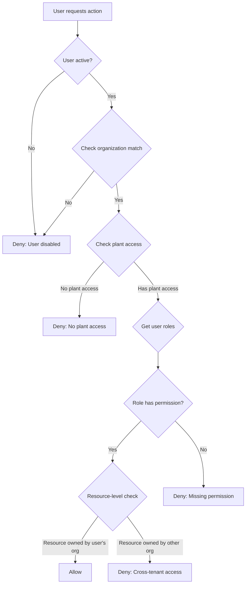
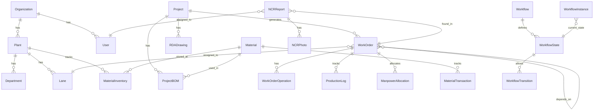
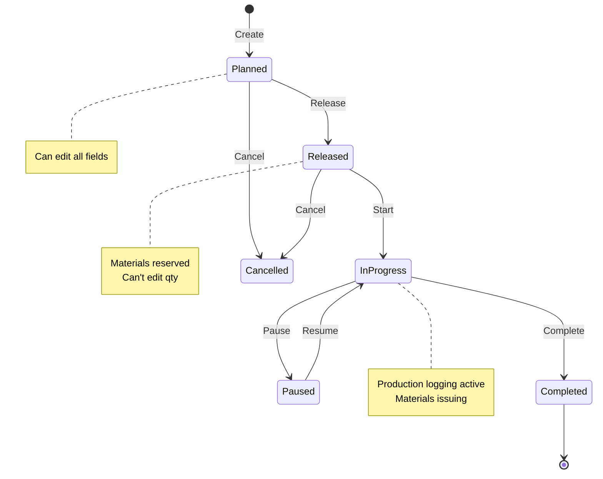

# Functional Requirements Document - Overview
# Unison Manufacturing ERP

**Version**: 4.0
**Date**: 2025-11-08
**Owner**: Product + Engineering

---

## Purpose

This document specifies **HOW THE SYSTEM BEHAVES** from a functional perspective. It defines:
- Business rules (when X happens, system does Y)
- Workflows and processes
- Data relationships
- Validation rules
- API contracts (inputs/outputs, not implementation)
- UI behavior (what user sees, not how it's rendered)

**Out of Scope**: Technical implementation, code, database schemas, infrastructure (see Architecture Doc).

---

## Document Structure

The FRD has been split into domain-specific files for better LLM consumption. See [FRD_INDEX.md](FRD_INDEX.md) for the complete table of contents.

**Domain Files**:
- **FRD_MATERIAL_MANAGEMENT.md** - Material costing, validation, inventory
- **FRD_WORK_ORDERS.md** - Work order rules, dependencies, costing, scheduling
- **FRD_QUALITY.md** - NCR rules, inspection plans, quality metrics
- **FRD_EQUIPMENT.md** - Equipment management, OEE, utilization
- **FRD_MAINTENANCE.md** - Preventive maintenance, downtime tracking
- **FRD_TRACEABILITY.md** - Serial/lot tracking, genealogy, recalls
- **FRD_SHIFTS.md** - Shift management, handovers, performance
- **FRD_ONBOARDING.md** - Self-service onboarding workflow
- **FRD_WORKFLOWS.md** - Generic workflows, notifications, integrations
- **FRD_API_CONTRACTS.md** - All API endpoint specifications
- **FRD_UI_BEHAVIOR.md** - UI behavior, forms, reporting

---

## Multi-Tenancy Isolation Rules

**Rule**: Each organization's data is completely isolated at the database level using Row-Level Security (RLS).

**Isolation Mechanisms**:

1. **Subdomain Routing**:
   - Each organization gets unique subdomain: `{org_slug}.unison.com`
   - System extracts `org_slug` from subdomain on each request
   - Validates organization exists and is active
   - If invalid subdomain → Show "Organization not found" page

2. **Row-Level Security (RLS) Enforcement**:
   - Every database query automatically filters by `organization_id`
   - RLS policies enforced at PostgreSQL level (not application layer)
   - Impossible to query data from other organizations even with SQL injection
   - Example: `SELECT * FROM materials` → PostgreSQL auto-adds `WHERE organization_id = current_org_id`

3. **Plant Switching Behavior**:
   - User can belong to multiple plants within same organization
   - Plant selection stored in session (JWT claim: `current_plant_id`)
   - User clicks plant dropdown → System updates JWT → Refreshes page
   - All queries filter by both `organization_id` AND `current_plant_id`
   - Switch time requirement: <2 seconds

4. **Cross-Tenant Prevention**:
   - Foreign key relationships enforce same `organization_id`
   - Example: Cannot assign Material from Org A to Work Order from Org B
   - Database constraint prevents data mixing even if application has bug
   - All joins require matching `organization_id`

**User Access Rules**:
- User belongs to ONE organization only (cannot switch organizations)
- User can access MULTIPLE plants within their organization
- Admin users see all plants, regular users see assigned plants only
- Plant-level permissions evaluated after organization-level access

**Example Flow**:
```
Request: GET https://acme.unison.com/api/materials
1. Extract org_slug = "acme"
2. Lookup Organization where slug = "acme" → org_id = 123
3. Extract JWT → current_plant_id = 5
4. Query: SELECT * FROM materials WHERE organization_id = 123 AND plant_id = 5
5. PostgreSQL RLS auto-enforces organization_id = 123 (double protection)
```

---

## White-Labeling Behavior Rules

**Rule**: Organizations can customize branding elements to match their corporate identity.

**Customizable Elements**:

1. **Logo**:
   - Uploaded as image file (PNG, JPG, SVG)
   - Max file size: 2MB
   - Displayed in: Navigation bar (top-left), login page, email templates
   - Fallback: Unison default logo if not configured

2. **Color Scheme**:
   - Primary color (hex code): Used for buttons, links, active states
   - Secondary color (hex code): Used for highlights, badges
   - Accent color (hex code): Used for warnings, alerts
   - Applied via CSS variables: `--color-primary`, `--color-secondary`, `--color-accent`

3. **Favicon**:
   - Uploaded as .ico or .png file (16x16, 32x32, 64x64)
   - Shown in browser tab
   - Fallback: Unison default favicon

4. **Email Templates**:
   - Organization logo inserted in email header
   - Primary color used for email buttons and headers
   - Organization name used in email footer
   - Example: "This notification was sent by {Organization Name}"

**Application Hierarchy**:
```
1. Check organization settings for branding elements
2. If found → Apply organization branding
3. If not found → Apply Unison default branding
4. No cascading (no plant-level branding overrides)
```

**Caching Behavior**:
- Branding elements cached for 1 hour
- On branding update → Invalidate cache
- Users see new branding after next page refresh (no forced logout)

**Validation Rules**:
- Logo aspect ratio: Must be between 1:4 and 4:1 (reject extreme ratios)
- Color codes: Must be valid 6-digit hex codes (e.g., #FF5733)
- File types: Only PNG, JPG, SVG, ICO accepted

---

## RBAC Permission Evaluation Rules

**Rule**: User permissions evaluated hierarchically using Role-Based Access Control (RBAC) with resource-level granularity.

**Permission Check Algorithm**:



**Role Hierarchy** (Highest to Lowest):
1. **System Admin**: All permissions, all organizations
2. **Organization Admin**: All permissions within organization
3. **Plant Manager**: All permissions within assigned plants
4. **Department Head**: Department-level permissions
5. **Supervisor**: Work order and production management
6. **Operator**: Production logging only
7. **QC Inspector**: Quality management only
8. **Viewer**: Read-only access

**Permission Inheritance**:
- Higher roles inherit all permissions from lower roles
- Example: Plant Manager has all Supervisor permissions + more
- Cannot remove inherited permissions (only add new ones)

**Permission Format**: `{resource}:{action}`
- Examples: `materials:read`, `work_orders:write`, `ncr:approve`
- Wildcard supported: `materials:*` (all material actions)

**Resource-Level Access Rules**:

1. **Organization-Scoped**:
   - User can only access resources in their organization
   - Even if role has permission, cross-org access denied
   - Example: User in Org A cannot see materials from Org B

2. **Plant-Scoped**:
   - User can only access resources in assigned plants
   - Admin users can access all plants in their organization
   - Example: Supervisor assigned to Plant 1 cannot manage Plant 2 work orders

3. **User-Scoped** (Limited cases):
   - Users can only edit their own profile
   - Users can only view their own production logs
   - Exception: Managers can view subordinates' logs

**Permission Caching**:
- User permissions cached in JWT (expires in 8 hours)
- On role change → Invalidate all user sessions → Force re-login
- Permission changes take effect immediately for new logins
- Existing sessions use cached permissions until expiry

**Example Evaluation**:
```
Request: PUT /api/work-orders/123/start
User: john@acme.com (Role: Supervisor, Plant: Plant 1)

Check 1: User active? → Yes
Check 2: Organization match? → Work order org = Acme, User org = Acme → Yes
Check 3: Plant access? → Work order plant = Plant 1, User plants = [Plant 1] → Yes
Check 4: Permission? → Supervisor role has work_orders:write → Yes
Check 5: Resource ownership? → Same org, same plant → Yes
Result: ALLOW
```

---

## Data Relationships

### Entity Relationship Diagram



**Key Relationships**:

- **One Organization** → **Many Plants** (1:N)
- **One Plant** → **Many Lanes** (1:N)
- **One Project** → **Many Work Orders** (1:N)
- **One Work Order** → **Many Production Logs** (1:N)
- **One Work Order** → **One Lane** (N:1, at a time)
- **Work Orders** → **Work Orders** (N:M, dependencies)
- **One Material** → **Many Inventory Records** (1:N, one per plant/location)
- **One NCR** → **Many Photos** (1:N)
- **One Workflow** → **Many States** → **Many Transitions** (1:N:M)

### Work Order Lifecycle



**State Transitions**:
- **Planned**: Draft state, can edit all fields
- **Released**: Locked for production, materials reserved, assigned to lane
- **In Progress**: Work started, operators logging production
- **Paused**: Temporarily stopped (waiting for materials, equipment issue, etc.)
- **Completed**: All operations finished, qty completed = qty ordered
- **Cancelled**: Terminated (order cancelled, no longer needed)

**Rules**:
- Can only start if status = Released
- Can only complete if qty completed = qty ordered
- Cannot delete (can only cancel for audit trail)
- Once completed, fields locked (cannot edit)

---

## See Also

- [FRD_MATERIAL_MANAGEMENT.md](FRD_MATERIAL_MANAGEMENT.md) - Material and inventory management
- [FRD_WORK_ORDERS.md](FRD_WORK_ORDERS.md) - Work order rules and workflows
- [FRD_QUALITY.md](FRD_QUALITY.md) - Quality control and NCR management
- [FRD_ONBOARDING.md](FRD_ONBOARDING.md) - Self-service onboarding workflow
- [FRD_INDEX.md](FRD_INDEX.md) - Complete FRD index

---

**Document Status**: Active
**Last Updated**: 2025-11-10
**Approvals**: Pending Product, Engineering, QA
