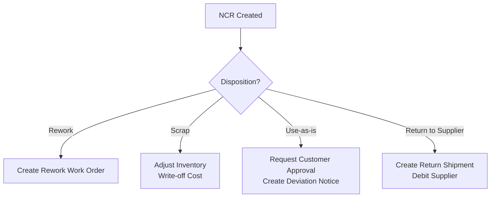
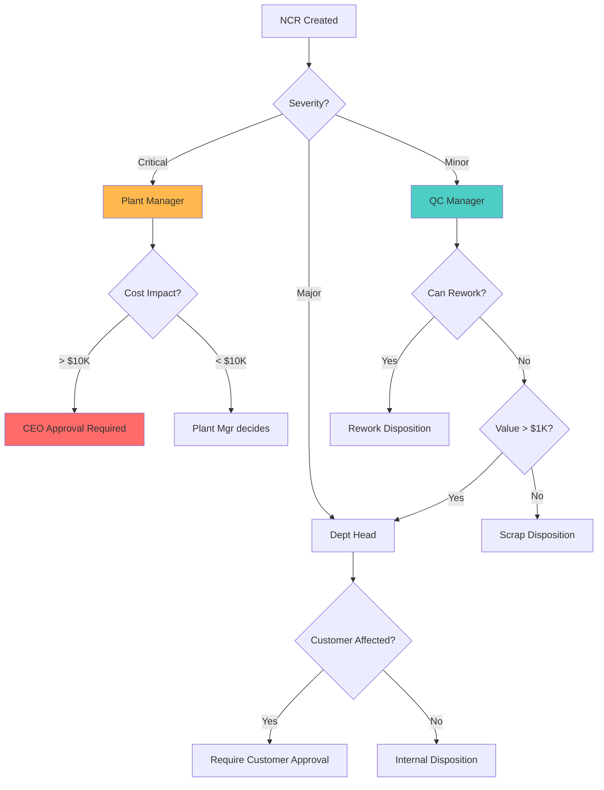
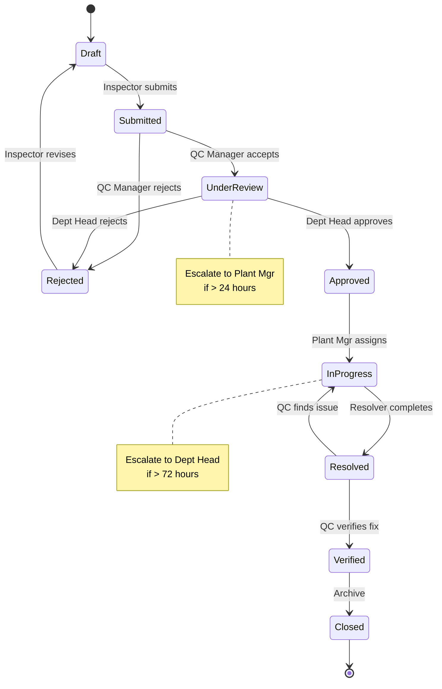

# Functional Requirements Document - Quality Management
# Unison Manufacturing ERP

**Version**: 4.0
**Date**: 2025-11-10
**Domain**: NCR, Inspections, Quality Control

---

## NCR Disposition Rules

**Rule**: Each NCR must have a disposition that triggers specific actions.

**Disposition Types** (configurable per organization):



**Behavior per Disposition**:

1. **Rework**:
   - Create new work order (type = "rework")
   - Link to original work order
   - Copy material requirements
   - Assign to supervisor
   - Track rework cost separately

2. **Scrap**:
   - Create material transaction (type = "scrap", quantity = negative)
   - Decrease inventory
   - Record scrap cost on NCR
   - Update work order cost

3. **Use-as-is**:
   - Send notification to customer (if configured)
   - Require customer approval (if configured)
   - Create deviation document
   - Proceed with delivery

4. **Return to Supplier**:
   - Create return shipment
   - Link to supplier
   - Send return notification to supplier
   - Track return cost for chargebacks

### NCR Disposition Decision Tree (Conditional Routing)



---

## NCR Approval Workflow (Standard Template)



**States**:
1. **Draft**: Inspector editing (can add photos, change severity)
2. **Submitted**: Waiting for QC Manager review
3. **Under Review**: QC Manager analyzing
4. **Rejected**: Sent back to inspector (requires comment)
5. **Approved**: Waiting for Plant Manager to assign resolver
6. **In Progress**: Resolver working on fix
7. **Resolved**: Fix completed, awaiting verification
8. **Verified**: QC confirmed fix
9. **Closed**: Final state

**Transitions**:
- **Submit**: Inspector → QC Manager (auto-email notification)
- **Accept**: QC Manager → Dept Head (if severity ≥ Major)
- **Reject**: Any approver → Inspector (requires comment)
- **Approve**: Dept Head → Plant Manager (auto-email)
- **Assign**: Plant Manager selects resolver → Resolver (auto-email)
- **Resolve**: Resolver marks complete (requires description of fix)
- **Verify**: QC Inspector confirms (in-person check)
- **Close**: Automatic (no further action required)

**Escalations**:
- If Under Review > 24 hours → Email Plant Manager
- If In Progress > 72 hours → Email Dept Head

**Conditional Routing**:
- If severity = Critical → Skip Dept Head, go straight to Plant Manager
- If severity = Minor → QC Manager can approve directly (no Dept Head)

---

## Inspection Plan Rules

**Rule**: Products require in-process quality checks at defined inspection points.

**Inspection Characteristics**:
- **Name**: (e.g., "Shaft Diameter", "Weld Strength", "Color Match")
- **Type**: Dimensional, Weight, Visual, Functional Test
- **Specification**: Target value (e.g., 25mm, 500g, "Pass/Fail")
- **Tolerance**: ±range (e.g., ±0.1mm) or Pass/Fail
- **Measurement Method**: Tool/procedure (e.g., "Micrometer", "Visual comparison to sample")
- **Upper Spec Limit (USL)**: Maximum acceptable value
- **Lower Spec Limit (LSL)**: Minimum acceptable value

**Inspection Frequency Types**:
1. **First Piece**: Inspect first unit of production run
2. **Periodic**: Every N units (e.g., every 50 units)
3. **Sampling**: Statistical sampling plan (AQL-based)
4. **Final**: 100% inspection at end

**Statistical Process Control (SPC)**:

**Cp/Cpk Calculation** (Process Capability):
```
Cp = (USL - LSL) / (6 × σ)
Cpk = min[(USL - μ) / (3 × σ), (μ - LSL) / (3 × σ)]

Where:
- USL/LSL = Upper/Lower Spec Limits
- μ = Process mean
- σ = Process standard deviation

Interpretation:
- Cpk ≥ 1.67: Excellent (5σ capable)
- Cpk ≥ 1.33: Good (4σ capable)
- Cpk ≥ 1.00: Marginal (3σ capable)
- Cpk < 1.00: Poor (process improvement required)
```

**Control Chart Rules** (Auto-generate alerts):
- Point outside control limits (±3σ) → Alert
- 7+ consecutive points above/below center line → Trend alert
- 2 out of 3 points > 2σ from center → Warning alert

**Behavior**:
- **On Inspection Due**: Notify inspector via mobile app
- **On Failed Inspection**: Auto-create NCR, pause work order
- **On Control Limit Violation**: Alert quality manager
- **Daily**: Calculate Cp/Cpk for critical characteristics
- **Weekly**: Review control charts, identify trends

---

## NCR Validation Rules

### On Create
- NCR Number: Auto-generated, unique
- NCR Type: Required, must be from organization's configured list
- Severity: Required, must be from: Minor, Major, Critical
- Description: Required, 10-5000 characters
- Work Order or Project: At least one must be provided (where was defect found?)
- Photos: Optional, max 10 photos, max 10MB per photo

### On Disposition
- Disposition Type: Required, must be from organization's configured list
- If disposition = Rework → Rework cost must be provided
- If disposition = Scrap → Scrap quantity must be provided

---

## See Also

- [FRD_WORK_ORDERS.md](FRD_WORK_ORDERS.md) - Work order lifecycle and rework
- [FRD_WORKFLOWS.md](FRD_WORKFLOWS.md) - Custom workflow configuration
- [FRD_TRACEABILITY.md](FRD_TRACEABILITY.md) - Defect traceability and recalls
- [FRD_API_CONTRACTS.md](FRD_API_CONTRACTS.md) - NCR and inspection API endpoints
- [FRD_INDEX.md](FRD_INDEX.md) - Complete FRD index

---

**Document Status**: Active
**Last Updated**: 2025-11-10
**Line Count**: ~210 lines
