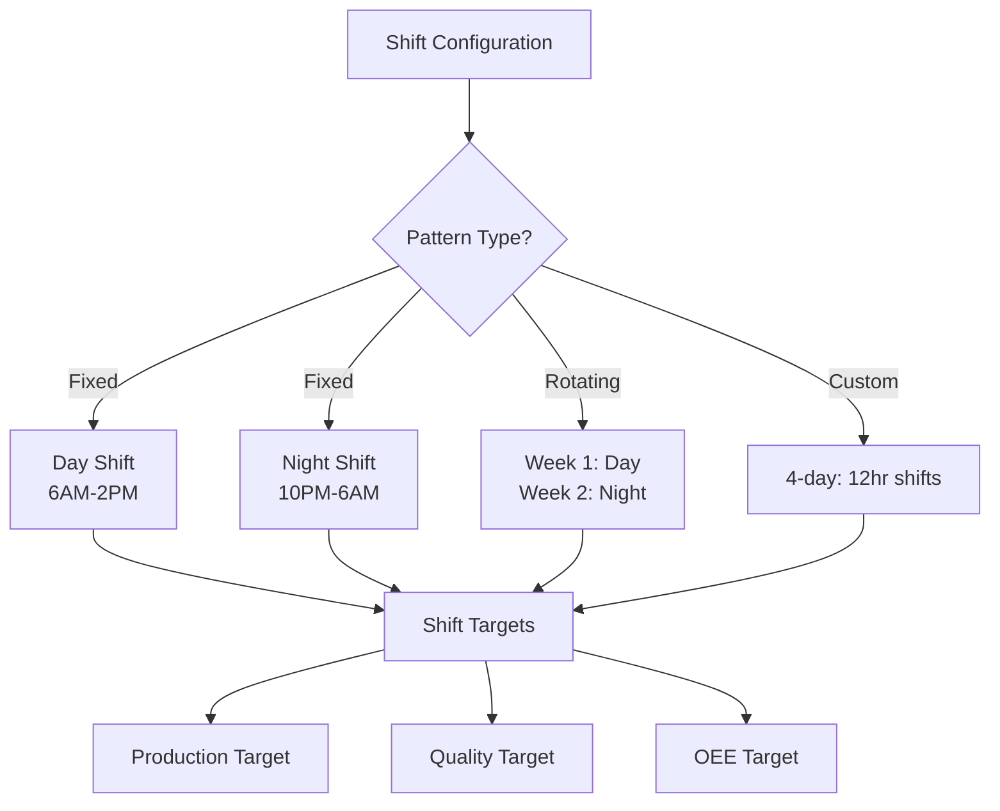
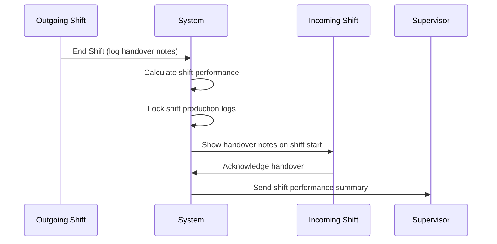

# Functional Requirements Document - Shift Management
# Unison Manufacturing ERP

**Version**: 4.0
**Date**: 2025-11-10
**Domain**: Shifts, Handovers, Shift Performance

---

### 2.13 Shift Management Rules

**Rule**: Multi-shift plants define shift patterns and track performance per shift.

**Shift Pattern Types**:

**Shift Definition Fields**:
- Shift Name (e.g., "Day Shift", "Night Shift", "A Shift")
- Start Time (e.g., 06:00)
- End Time (e.g., 14:00)
- Break Duration (e.g., 30 minutes)
- Days Active (Mon-Sun selection)
- Production Target (units per shift)
- OEE Target (percentage)

**Shift Performance Calculation**:

**Metrics per Shift**:
1. **Actual Production** = Sum of units completed during shift hours
2. **Target Attainment** = (Actual / Target) × 100
3. **Shift OEE** = OEE calculated only for shift hours
4. **Shift Downtime** = Total downtime minutes during shift
5. **Shift Quality** = (Good units / Total units) during shift

**Shift Handover Behavior**:

**Handover Rules**:
- Outgoing shift must log handover notes (required)
- Handover notes include: WIP status, issues, blocked work orders
- Incoming shift must acknowledge handover (mark as read)
- System auto-generates performance summary at shift end
- Supervisor receives email with shift metrics

**Shift Comparison Reports**:
- Compare same shift across different days (e.g., all Day Shifts this week)
- Compare different shifts on same day (Day vs Night)
- Identify lowest-performing shift for targeted improvement
- Track shift target attainment trends

**Behavior**:
- **On Shift Start**: System identifies current shift from clock time
- **On Production Log**: Tag log with current shift_id
- **On Shift End**: Auto-calculate shift KPIs, send notifications
- **On Report View**: Filter/group by shift automatically

---

## See Also

- [FRD_EQUIPMENT.md](FRD_EQUIPMENT.md) - Shift-based OEE calculations
- [FRD_WORK_ORDERS.md](FRD_WORK_ORDERS.md) - Production logs tagged by shift
- [FRD_API_CONTRACTS.md](FRD_API_CONTRACTS.md) - Shift management API endpoints
- [FRD_INDEX.md](FRD_INDEX.md) - Complete FRD index

---

**Document Status**: Active
**Last Updated**: 2025-11-10
**Line Count**: ~95 lines
