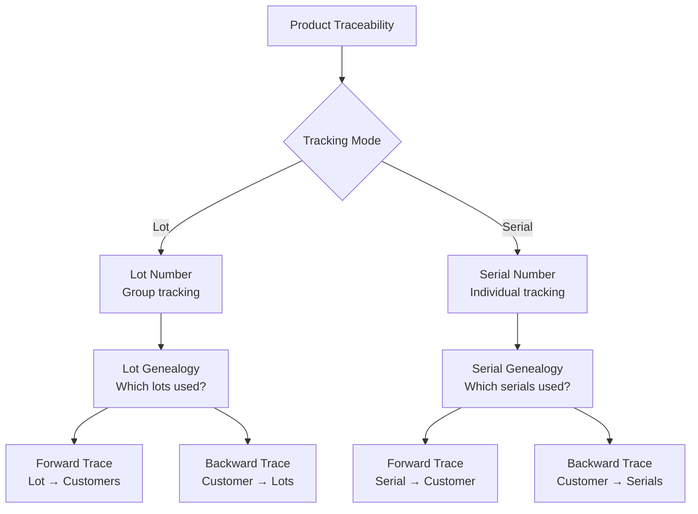
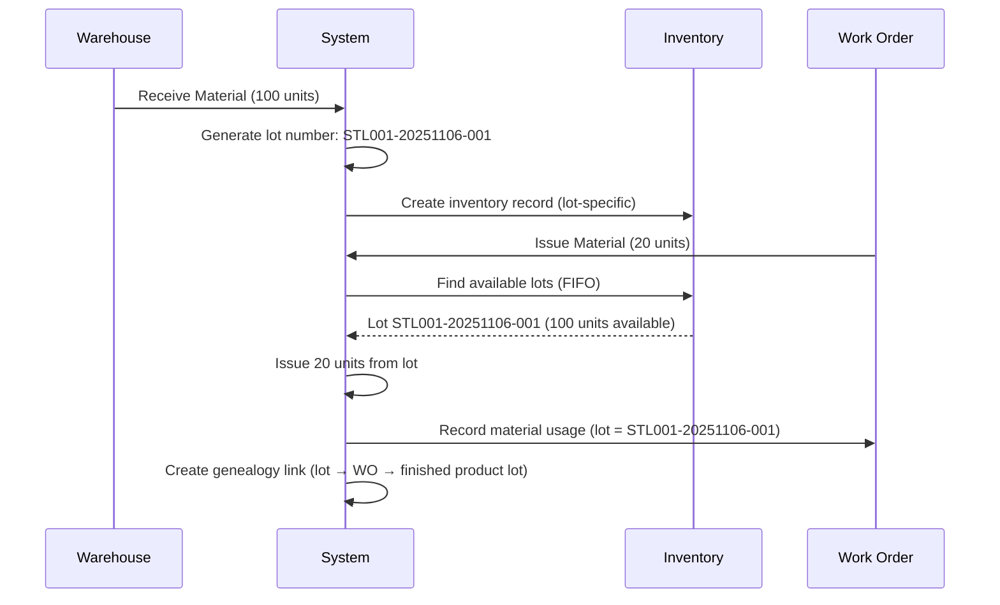

# Functional Requirements Document - Traceability
# Unison Manufacturing ERP

**Version**: 4.0
**Date**: 2025-11-10
**Domain**: Serial Numbers, Lot Tracking, Genealogy, Recalls

---

### 2.17 Serial Number & Lot Traceability Rules

**Rule**: Critical products require complete forward and backward traceability.

**Traceability Modes**:



**Lot Tracking Rules**:

**Lot Number Format** (Configurable):
- Pattern: `{Material Code}-{YYYYMMDD}-{Sequence}`
- Example: `STL001-20251106-001`
- Auto-generated on material receipt
- Unique per organization

**Lot Assignment Behavior**:


**Lot Genealogy Recording**:
- **Material Issue**: Record which lot(s) issued to which work order
- **Production Complete**: Generate finished goods lot number
- **Genealogy Link**: Map input lots → work order → output lot
- **Multi-Level**: Track through multiple production stages

**Serial Number Tracking Rules**:

**Serial Number Format** (Configurable):
- Pattern: `{Product Code}-{YYMM}-{Sequence}`
- Example: `PUMP-2511-00001`
- Auto-generated when work order completes
- Can also be scanned from physical label

**Serial Assignment Methods**:
1. **Auto-Generate**: System assigns sequential numbers
2. **Manual Entry**: Operator scans existing serial from label
3. **Pre-Assigned**: Serials assigned before production starts

**Serial Genealogy Recording**:

```
Work Order WO-123: Produce 5 pumps

Input Materials (with lots):
- Motor: Lot MOT-20251101-001 (serials: MOT-001, MOT-002, MOT-003, MOT-004, MOT-005)
- Housing: Lot HSG-20251102-001
- Gasket: Lot GSK-20251103-001

Output (finished goods with serials):
- PUMP-2511-00001 (used: MOT-001, HSG-20251102-001, GSK-20251103-001)
- PUMP-2511-00002 (used: MOT-002, HSG-20251102-001, GSK-20251103-001)
- PUMP-2511-00003 (used: MOT-003, HSG-20251102-001, GSK-20251103-001)
- PUMP-2511-00004 (used: MOT-004, HSG-20251102-001, GSK-20251103-001)
- PUMP-2511-00005 (used: MOT-005, HSG-20251102-001, GSK-20251103-001)

Genealogy links stored for forward/backward tracing
```

**Traceability Queries**:

**Forward Trace** (Recall scenario):
```
Input: Defective material lot HSG-20251102-001
Query: Which finished products contain this lot?
Output: All PUMP serials that used this housing lot
Action: Contact customers who received these pumps
```

**Backward Trace** (Customer complaint):
```
Input: Customer complaint about PUMP-2511-00003
Query: Which material lots were used in this pump?
Output: 
- Motor: MOT-20251101-001 (serial MOT-003)
- Housing: HSG-20251102-001
- Gasket: GSK-20251103-001
Action: Investigate supplier quality for these lots
```

**Recall Report Generation**:
- Input: Material lot number OR finished goods lot/serial
- Output: Complete list of affected customers with:
  - Customer name, address
  - Products shipped (serial numbers)
  - Ship date
  - Contact information
- Export: CSV, PDF for rapid recall response

**Behavior**:
- **On Material Receipt**: Generate lot number, record in genealogy
- **On Material Issue**: Link lot to work order
- **On Production Complete**: Generate finished goods lot/serials
- **On Serial Scan**: Instant genealogy lookup
- **On Recall Query**: Generate affected customers list in <1 minute


---

## See Also

- [FRD_MATERIAL_MANAGEMENT.md](FRD_MATERIAL_MANAGEMENT.md) - Material receipt and lot generation
- [FRD_WORK_ORDERS.md](FRD_WORK_ORDERS.md) - Production genealogy tracking
- [FRD_QUALITY.md](FRD_QUALITY.md) - NCR tracking with serial numbers
- [FRD_API_CONTRACTS.md](FRD_API_CONTRACTS.md) - Traceability API endpoints
- [FRD_INDEX.md](FRD_INDEX.md) - Complete FRD index

---

**Document Status**: Active
**Last Updated**: 2025-11-10
**Line Count**: ~140 lines
