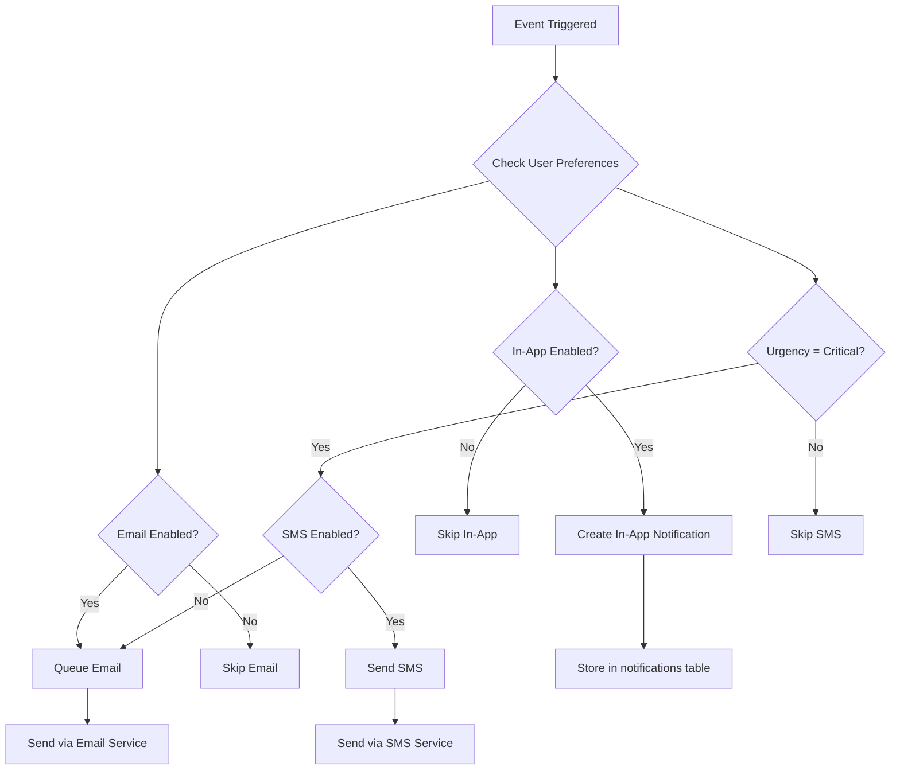
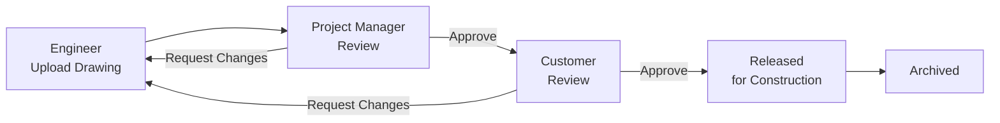
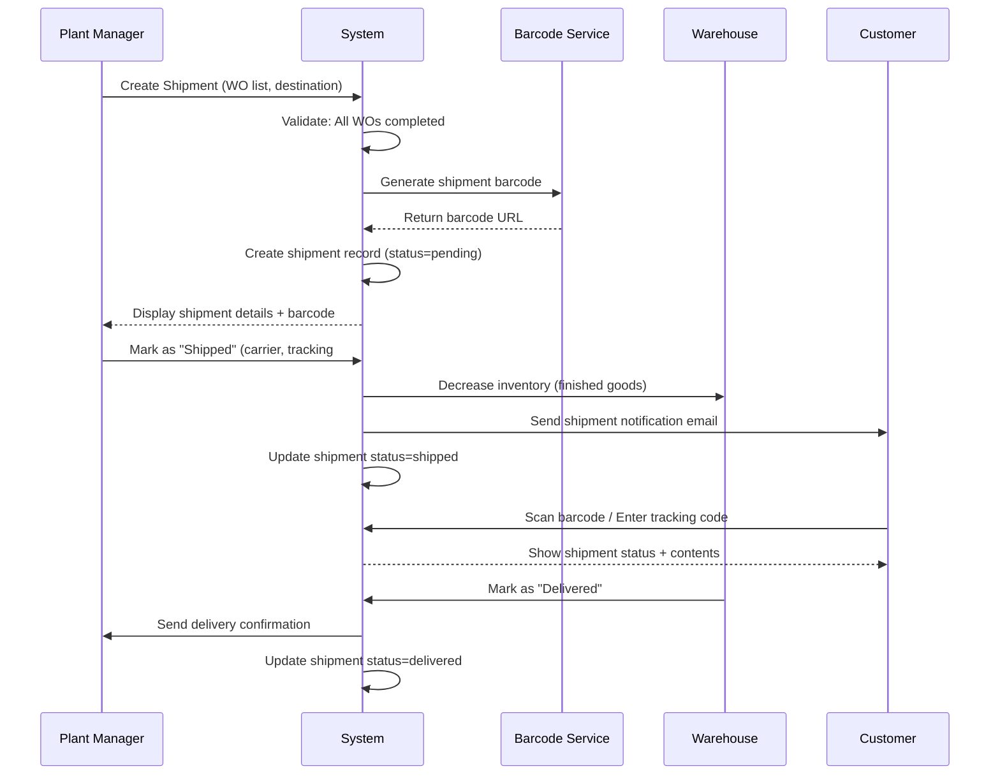
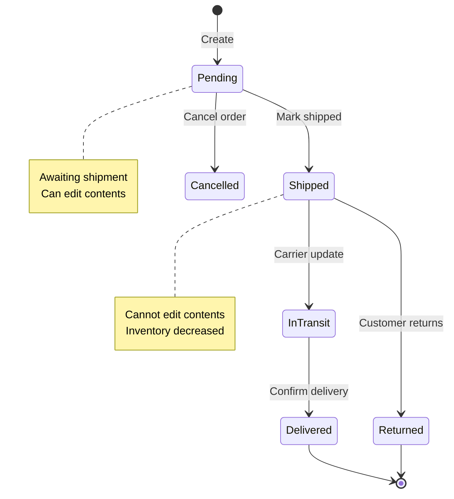
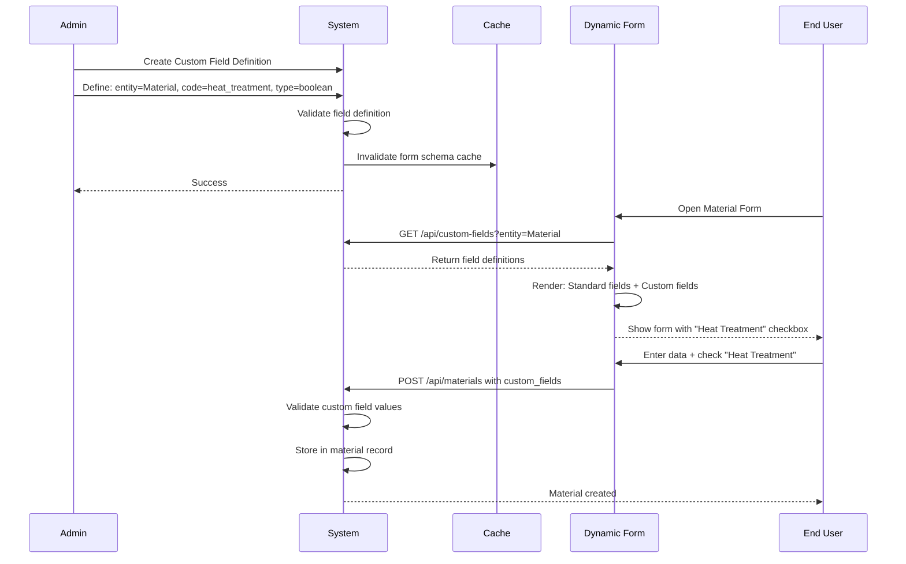

# Functional Requirements Document - Workflows & Integrations
# Unison Manufacturing ERP

**Version**: 4.0
**Date**: 2025-11-10
**Domain**: Workflows, Notifications, SAP Integration, Custom Workflows

---

### 2.9 SAP Integration Sync Rules

**Rule**: Unison syncs specific entities with SAP ERP bi-directionally on scheduled intervals.

**Sync Trigger Conditions**:

1. **Scheduled Sync** (Primary):
   - Runs every 15 minutes for critical entities
   - Runs every 4 hours for non-critical entities
   - Critical: Materials, Work Orders, Inventory
   - Non-critical: Projects, BOMs, Suppliers

2. **Event-Driven Sync** (Optional):
   - Work order completed → Immediate sync to SAP
   - Material received → Immediate sync to SAP
   - NCR disposition approved → Immediate sync to SAP

3. **Manual Sync**:
   - Admin can trigger "Sync Now" button
   - Syncs all pending changes immediately

**Data Mapping Rules**:

**Materials** (Unison → SAP):
```
Unison Field          → SAP Field
material_code         → MATNR (Material Number)
name                  → MAKTX (Material Description)
standard_cost         → STPRS (Standard Price)
unit_of_measure       → MEINS (Base Unit of Measure)
```

**Work Orders** (Unison → SAP Production Orders):
```
Unison Field          → SAP Field
work_order_number     → AUFNR (Order Number)
quantity_ordered      → GAMNG (Total Order Quantity)
quantity_completed    → GMNGA (Confirmed Yield)
actual_material_cost  → Material actual costs
actual_labor_cost     → Activity actual costs
```

**Conflict Resolution Logic**:

1. **Last Write Wins** (Default):
   - If Unison updated at 10:00 AM, SAP updated at 10:05 AM
   - SAP wins (newer timestamp)
   - Unison data overwritten on next sync

2. **Field-Level Merge** (For specific entities):
   - Inventory quantity: SAP is source of truth (always sync from SAP to Unison)
   - Work order status: Unison is source of truth (always sync from Unison to SAP)
   - Material master data: SAP is source of truth

3. **Error Handling**:
   - If sync fails (SAP offline, validation error):
     - Mark entity as "sync_pending"
     - Retry on next sync cycle (exponential backoff: 15min, 1hr, 4hr)
     - After 3 failed retries → Send alert to admin
     - Admin must manually resolve conflict

**Sync Status Indicator**:
- Green checkmark: Successfully synced
- Yellow clock: Pending sync
- Red X: Sync failed (requires attention)

**Mock Adapter Behavior** (MVP Phase):
- Simulates SAP responses with 200ms delay
- Returns success for all operations
- Does NOT persist data (logs only)
- Allows testing integration flows without real SAP
### 2.11 Notification Trigger Rules

**Rule**: System sends notifications on specific events via email and in-app channels.

**Notification Triggers**:

| Event | Recipients | Delivery Method | Urgency |
|-------|-----------|-----------------|---------|
| Work Order Created | Assigned Supervisor | Email + In-app | Normal |
| Work Order Started | Supervisor + Plant Manager | In-app | Normal |
| Work Order Completed | Supervisor + Plant Manager | Email + In-app | Normal |
| NCR Created | QC Manager | Email + In-app | High |
| NCR Critical Severity | Plant Manager + Dept Head | Email + SMS | Critical |
| Material Below Reorder Point | Procurement + Supervisor | Email | High |
| Drawing Awaiting Approval | Assigned Approver | Email | Normal |
| Workflow Escalation (>24hrs) | Manager's Manager | Email | High |
| Production Target Missed | Supervisor + Plant Manager | Email + In-app | High |
| Shipment Delivered | Plant Manager + Customer | Email | Normal |

**Notification Delivery Rules**:



**User Preference Management**:
- Users can enable/disable each channel per notification type
- Default: Email ON, In-App ON, SMS OFF (except Critical)
- Critical notifications cannot be fully disabled (always in-app)

**Retry Logic**:
- Email failed → Retry 3 times (1min, 5min, 15min intervals)
- After 3 failures → Mark as "failed", alert admin
- In-app never fails (stored in database)
- SMS failed → Log error, no retry (too expensive)

**Batch Processing**:
- Low urgency notifications batched (sent every hour)
- Normal/High urgency sent immediately
- Critical sent immediately via all enabled channels


### 3.4 Drawing Approval Flow



**Steps**:
1. **Engineer Uploads**:
   - Uploads drawing file (PDF, DWG, DXF)
   - Enters: Drawing number, revision, description
   - Submits for review
   
2. **Project Manager Reviews**:
   - Receives email notification
   - Views drawing (inline PDF viewer)
   - Options: Approve, Request Changes (requires comment)
   - If approved → Routes to customer

3. **Customer Reviews** (if configured):
   - Customer receives email with link
   - Views drawing (read-only)
   - Options: Approve, Request Changes
   - If approved → Drawing marked "Released for Construction"

4. **Engineer Revises** (if changes requested):
   - Uploads new version (increments revision number)
   - Process repeats

5. **Released**:
   - Drawing locked (no further edits)
   - Production can begin
   - Drawing appears in "Approved Drawings" report

**Revision Control**:
- Each upload creates new version
- Revision number auto-increments (Rev A, Rev B, ...)
- Old versions remain accessible (audit trail)
- Can compare versions (visual diff highlights changes)

**Notifications**:
- Email on each state change
- Escalate to manager if project manager doesn't review in 48 hours

---

### 3.5 Shipment Creation & Tracking Flow



**Steps**:

1. **Create Shipment**:
   - Plant Manager selects completed work orders to ship
   - Enters destination address, customer info
   - System validates: All work orders must be in "completed" status
   - System generates unique shipment number (e.g., SHIP-2025-001)
   - System generates barcode (QR code with shipment URL)

2. **Pack & Ship**:
   - Warehouse prints shipment barcode (attached to packing slip)
   - Physical items packed for shipping
   - Plant Manager marks shipment as "Shipped"
   - Enters: Carrier name, tracking number, ship date
   - System decreases finished goods inventory
   - System sends email to customer with tracking details

3. **Track Shipment**:
   - Customer scans barcode or visits tracking URL
   - System shows: Shipment status, contents list, estimated delivery
   - Status updates: Pending → Shipped → In Transit → Delivered

4. **Receive & Confirm**:
   - Customer receives shipment
   - Warehouse marks as "Delivered" (or customer confirms online)
   - System sends delivery confirmation to plant manager
   - Shipment closed

**Shipment Status States**:



**Barcode Lifecycle**:
1. **Generation**: Created when shipment created (stored in MinIO)
2. **Printing**: Downloaded as PNG/PDF for packing slip
3. **Scanning**: Customer or warehouse scans to view/update status
4. **Tracking**: Barcode contains shipment ID for instant lookup
5. **Archival**: Remains accessible for 7 years (audit trail)

**Validation Rules**:
- Cannot ship work order that is not completed
- Destination address required
- Carrier and tracking number required when marking "Shipped"
- Cannot edit shipment contents after status = "Shipped"
- Cannot delete shipment (can only cancel)

**Notifications**:
- Customer receives email when status changes to "Shipped"
- Plant manager receives email when status changes to "Delivered"
- If shipment not delivered in 14 days → Alert plant manager

## 6. API Contracts

**Custom Field Configuration Flow**:



---

## See Also

- [FRD_QUALITY.md](FRD_QUALITY.md) - NCR approval workflow
- [FRD_WORK_ORDERS.md](FRD_WORK_ORDERS.md) - Drawing approval workflow
- [FRD_OVERVIEW.md](FRD_OVERVIEW.md) - Multi-tenancy and RBAC
- [FRD_API_CONTRACTS.md](FRD_API_CONTRACTS.md) - Workflow API endpoints
- [FRD_INDEX.md](FRD_INDEX.md) - Complete FRD index

---

**Document Status**: Active
**Last Updated**: 2025-11-10
**Line Count**: ~350 lines
