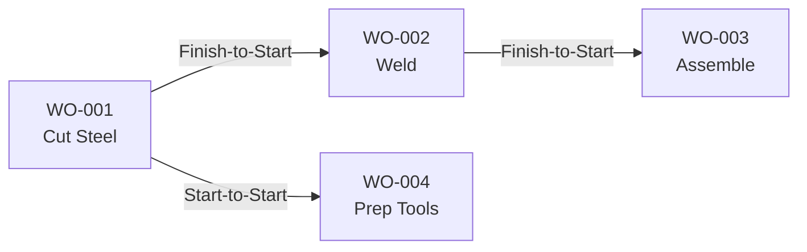
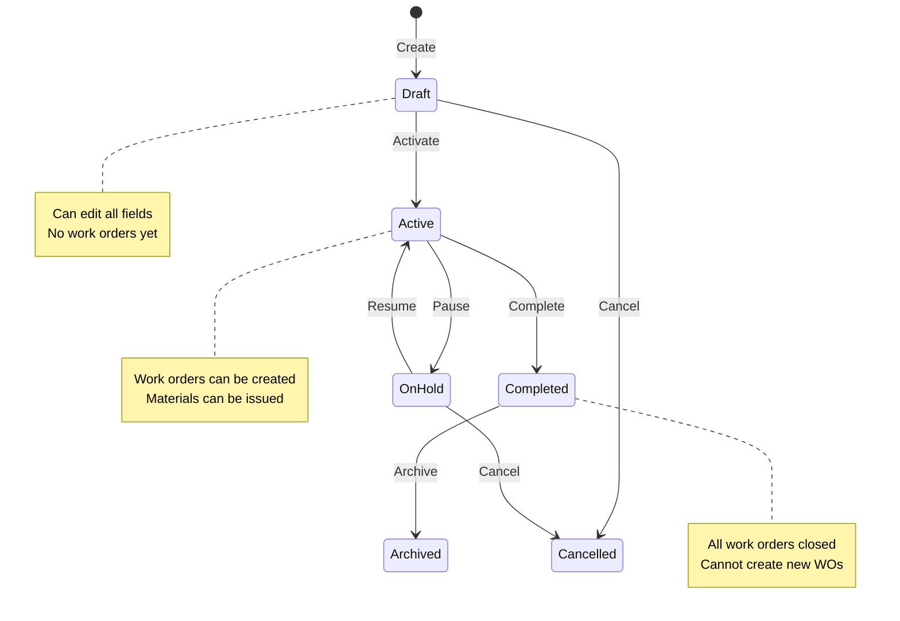
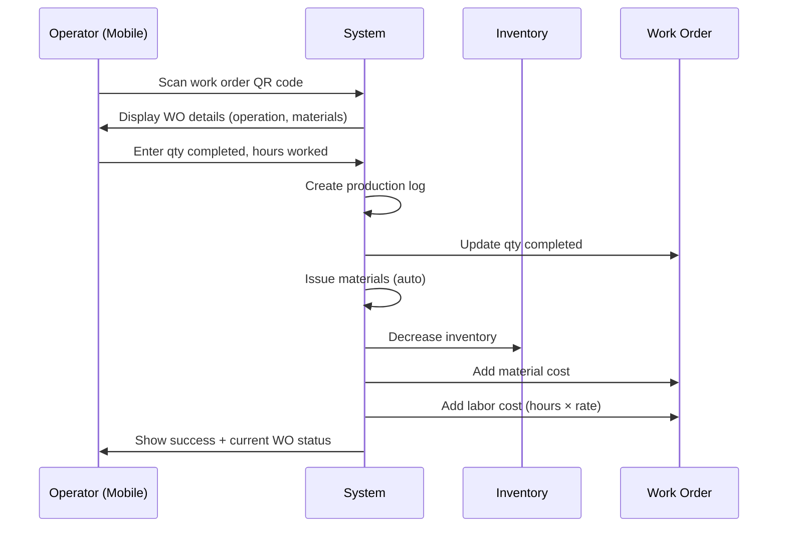

# Functional Requirements Document - Work Orders
# Unison Manufacturing ERP

**Version**: 4.0
**Date**: 2025-11-10
**Domain**: Work Orders, Production Planning, Scheduling

---

## Work Order Dependency Rules

**Rule**: Work orders can depend on other work orders.

**Dependency Types**:
1. **Finish-to-Start**: WO-B cannot start until WO-A completes
2. **Start-to-Start**: WO-B cannot start until WO-A starts
3. **Finish-to-Finish**: WO-B cannot finish until WO-A finishes

**Behavior**:
- **On WO Start Attempt**: Check all dependencies
  - If any blocking dependency not met → Show error "Waiting for WO-XXX to {complete/start}"
  - If all dependencies met → Allow start
- **On Dependency Status Change**: Notify dependent work orders
  - WO-A completes → Check if any WO-Bs can now start → Send notifications

**Example**:


- WO-002 cannot start until WO-001 is complete
- WO-003 cannot start until WO-002 is complete
- WO-004 can start as soon as WO-001 starts (doesn't need to wait for completion)

---

## Work Order Costing Rules

**Rule**: Work orders accumulate actual costs as work progresses.

**Cost Components**:
1. **Material Cost** = Sum of all material issues to this work order (calculated by costing method)
2. **Labor Cost** = Sum of (hours worked × worker hourly rate)
3. **Overhead** = Labor Cost × Organization's overhead rate (e.g., 150%)
4. **Total Cost** = Material + Labor + Overhead

**Behavior**:
- **On Material Issue**: Add material cost to WO actual_material_cost
- **On Production Log**: Add (hours × rate) to WO actual_labor_cost
- **On WO Complete**: Calculate final total cost, compare to standard cost
- **Variance**: Actual Cost - Standard Cost (positive = over budget, negative = under budget)

**Example**:
```
Work Order WO-123: Fabricate 10 units of Product X

Material Issues:
- 20kg Steel @ $10/kg = $200
- 5 units Hardware @ $5/unit = $25
Material Cost Total: $225

Labor:
- Operator A: 4 hours @ $25/hour = $100
- Operator B: 2 hours @ $30/hour = $60
Labor Cost Total: $160

Overhead:
- 150% of Labor = $160 × 1.5 = $240

Total Actual Cost: $225 + $160 + $240 = $625
Cost per Unit: $625 / 10 = $62.50/unit
```

---

## Project & BOM Management Rules

**Rule**: Projects organize related work orders and track Bill of Materials (BOM) hierarchy.

**Project Lifecycle States**:



**State Behaviors**:
1. **Draft**: Project being planned, can edit all fields, cannot create work orders
2. **Active**: Production in progress, can create work orders, materials can be issued
3. **On Hold**: Temporarily paused, cannot start new work orders, existing WOs can finish
4. **Completed**: All work orders closed, project locked, cannot create new WOs
5. **Cancelled**: Project terminated, all WOs cancelled, materials unreserved
6. **Archived**: Historical record, read-only access

**BOM Hierarchy Rules**:

**Structure**: Multi-level BOM (parent-child relationships)
- **Level 0**: Finished product (e.g., "Complete Assembly")
- **Level 1**: Sub-assemblies (e.g., "Frame", "Motor Housing")
- **Level 2**: Components (e.g., "Steel Plate", "Bolts")
- **Level 3+**: Raw materials

**BOM Explosion**:
- When work order created from project → System "explodes" BOM
- Calculates total material requirements at all levels
- Example: To make 10 assemblies (each needs 2 frames, each frame needs 4 plates)
  - Material requirement: 10 × 2 × 4 = 80 plates
- Reserved quantity = BOM quantity × Work order quantity

**BOM Validation**:
- Circular dependencies not allowed (A contains B, B contains A → Error)
- Total BOM depth ≤ 10 levels (prevent infinite recursion)
- Each child must have quantity > 0
- Unit of measure must be compatible (cannot add "liters" to "pieces")

**Project-to-Work-Order Flow**:
```
1. Project Manager creates Project
2. Uploads BOM (CSV or manual entry)
3. Activates Project
4. Creates Work Order from Project
5. System generates material requirements from BOM
6. Materials reserved automatically
7. Work Order released → Production begins
```

---

## Production Logging Workflow (Mobile PWA)



**Steps**:
1. Operator opens mobile PWA
2. Scans work order QR code (or selects from "My Work Orders")
3. System shows: WO number, product, operation, materials required
4. Operator enters:
   - Quantity completed (this session)
   - Hours worked (this session)
   - Notes (optional)
5. System validates:
   - Quantity > 0
   - Quantity ≤ (Quantity ordered - Quantity already completed)
   - Hours > 0
6. System creates production log record
7. System updates work order: Qty completed += entered quantity
8. System automatically issues materials:
   - Calculate material needed (based on BOM ratio)
   - Example: If BOM says 2kg steel per unit, and operator completed 10 units → Issue 20kg
   - Create material transaction (type = issue, reference = WO)
   - Decrease inventory
   - Add material cost to WO
9. System calculates labor cost: Hours × Operator's hourly rate
10. System adds labor cost to WO
11. Show success: "Logged 10 units, 2 hours. WO is 50% complete."

**Offline Behavior** (if no internet):
- Save to local queue (IndexedDB)
- Show "Queued for sync" message
- When internet returns → Auto-sync in background
- If conflict (someone else logged production while offline) → Show user both versions, let user decide

**Validation Rules**:
- Quantity must be positive integer
- Quantity cannot exceed (Ordered - Already completed)
- Hours must be positive number ≤ 24 (sanity check)
- Work order must be in "in_progress" status

---

## Visual Production Scheduling Workflow (Gantt Chart)

**Purpose**: Interactive Gantt chart for visual production scheduling with drag-and-drop rescheduling.

**Gantt Chart Layout**:

```
Y-Axis (Lanes):
├── Lane 1 (CNC Machining)
├── Lane 2 (Welding)
├── Lane 3 (Assembly)
└── Lane 4 (Packaging)

X-Axis (Time):
├── Week 1 (Nov 6-12)
├── Week 2 (Nov 13-19)
└── Week 3 (Nov 20-26)

Bars:
- Each bar = One work order
- Bar width = Duration (start date to end date)
- Bar position = Lane (Y) + Date (X)
- Bar color = Status (blue=planned, yellow=in_progress, green=completed, red=delayed)
```

**Gantt Interactions**:

1. **Drag Horizontally** (Reschedule):
   - User drags bar left/right to new dates
   - System validates: Lane has capacity for new dates
   - System validates: Dependencies still satisfied
   - If valid → Update planned dates
   - If invalid → Show error + revert

2. **Drag Vertically** (Reassign Lane):
   - User drags bar to different lane
   - System validates: New lane has capacity
   - System validates: New lane can handle this operation
   - If valid → Reassign to new lane
   - If invalid → Show error + revert

3. **Resize Bar** (Change Duration):
   - User drags bar edge to extend/shrink duration
   - System recalculates: Planned end date based on new duration
   - System validates: New end date doesn't conflict with dependent WOs
   - If valid → Update duration
   - If invalid → Show error + revert

4. **Click Bar** (View Details):
   - Show popup with: WO number, product, quantity, status, assigned operator
   - Options: Start WO, View logs, View materials

**Conflict Detection Rules**:

**Conflict Types**:
1. **Lane Overload**: Multiple WOs assigned to same lane at same time
   - Visual: Red highlight on lane label
   - Warning: "Lane 2: 3 WOs scheduled simultaneously (capacity: 2)"
   - Action: User must reschedule or reassign to different lane

2. **Dependency Violation**: Dependent WO scheduled before prerequisite WO completes
   - Visual: Red X on dependency arrow
   - Error: "WO-002 cannot start before WO-001 completes"
   - Action: System prevents save, user must fix

3. **Material Shortage**: WO scheduled before materials available
   - Visual: Orange exclamation mark on bar
   - Warning: "Steel delivery expected Nov 10 (WO scheduled Nov 8)"
   - Action: User can proceed with warning (risk noted)

**View Modes**:
- **Day View**: 24-hour timeline (hour-by-hour detail)
- **Week View**: 7-day timeline (default, best for weekly planning)
- **Month View**: 30-day timeline (long-range planning)

**Filters**:
- **By Plant**: Show only WOs for selected plant
- **By Lane**: Show specific lanes only
- **By Status**: Filter planned/released/in_progress
- **By Product**: Show WOs for specific product
- **By Date Range**: Custom date range selector

**Color Coding**:
- **Blue**: Planned (not started)
- **Yellow**: In Progress (actively producing)
- **Green**: Completed (all units done)
- **Red**: Delayed (past due date, not complete)
- **Gray**: On Hold / Paused

**Performance**:
- Render 500 work orders in <2 seconds
- Smooth drag-and-drop (60 FPS)
- Real-time conflict detection (<100ms)
- Debounced save (auto-save 2 seconds after last change)

---

## Work Order Validation Rules

### On Create
- Work Order Number: Required, unique per organization, auto-generated if not provided
- Project: Required, must exist and be active
- Plant: Required, must exist and belong to organization
- Quantity Ordered: Required, must be positive integer
- Operations: Optional, if provided each must have unique operation number (10, 20, 30...)

### On Start
- Status must be "released"
- All dependencies must be satisfied
- Lane must be assigned
- Materials must be available (reserved quantity ≤ on-hand quantity)

### On Production Log
- Quantity completed this log: > 0, ≤ (Ordered - Already completed)
- Hours: > 0, ≤ 24 (sanity check)

### On Complete
- Quantity completed must = Quantity ordered
- All operations must be complete

---

## See Also

- [FRD_MATERIAL_MANAGEMENT.md](FRD_MATERIAL_MANAGEMENT.md) - Material costing and inventory
- [FRD_QUALITY.md](FRD_QUALITY.md) - NCR and inspection plans
- [FRD_WORKFLOWS.md](FRD_WORKFLOWS.md) - Drawing approval and shipment workflows
- [FRD_EQUIPMENT.md](FRD_EQUIPMENT.md) - Machine utilization and OEE
- [FRD_INDEX.md](FRD_INDEX.md) - Complete FRD index

---

**Document Status**: Active
**Last Updated**: 2025-11-10
**Line Count**: ~320 lines
