# Product Requirements Document (PRD)
# Unison Manufacturing ERP - Configurable SaaS Platform

**Version**: 4.0 (Final - Pure Business Focus)
**Date**: 2025-11-06
**Owner**: Product Management

---

## 1. Executive Summary

### Product Vision
A **configurable, white-labeled B2B SaaS platform** for manufacturing companies to manage multi-plant production operations with minimal IT overhead.

**Core Promise**: "Configure 80% of your unique processes through UI, not code."

### Target Market
- **Primary**: Discrete manufacturers (switchgear, automotive parts, electronics, industrial equipment)
- **Company Size**: 50-500 employees, $10M-$100M revenue
- **Personas**: Plant managers, production supervisors, QC inspectors, operators
- **Geography**: Global (English-only MVP, multi-language Phase 2)

### Business Goals
- **Year 1**: 20 customers, $500K ARR
- **Year 2**: 100 customers, $3M ARR
- **Year 3**: 300 customers, $10M ARR, break-even

---

## 2. Problem Statement

### Current Pain Points

**Manufacturing Companies Struggle With**:
1. **Fragmented Systems**: SAP for ERP, Excel for scheduling, email for approvals, paper for shop floor
2. **Inflexible Software**: Existing ERPs require expensive customization ($50K-$200K per change)
3. **Poor Mobile Access**: Shop floor workers can't log production from mobile devices
4. **No Real-Time Visibility**: Management doesn't know production status without manual reports
5. **Manual Coordination**: Engineers chase approvals, supervisors manually assign work

**Cost of Status Quo**:
- 20-30 hours/week wasted on manual coordination
- 5-10% of orders delivered late (customer dissatisfaction)
- $100K-$500K/year in excessive inventory (poor tracking)
- Unable to scale without proportional admin staff increase

---

## 3. Solution Overview

### Product Description
Cloud-based manufacturing management platform that adapts to each company's unique processes through configuration, not customization.

### Key Differentiators

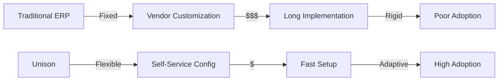

**vs SAP/Oracle**: Self-service configuration, 1/10th the cost, 10x faster setup
**vs Spreadsheets**: Data integrity, real-time updates, mobile access, workflows
**vs Custom Build**: Proven solution, continuous updates, lower TCO

### Value Proposition by Persona

**For Plant Manager**:
- Real-time production visibility (no more chasing status updates)
- On-time delivery tracking (predict delays before they happen)
- Resource utilization insights (optimize capacity)

**For Production Supervisor**:
- Mobile-friendly work order assignment (from anywhere)
- Quick production logging (60 seconds per update)
- Lane utilization at a glance (know what's happening now)

**For Quality Inspector**:
- NCR creation with photos (30 seconds from detection to logged)
- Approval workflows (automatic routing, no email chains)
- Trend analysis (which defects are recurring)

**For Shop Floor Operator**:
- Barcode/QR scanning (no typing errors)
- Simple production logging (tap, scan, submit)
- Clear work instructions (see assigned tasks)

---

## 4. Core Features

### 4.1 Multi-Tenant Organization Management

**Business Challenge**:
Manufacturing companies need secure separation between divisions while enabling employees to support multiple facilities without compromising data security or brand identity.

**Solution**:
Each customer operates on their own branded subdomain (acme.unison.com) with complete data isolation. Employees can access multiple plants within their organization without re-logging in.

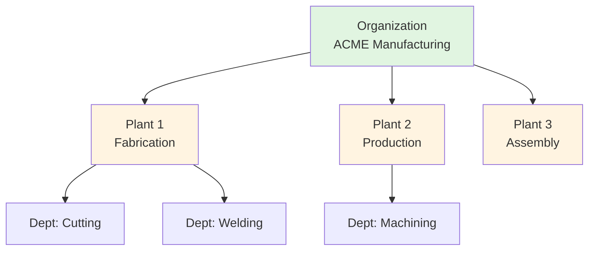

**Business Value**:
- **Security & Compliance**: Zero risk of competitor data leakage, meets SOC 2 Type II requirements
- **Brand Reinforcement**: Custom domains strengthen customer brand identity
- **Operational Flexibility**: Support staff can manage multiple facilities without juggling logins
- **Scalability**: Add plants instantly without infrastructure changes

**Success Metrics**:
- 100% data isolation (zero cross-tenant data access incidents)
- <2 seconds to switch between plants
- 95% reduction in "wrong data showing" support tickets

---

### 4.2 Self-Service Configuration Engine

**Business Challenge**:
Every manufacturer has unique processes. Traditional ERPs require $50K-$200K vendor customization and weeks of waiting time for simple changes.

**Solution**:
Administrators configure the system through intuitive UI without coding or vendor involvement.

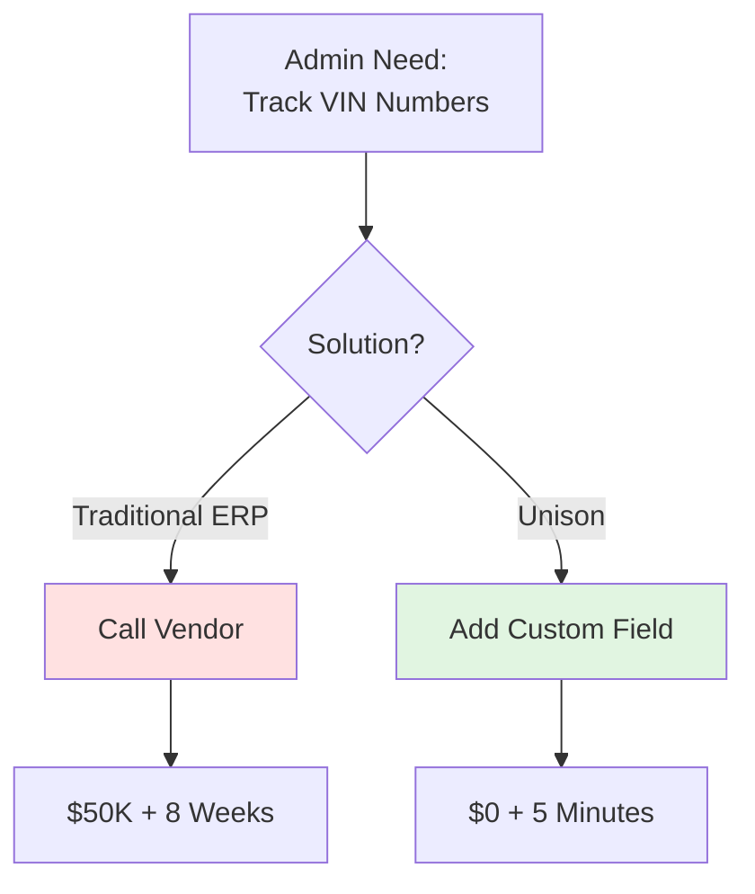

**Configuration Capabilities**:

**Custom Fields** - Add industry-specific data to any entity:
- Automotive: VIN tracking on work orders
- Electronics: PCB revision on materials
- Switchgear: Customer spec documents on projects
- Aerospace: FAA compliance fields on quality reports

**Type Customization** - Define your terminology:
- Plant types: Fabrication, Assembly, Testing, R&D, Warehouse
- Operations: Stamping, Welding, Painting, Final Assembly (automotive)
- NCR types: Material defect, Process deviation, Customer complaint
- Lane types: Assembly line, Test bench, Inspection area

**Business Value**:
- **Cost Savings**: $0 vs. $50K-$200K per customization
- **Speed**: Minutes vs. weeks for changes
- **Autonomy**: Business users control system without IT dependency
- **Agility**: Adapt to new customer requirements immediately

**Success Metrics**:
- >60% of customers create custom fields within 60 days
- Average 8 custom fields per organization
- <5 minutes to add new field (time-to-value)

---

### 4.3 Visual Workflow Engine

**Business Challenge**:
Approval processes vary wildly across manufacturers. NCR approvals might need 2 levels at one company, 4 levels at another. Hardcoded workflows fail.

**Solution**:
Business users design approval workflows visually with drag-and-drop interface. No coding required.

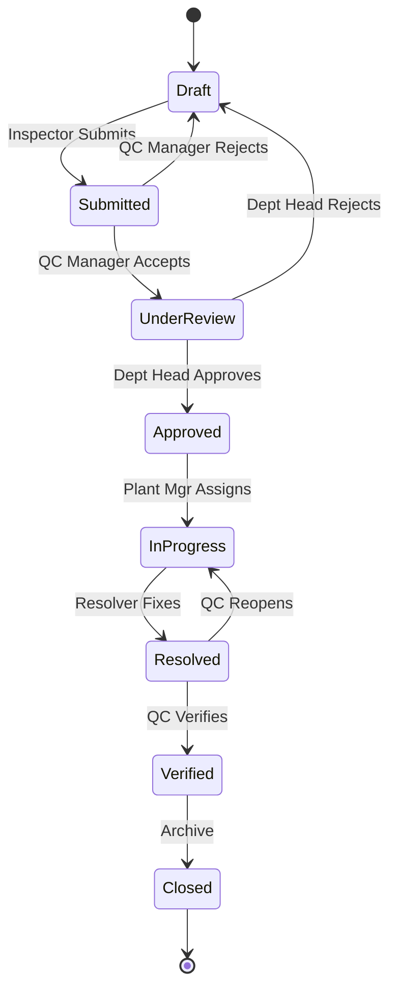

**Workflow Features**:
- **Visual Designer**: Drag-and-drop states, transitions, approvers
- **Conditional Routing**: Critical defects → Plant Manager, Low severity → QC Manager
- **Automatic Escalation**: Email manager if not acted upon in 48 hours
- **Workflow Templates**: NCR approval, Drawing approval, Work order release, Engineering change orders

**Use Case Examples**:
- **Aerospace**: 3-level approval (Engineer → Manager → Customer) with 48-hour escalation
- **Automotive**: 8D problem-solving workflow with automatic customer notifications
- **Medical Device**: FDA-compliant approval chains with electronic signatures

**Business Value**:
- **Compliance**: Documented approval trails for audits (ISO 9001, AS9100)
- **Speed**: Eliminate email chains, reduce approval time by 60%
- **Visibility**: Know exactly where every approval is stuck
- **Flexibility**: Change processes without vendor involvement

**Success Metrics**:
- >50% of Professional customers create custom workflows within 90 days
- 60% reduction in approval cycle time
- Zero missed approvals due to lost emails

---

### 4.4 White-Label Branding

**Business Challenge**:
Customers want employees to see "their" system, not "Unison". Brand reinforcement matters for adoption and enterprise sales.

**Solution**:
Each organization gets fully branded experience with custom domain, logo, colors, and fonts.

**Branding Options**:
- **Custom Domain**: acme.unison.com OR erp.acme.com (full custom domain)
- **Logo**: Header, login page, reports, emails
- **Color Scheme**: 6 customizable colors matching corporate identity
- **Fonts**: Select from enterprise-safe font library
- **Email Branding**: Notifications show customer logo, custom from-name

**Business Value**:
- **Employee Adoption**: Employees see familiar branding, not "another vendor tool"
- **Enterprise Sales**: CIOs require white-labeling for internal systems
- **Brand Consistency**: All systems match corporate identity guidelines
- **Professional Image**: Customer-facing reports include customer branding

**Success Metrics**:
- 90% of Enterprise customers enable white-labeling
- 25% higher employee adoption with white-labeling vs. default branding

---

### 4.5 Material & Inventory Management

**Business Challenge**:
Manufacturers waste $100K-$500K/year on excess inventory from poor tracking. Stockouts delay production. Manual processes are error-prone.

**Solution**:
Track materials across multiple locations with barcode scanning, automated alerts, and flexible costing methods.

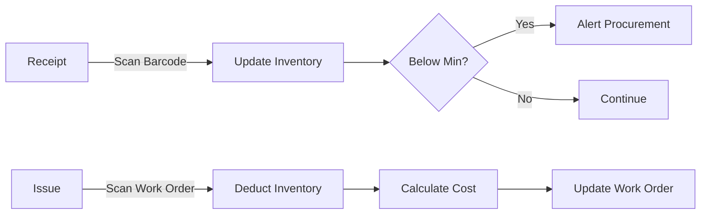

**Capabilities**:
- **Barcode Tracking**: Code128 barcodes and QR codes for every material
- **Multi-Location**: Track inventory by plant, warehouse, shelf location
- **Costing Flexibility**: FIFO, LIFO, or Weighted Average (customer chooses)
- **Automated Alerts**: Min/max stock levels trigger procurement alerts
- **SAP Integration**: Sync material master data with SAP ERP

**Material Receiving Process**:
Warehouse staff receive shipments in under 60 seconds using barcode scanning. System automatically updates inventory and triggers procurement alerts when stock is low.

**Business Value**:
- **Cost Reduction**: 30-50% reduction in excess inventory
- **Speed**: 60 seconds vs. 5 minutes manual process (80% faster)
- **Accuracy**: Barcode scanning eliminates data entry errors (>99.9% accuracy)
- **Proactive Management**: Never run out of critical materials

**Success Metrics**:
- >70% of organizations use barcode scanning within 30 days
- 40% reduction in inventory holding costs
- <1% stockout incidents (vs. 5-10% industry average)

---

### 4.6 Project & Order Management

**Business Challenge**:
Customer orders get lost in email chains. Engineers can't find latest drawings. Nobody knows which projects are at risk.

**Solution**:
Centralized project tracking with document management, milestone tracking, and predicted delivery dates.

**Capabilities**:
- **Order Tracking**: Link projects to customer orders (optionally SAP sales orders)
- **Bill of Materials**: Multi-level BOM showing all materials required
- **Document Management**: Upload and version-control drawings (PDF, DWG, DXF)
- **Drawing Approvals**: Configurable workflow (Engineer → Manager → Customer)
- **Milestone Tracking**: Target vs. actual dates, automatic delay alerts
- **Delivery Prediction**: System predicts delivery date based on current progress

**Business Value**:
- **On-Time Delivery**: Predict delays 2-3 weeks early, take corrective action
- **Customer Satisfaction**: Proactive communication about delays
- **No Lost Drawings**: Single source of truth for all project documents
- **Audit Trail**: Complete history of drawing approvals for compliance

**Success Metrics**:
- 20% improvement in on-time delivery rate
- 95% reduction in "where's the latest drawing?" questions
- Zero customer complaints about missing documentation

---

### 4.7 Production Management & Scheduling

**Business Challenge**:
Production supervisors juggle Excel spreadsheets, whiteboards, and paper to assign work. Nobody knows real-time status. Operators waste time finding work instructions.

**Solution**:
Digital work order management with visual lane scheduling, mobile production logging, and real-time progress tracking.

```mermaid
gantt
    title Work Order Dependencies (Finish-to-Start)
    dateFormat HH:mm
    section Lane 1 - Cutting
    WO-001 Cut Steel    :a1, 09:00, 2h
    section Lane 2 - Welding
    WO-001 Weld Frame   :after a1, 2h
    section Lane 3 - Assembly
    WO-001 Final Assy   :after a2, 3h
```

**Capabilities**:
- **Work Order Creation**: Create from projects, link to SAP production orders
- **Multi-Operation**: Define sequence (Cutting → Welding → Assembly → Testing)
- **Lane Scheduling**: Visual calendar showing lane assignments (drag-and-drop)
- **Dependencies**: Work Order B can't start until Work Order A completes
- **Mobile Logging**: Operators log progress from mobile devices (60 seconds per update)
- **Real-Time Visibility**: Supervisors see live status of all lanes

**Resource-Based Scheduling (RBS/RPS)**:
Planner assigns work orders to specific lanes (production lines, test benches) on visual calendar. System highlights conflicts and capacity constraints.

**Business Value**:
- **Efficiency**: 80% faster work order creation vs. paper/Excel
- **Visibility**: Real-time production status (no more chasing operators)
- **Capacity Optimization**: See capacity constraints, balance workload
- **Mobile Freedom**: Operators log from shop floor, no office trips

**Success Metrics**:
- >80% of production logs from mobile devices within 60 days
- 40% reduction in work order creation time
- 30% improvement in lane utilization

---

### 4.8 Quality Management & NCR

**Business Challenge**:
Defects found on shop floor take 30 minutes to document on paper, then chase approvals via email for days. No trend analysis to prevent recurrence.

**Solution**:
Mobile NCR creation with photos, automatic workflow routing, and trend analysis dashboards.

**Capabilities**:
- **Mobile NCR Creation**: Take 3 photos of defect, submit NCR in 30 seconds
- **Automatic Routing**: NCR goes to right approver based on severity/type
- **Disposition Actions**: Rework → create new work order, Scrap → adjust inventory
- **Trend Analysis**: Pareto charts showing top defect types
- **8D Reports**: Automotive industry standard problem-solving template

**NCR Workflow Example**:
Inspector finds cracked weld → Opens mobile app → Scans work order → Takes photos → Submits → QC Manager automatically notified → Reviews on tablet → Sets disposition "Rework" → Supervisor notified → Rework work order auto-created

**Business Value**:
- **Speed**: 30 seconds to create NCR vs. 30 minutes on paper (99% faster)
- **Compliance**: Digital audit trail for ISO 9001, AS9100 audits
- **Prevention**: Trend analysis prevents recurring defects (reduce defect rate 20-30%)
- **No Lost NCRs**: Everything tracked in system, nothing lost in email

**Success Metrics**:
- >70% of NCRs created via mobile within 60 days
- 70% reduction in NCR cycle time (detection to closure)
- 25% reduction in recurring defects through trend analysis

---

### 4.9 Logistics & Barcode Tracking

**Business Challenge**:
Shipments to customers or between plants are tracked on paper. No visibility into what was shipped when. Receiving takes forever.

**Solution**:
QR code scanning for shipments with complete audit trail.

**Capabilities**:
- **Shipment Management**: Track customer deliveries and inter-plant transfers
- **QR Scanning**: Scan to receive materials, start work orders, confirm shipments
- **Status Tracking**: Pending → In Transit → Delivered
- **Audit Trail**: Complete history of who scanned what, when, where

**Business Value**:
- **Visibility**: Know exactly what's in transit at all times
- **Speed**: Scan-based receiving 5x faster than manual data entry
- **Accuracy**: Eliminate receiving errors (99.9% accuracy vs. 95% manual)
- **Compliance**: Digital trail for customer audits

---

### 4.10 Manufacturing Dashboards & KPIs

**Business Challenge**:
Executives can't see production performance without asking for manual reports. By the time report is ready, data is stale.

**Solution**:
Role-specific dashboards with manufacturing KPIs updating automatically every 30-60 seconds.

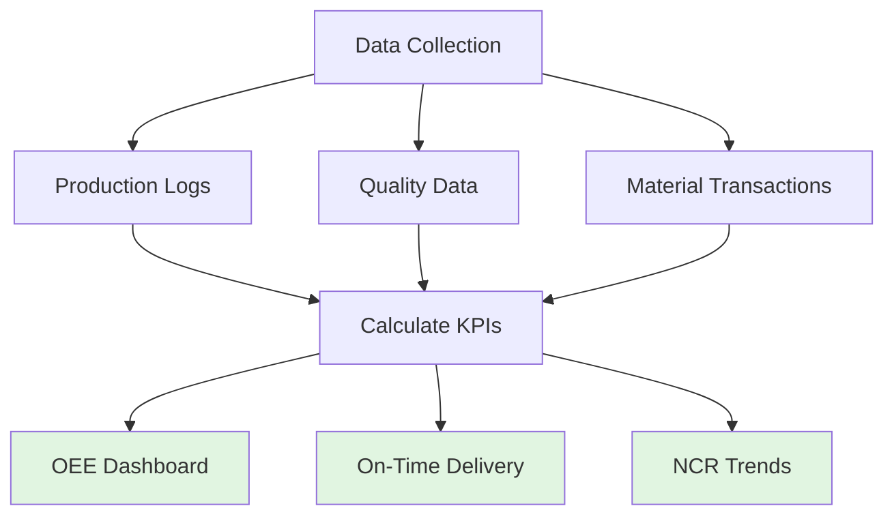

**Pre-Built Dashboards**:
1. **Executive View**: OTD, OEE, Top NCRs, Revenue by plant
2. **Plant Manager View**: Lane utilization, Work order status, Manpower allocation
3. **Supervisor View**: Today's assignments, Production vs. target, Material availability
4. **Operator View**: My assigned tasks, Instructions, Scan history

**Manufacturing KPIs**:
- **OEE** (Overall Equipment Effectiveness): Availability × Performance × Quality
- **On-Time Delivery (OTD)**: Orders delivered on-time / total orders
- **First Pass Yield (FPY)**: Units passed first time / total units
- **Cycle Time**: Time from work order start to complete
- **Capacity Utilization**: Actual hours / available hours per lane

**Reporting Capabilities**:
- Filter by date range, plant, product, customer
- Export to CSV or PDF
- Schedule automated email delivery

**Business Value**:
- **Real-Time Decisions**: Make decisions on current data, not week-old reports
- **Performance Management**: Hold teams accountable to KPIs
- **Customer Transparency**: Share OTD dashboards with customers
- **Executive Visibility**: C-suite sees performance without asking

**Success Metrics**:
- >90% of customers use dashboards daily within 30 days
- 50% reduction in "status update" meetings
- NPS improvement from real-time visibility

---

### 4.11 Equipment & Machine Management

**Business Challenge**:
Manufacturers track machines on spreadsheets or whiteboards. Can't answer: "Which machines are available?" "What's our equipment utilization?" "Which machines need maintenance?"

**Solution**:
Equipment registry with real-time status tracking and utilization reporting.

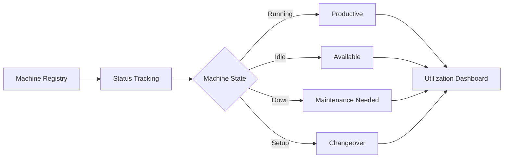

**Capabilities**:
- **Machine Master Data**: Name, capacity (units/hour), plant, lane assignment
- **Real-Time Status**: Running, Idle, Down, Setup (from production logs)
- **Utilization Tracking**: Productive time / Available time
- **Machine History**: Work orders completed, downtime events
- **Capacity Planning**: Available capacity by machine/lane/plant

**Configuration**:
- Add machines through UI (no coding)
- Define machine specs as custom fields (speed, tonnage, dimensions)
- Link machines to lanes for scheduling

**Business Value**:
- **Capacity Planning**: Know available capacity before quoting new orders
- **Bottleneck Identification**: See which machines limit throughput
- **Investment Justification**: Data for new equipment purchase decisions
- **Utilization Improvement**: Target underutilized machines

**Success Metrics**:
- 70%+ of customers track equipment utilization within 60 days
- 10-20% improvement in equipment utilization
- 30% reduction in "can we take this order?" inquiries

---

### 4.12 Shift Management

**Business Challenge**:
Multi-shift plants can't compare performance across shifts. Handover information lost between shifts. Production targets unclear per shift.

**Solution**:
Structured shift management with targets, handovers, and performance tracking.

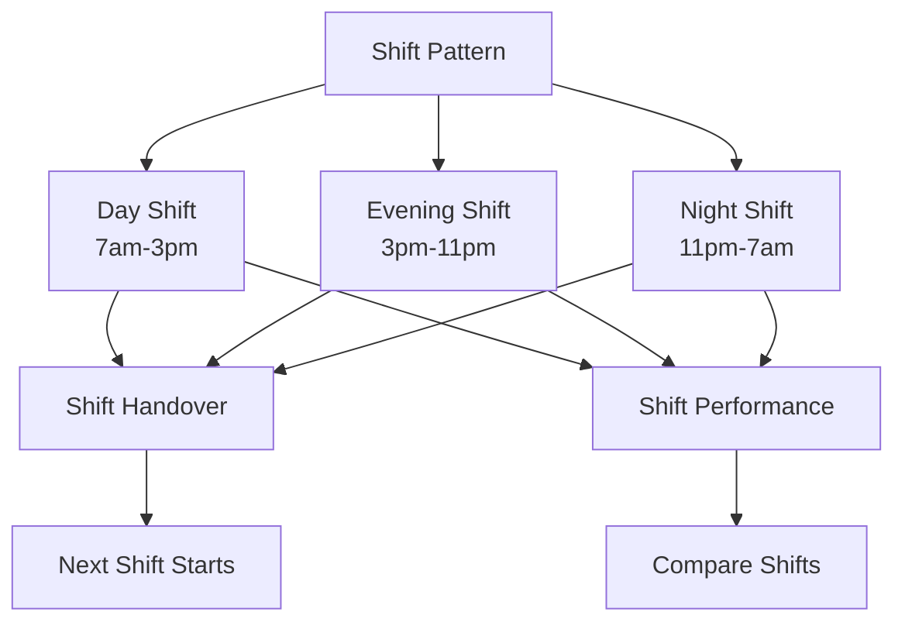

**Capabilities**:
- **Shift Patterns**: Define day/night/rotating shifts (configurable start/end times)
- **Shift Calendar**: Which shifts active on which days
- **Shift Handover**: Notes from outgoing to incoming shift (issues, pending work)
- **Shift Targets**: Production targets per shift (auto-calculated from work orders)
- **Shift Performance**: Compare actual vs target by shift
- **Shift Reports**: OEE, production, quality by shift

**Configuration**:
- Self-service shift pattern creation
- Flexible shift times (not hardcoded to 8 hours)
- Holiday calendar (skip shifts on holidays)

**Business Value**:
- **Fair Performance Measurement**: Compare shifts on equal basis
- **Accountability**: Identify high/low performing shifts
- **Knowledge Transfer**: Structured handover prevents information loss
- **Better Planning**: Set realistic targets per shift
- **24/7 Operations**: Enable efficient round-the-clock production

**Success Metrics**:
- 90%+ of multi-shift plants adopt shift management
- 15% improvement in lowest-performing shift
- 50% reduction in "I didn't know" shift handover issues

---

### 4.13 Visual Production Scheduling

**Business Challenge**:
Supervisors schedule work orders in spreadsheets or on whiteboards. Can't see timeline conflicts. Manual rescheduling is error-prone and time-consuming.

**Solution**:
Visual Gantt chart scheduling with drag-and-drop rescheduling and conflict detection.

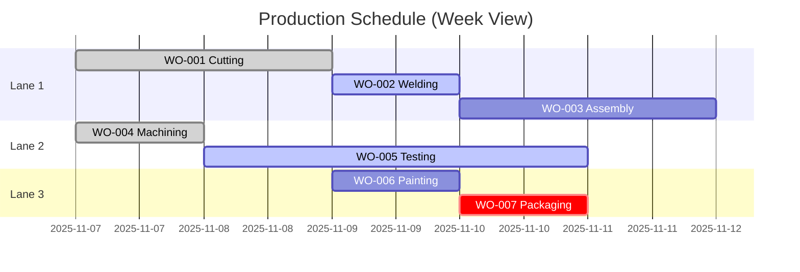

**Capabilities**:
- **Timeline View**: Lanes on Y-axis, dates on X-axis (day/week/month zoom)
- **Drag-and-Drop**: Reschedule work orders visually
- **Dependency Lines**: See which WOs block others (Finish-to-Start arrows)
- **Color Coding**: Status colors (planned=blue, in-progress=yellow, completed=green, delayed=red)
- **Conflict Detection**: Visual warning if lane overloaded
- **Load View**: See total hours vs capacity per lane

**Configuration**:
- Set working hours per plant (e.g., 7am-5pm, exclude lunch)
- Define holiday calendar (system skips non-working days)
- Customize zoom levels and colors

**Business Value**:
- **Visual Planning**: See entire production schedule at a glance
- **Fast Rescheduling**: Drag-and-drop beats manual spreadsheet updates (10x faster)
- **Conflict Avoidance**: Catch overloads before production starts
- **Better Communication**: Share timeline with team (everyone sees same view)
- **Realistic Commitments**: Don't promise dates you can't meet

**Success Metrics**:
- 80%+ of plants use Gantt scheduling within 90 days
- 50% reduction in schedule conflicts
- 30% reduction in time spent on scheduling

---

### 4.14 Maintenance Management

**Business Challenge**:
Unplanned equipment breakdowns cost 5-20% of production capacity. Maintenance is reactive (fix after failure) instead of preventive. No structured PM schedules.

**Solution**:
Preventive maintenance scheduling with auto-generated work orders and downtime tracking.

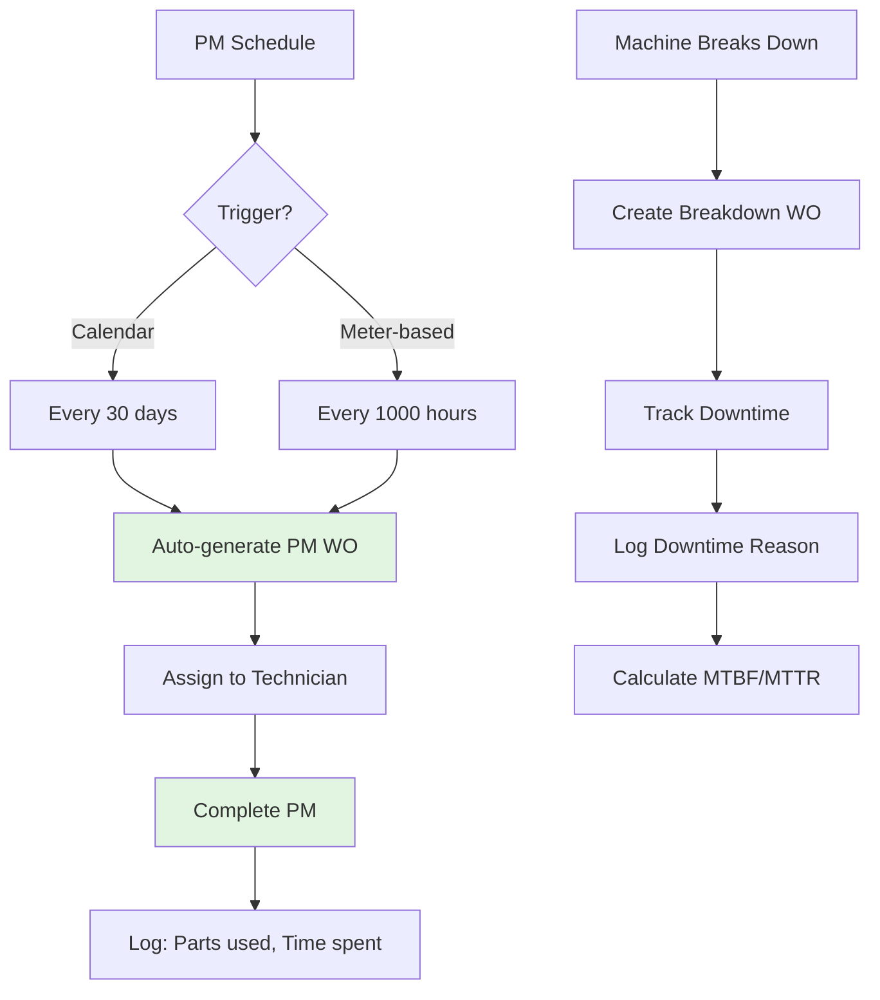

**Capabilities**:

**Preventive Maintenance**:
- PM schedules (calendar-based or meter-based triggers)
- Auto-generate PM work orders 7 days before due
- PM task checklists (lubrication, inspection, calibration)
- Spare parts planning (link PM to materials required)
- PM compliance tracking (overdue alerts)

**Downtime Tracking**:
- Downtime reasons (breakdown, no material, no operator, setup, planned maintenance)
- Downtime duration (start/end timestamps)
- Downtime cost calculation
- Pareto analysis (top downtime reasons)

**Maintenance Metrics**:
- MTBF (Mean Time Between Failures)
- MTTR (Mean Time To Repair)
- PM compliance rate
- Breakdown vs PM cost comparison

**Configuration**:
- Self-service PM schedule creation
- Customizable downtime reason taxonomy
- Configurable alert thresholds

**Business Value**:
- **50-80% Reduction in Unplanned Downtime**: Preventive beats reactive
- **20-40% Lower Maintenance Costs**: Planned repairs cheaper than emergencies
- **10-20% Longer Equipment Life**: Proper maintenance extends life
- **Improved OTD**: Fewer production interruptions
- **Safety**: Reduces risk of equipment failures causing injuries

**Success Metrics**:
- MTBF increases 50% within 6 months
- Unplanned downtime < 5% of total downtime
- PM compliance rate > 90%
- 30% reduction in maintenance costs

---

### 4.15 Inspection Plans & In-Process Quality

**Business Challenge**:
Defects discovered at final inspection (too late). No structured in-process quality checks. Operators don't know what to measure or when.

**Solution**:
In-process inspection plans with characteristics, tolerances, and sampling rules.

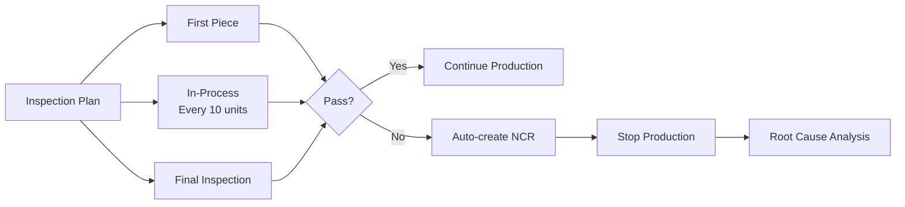

**Capabilities**:

**Inspection Planning**:
- Define inspection characteristics (dimensions, tolerances, measurement methods)
- Inspection frequency (first piece, every N units, final)
- Sampling plans (AQL, sample size, accept/reject criteria)
- Inspection instructions (what to measure, how to measure)

**Inspection Execution**:
- Mobile inspection logging (scan work order, record measurements)
- Pass/fail determination (auto-calculate based on tolerances)
- Auto-create NCR if inspection fails
- Photo capture of defects

**Statistical Analysis**:
- Control charts (X-bar, R charts for dimensional data)
- Process capability (Cp, Cpk when enough data)
- Trend detection (alert if approaching control limits)

**Configuration**:
- Add inspection characteristics through UI
- Configure sampling plans (normal, tightened, reduced inspection)
- Customize tolerance formats (±0.5mm, 10-12mm, etc.)

**Business Value**:
- **Catch Defects Early**: In-process checks prevent defects from reaching customer
- **Reduce Scrap**: Fix issues before entire batch is produced
- **Data-Driven Quality**: Statistical analysis identifies process drift
- **Operator Clarity**: Clear instructions on what/when to inspect
- **Compliance**: Meet customer quality requirements (PPAP, FAI)

**Success Metrics**:
- 50% reduction in final inspection failures
- 30% reduction in scrap cost
- FPY improvement from 90% to 97%+
- 100% inspection plan coverage for critical products

---

### 4.16 Serial Number & Lot Traceability

**Business Challenge**:
Product recalls require manual investigation ("Which customers got steel lot #X123?"). No way to trace which materials went into which products. Regulatory compliance risk.

**Solution**:
Complete serial number and lot traceability for forward/backward genealogy.

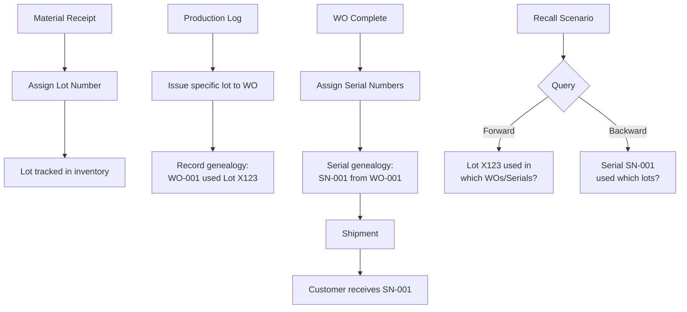

**Capabilities**:

**Lot Tracking**:
- Lot number capture at material receipt
- Lot-specific inventory (track quantities per lot)
- Lot-specific material issue (FIFO/LIFO by lot, not just material)
- Lot genealogy (which work orders consumed which lots)

**Serial Number Tracking**:
- Serial number generation (auto or manual, configurable format)
- Serial assignment at production completion or shipment
- Serial genealogy (which materials/lots used for each serial)
- Serial search (find which customer has serial #12345)

**Traceability Reports**:
- **Forward Traceability**: Material lot → Work orders → Serial numbers → Customers
- **Backward Traceability**: Customer complaint → Serial number → Work order → Material lots
- **Where-Used**: Which products contain material lot #X?
- **Recall Report**: All affected customers for a specific lot

**Configuration**:
- Enable lot tracking per material (not all materials need lots)
- Enable serial tracking per product (not all products need serials)
- Configure serial number format (prefix, sequence, suffix)

**Business Value**:
- **Fast Recalls**: Identify affected customers in minutes, not days
- **Regulatory Compliance**: Meet FDA, ISO 9001, AS9100 traceability requirements
- **Warranty Claims**: Quickly identify which materials/processes caused defect
- **Supplier Accountability**: Trace defects back to specific supplier lots
- **Customer Confidence**: Demonstrate traceability during audits

**Success Metrics**:
- 100% traceability for critical/regulated products
- Recall investigation time: <1 hour (was days)
- Zero audit findings on traceability
- Customer audit success rate: 100%

---

## 5. Integration Strategy

### 5.1 SAP ERP Integration

**Business Challenge**:
Manufacturing companies have $1M+ invested in SAP. They need Unison to sync data bidirectionally without manual double-entry.

**Solution**:
Pluggable SAP integration with mock adapter for MVP, real adapter post-MVP.

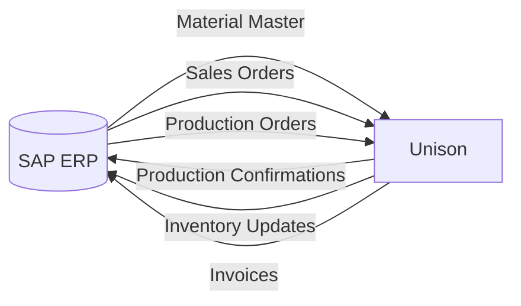

**Sync Flows**:
- **Material Master**: Daily sync (SAP → Unison)
- **Sales Orders → Projects**: Real-time or 15-min polling (SAP → Unison)
- **Production Orders → Work Orders**: 30-min polling (SAP → Unison)
- **Production Confirmations**: Real-time when work order completed (Unison → SAP)
- **Inventory Updates**: Real-time when materials issued (Unison → SAP)
- **Invoice Posting**: When project marked complete (Unison → SAP)

**MVP Strategy**:
Mock adapter for development (no SAP required). Real adapter swappable post-MVP based on customer needs.

**Business Value**:
- **No Double Entry**: Data flows automatically between systems
- **SAP Investment Protected**: Keep SAP for financials, use Unison for shop floor
- **Gradual Adoption**: Start without SAP, add integration when needed
- **Lower Risk**: MVP doesn't depend on SAP availability

**Success Metrics**:
- Zero manual data entry between systems
- <5% sync failures (with automatic retry)
- >95% customer satisfaction with SAP integration

---

### 5.2 Notification Services

**Business Challenge**:
Operators miss work assignments. Managers don't know about delays until too late.

**Solution**:
Real-time email and SMS notifications for critical events.

**Notification Use Cases**:
- **Task Assignment**: "Work Order WO-123 assigned to you"
- **Approval Required**: "NCR #45 needs your approval"
- **Escalation**: "Task overdue: NCR #45 pending 48 hours"
- **Alerts**: "Material inventory below reorder point: Steel Plate"
- **Delays**: "Project #123 delivery date at risk"

**Business Value**:
- **Responsiveness**: Act on issues within minutes, not hours
- **No Missed Tasks**: Everyone knows what's assigned to them
- **Proactive Management**: Fix problems before they escalate

---

## 6. Mobile & Offline Capabilities

### Progressive Web App (PWA)

**Business Challenge**:
Shop floor has spotty WiFi. Workers can't wait for connectivity to log production. Native apps are expensive to maintain.

**Solution**:
Progressive Web App works offline, queues data, syncs when connectivity returns. Installs like native app but runs in browser.

**Capabilities**:
- **Install to Home Screen**: Works like native app (no app store required)
- **Offline Data Entry**: Production logs queued, sync when WiFi returns
- **Camera Access**: NCR photos, barcode scanning (use device camera)
- **Push Notifications**: Get notified even when app is closed
- **Cross-Platform**: Works on iPhone, Android, tablets, desktops

**Offline Scenarios**:
- Operator in plant with spotty WiFi logs production → stored locally → syncs automatically when WiFi returns
- Inspector in remote warehouse scans materials → queued → syncs when back online
- Supervisor in plant assigns work orders → buffered → syncs within seconds

**Business Value**:
- **Reliability**: Never blocked by network issues
- **Cost Savings**: No native app development/maintenance ($100K+ saved)
- **Flexibility**: Works on any device employees already have
- **User Experience**: Feels like native app

**Success Metrics**:
- >80% of mobile users install to home screen within 30 days
- Zero production logs lost due to connectivity issues
- 90% user satisfaction with mobile experience

---

## 7. User Roles & Access Control

### Role Hierarchy

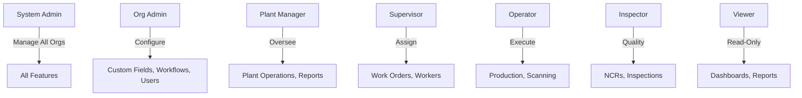

**Standard Roles**:
1. **System Admin** (Anthropic staff): Manages all organizations, platform settings
2. **Organization Admin** (Customer IT): Configures custom fields, workflows, users, billing
3. **Plant Manager**: Oversees plant operations, views all data, runs reports
4. **Supervisor**: Assigns work orders to lanes, allocates workers
5. **Operator**: Logs production, scans barcodes, views assigned tasks
6. **Quality Inspector**: Creates NCRs, performs inspections, approves dispositions
7. **Viewer**: Read-only access for executives and customers

**Permission Flexibility**:
Permissions configurable at organization, plant, and department levels. Support complex scenarios like multi-plant supervisors or cross-plant quality teams.

**Business Value**:
- **Security**: Principle of least privilege, role-based access
- **Flexibility**: Adapt to any organizational structure
- **Compliance**: Audit trail of who accessed what data when

---

## 8. Pricing & Business Model

### Subscription Tiers

| Tier | Price/Month | Users | Plants | Storage | Target Customer |
|------|-------------|-------|--------|---------|-----------------|
| **Starter** | $499 | 10 | 1 | 10GB | Small manufacturers (1 plant, <50 employees) |
| **Professional** | $1,499 | 50 | 5 | 50GB | Mid-size (multi-plant, 50-200 employees) |
| **Enterprise** | Custom | Unlimited | Unlimited | 500GB+ | Large (200+ employees, complex needs) |

### Feature Matrix

| Feature | Starter | Professional | Enterprise |
|---------|---------|--------------|------------|
| Core modules (Materials, Projects, Production, Quality) | ✅ | ✅ | ✅ |
| Multi-plant | ❌ (1 plant only) | ✅ (up to 5) | ✅ (unlimited) |
| Custom fields | ❌ | ✅ | ✅ |
| Workflow engine | ❌ (pre-built only) | ✅ | ✅ |
| White-labeling | ❌ | ❌ | ✅ |
| SAP integration | ❌ | Add-on $500/mo | ✅ |
| API access | ❌ | Add-on $200/mo | ✅ |
| SSO (SAML, OAuth) | ❌ | ❌ | ✅ |
| Dedicated support | Email only | Priority email + Slack | Dedicated Slack channel + Phone |
| SLA | None | 99% uptime | 99.5% uptime + 4-hour response |

### Add-Ons (Any Tier)
- Extra users: $30/user/month
- Extra plant: $200/plant/month
- Extra storage: $50/50GB/month
- SAP integration: $500/month (Professional tier)
- API access: $200/month (Professional tier)

### Pricing Philosophy
**Transparent, predictable pricing** with no hidden fees. Customers can calculate costs before talking to sales.

**Volume Discounts**:
- 11-25 users: 10% off per-user pricing
- 26-50 users: 15% off
- 50+ users: Custom pricing

### Free Trial
- **14 days**, no credit card required
- Full Professional features during trial
- Self-service onboarding (no sales call required)

### Payment Options
- Monthly or annual billing (annual = 2 months free, 17% savings)
- Credit card (Stripe) for Starter/Professional
- Invoice for Enterprise (NET 30 payment terms)

**Business Value**:
- **Predictable Costs**: Know exactly what you'll pay
- **Start Small**: Begin with Starter, upgrade as you grow
- **No Lock-In**: Monthly billing, cancel anytime
- **Try Before Buy**: 14-day trial to validate fit

---

## 9. Success Metrics & KPIs

### Product-Market Fit Indicators

**Early Signals (First 10 Customers)**:
- Time to first value: <2 hours (signup → first work order logged)
- Weekly Active Users (WAU): >75% of licensed users
- Feature adoption: >40% use custom fields within 30 days

**Growth Signals (20-50 Customers)**:
- NPS Score: >50 (World-class SaaS benchmark)
- Net Dollar Retention: >100% (customers expanding usage)
- Sales cycle: <45 days (fast decision-making indicates strong PMF)

### Business Metrics

**Year 1 Targets**:
- **Revenue**: $500K ARR from 20 paying customers
- **Customer Acquisition Cost (CAC)**: <$250K = <6 months payback
- **Logo Churn**: <10% annually
- **Gross Margins**: >80%

**Year 2 Targets**:
- **Revenue**: $3M ARR from 100 customers (+80 net new)
- **Net Revenue Retention**: >110% (expansion from upsells)
- **Logo Churn**: <5% annually
- **Expand to Enterprise**: 10% of customers on Enterprise tier

### User Engagement Metrics

**30-Day Targets**:
- Daily Active Users / Monthly Active Users (DAU/MAU): >60%
- Mobile usage: >30% of production logs from mobile devices
- Custom field adoption: >40% of organizations

**60-Day Targets**:
- Custom field adoption: >60%
- Workflow adoption: >40% of Professional customers create custom workflow
- Dashboard usage: >80% of users access dashboard weekly

**90-Day Targets**:
- User retention: >85% of users active in last 30 days
- Feature adoption: >70% using custom fields, >50% using workflows
- Mobile-first: >50% of production logs from mobile

### North Star Metric
**"Hours Saved Per User Per Week"**

Target: 5+ hours saved per user per week through automation and mobile access

Measured by:
- Reduction in manual data entry time
- Elimination of "status update" meetings
- Faster production logging (60s vs. 5 minutes paper)
- Faster NCR creation (30s vs. 30 minutes paper)

---

## 10. Scope Definition

### In Scope (MVP - 32 Weeks)
✅ All core modules (Materials, Projects, Production, Quality, Logistics)
✅ Configuration engine (custom fields, type lists)
✅ Workflow engine (visual designer)
✅ White-labeling (domain, logo, colors)
✅ SAP integration (mock adapter, pluggable for real adapter)
✅ PWA with offline mode
✅ Manufacturing KPIs (OEE, OTD, FPY, cycle time)
✅ Multi-tenancy + RBAC
✅ Subscription management (Stripe integration)
✅ Mobile barcode scanning
✅ Basic reporting (CSV/PDF export)

### Out of Scope (Post-MVP)
❌ Advanced analytics (predictive maintenance, demand forecasting)
❌ Financial modules (costing beyond work order, full accounting)
❌ HR & Payroll integration
❌ Advanced supply chain (purchase orders, vendor portals)
❌ CRM features (sales pipeline, lead management)
❌ IoT / machine integration
❌ Native mobile apps (PWA is sufficient)
❌ Multi-language UI (English only for MVP)
❌ Custom report builder (pre-built reports only)
❌ Real-time SAP adapter (mock for MVP)

---

## 11. Assumptions & Constraints

### Assumptions
- Customers have reliable internet connectivity (cloud-only deployment)
- Modern browsers (Chrome, Edge, Safari - no Internet Explorer 11)
- Mobile devices have cameras (for barcode scanning, NCR photos)
- English-speaking users (MVP targets US/UK/Canada)
- Customers handle their own data migration (we provide import tools/templates)
- Customers have basic IT support (password resets, user provisioning)

### Constraints
- **Cost Structure**: Must maintain <$50/user/month all-in cost to hit 80% gross margins
- **Uptime SLA**: 99.5% for Enterprise tier (43.8 minutes/month max downtime)
- **Security Compliance**: Must pass SOC 2 Type II audit before Enterprise sales
- **Data Privacy**: GDPR compliant for European customers
- **Time-to-Market**: Complete MVP in 32 weeks (market window constraint)
- **Team Size**: 1 PM, 3 backend engineers, 2 frontend engineers, 1 designer
- **Technology Lock-In**: AWS-only (no multi-cloud for MVP)

---

## 12. Dependencies & Risks

### External Dependencies
- **Stripe** (billing): Fallback = Chargebee
- **SendGrid** (email): Fallback = AWS SES
- **Twilio** (SMS): Fallback = AWS SNS
- **AWS** (hosting): No fallback (committed to AWS)
- **SAP** (for customers with SAP): Mock for MVP, real adapter post-MVP

### Risks & Mitigation

| Risk | Impact | Likelihood | Mitigation |
|------|--------|------------|------------|
| **SAP integration complexity underestimated** | High | Medium | Build mock adapter first, validate with 1 pilot customer before generalizing |
| **PWA offline conflicts cause data corruption** | High | Medium | Build conflict resolution POC before MVP, extensive offline testing |
| **Customers want >80% customization** | Medium | High | Set clear expectations in sales, charge premium for custom development |
| **Manufacturing KPI definitions don't match customer standards** | Medium | Medium | Make KPI formulas configurable, document calculations transparently |
| **Time-to-value >7 days (poor onboarding)** | High | Medium | Invest in self-service onboarding, video tutorials, sample data |
| **Price resistance from smaller manufacturers** | Medium | Low | Offer Starter tier at $499/mo, emphasize ROI calculations |
| **Competition from incumbents (SAP, Oracle lowering prices)** | High | Low | Focus on time-to-value and self-service, not price war |

---

## 13. Go-to-Market Strategy

### Target Customer Profile (ICP)
- **Industry**: Discrete manufacturing (automotive, electronics, industrial equipment)
- **Company Size**: 50-500 employees, $10M-$100M revenue
- **Pain Point**: Struggling with Excel/paper for shop floor, or frustrated with inflexible ERP
- **Budget Authority**: Plant Manager or VP Operations has budget authority
- **Technical Readiness**: Has internet in plant, employees have smartphones

### Marketing Channels
1. **Content Marketing**: "How to implement RBS/RPS" guides, manufacturing KPI templates
2. **Industry Forums**: Participate in r/Manufacturing, LinkedIn manufacturing groups
3. **Trade Shows**: IMTS (International Manufacturing Technology Show), Fabtech
4. **Partner Network**: Resellers in manufacturing-heavy regions (Midwest US, Germany)
5. **Case Studies**: Early customer success stories with quantified ROI

### Sales Strategy
- **Self-Service**: Starter tier 100% self-service (no sales call required)
- **Low-Touch**: Professional tier light touch (1-2 calls, $1.5K ACV)
- **Enterprise Sales**: White-glove for Enterprise (custom pricing, on-site demos)

### Customer Acquisition Targets
- **Year 1**: 20 customers (5 Starter, 12 Professional, 3 Enterprise)
- **CAC Payback**: <6 months for Starter/Professional, <12 months for Enterprise
- **Win Rate**: >30% of trials convert to paid (aggressive optimization target)

---

**Approvals**:
- [ ] Product Management
- [ ] Engineering Lead
- [ ] Sales/Customer Success
- [ ] Executive Sponsor

**Next Steps**:
1. Review & approve PRD
2. Proceed to Functional Requirements Document (FRD) for detailed behavior specs
3. Architecture document for technical implementation
