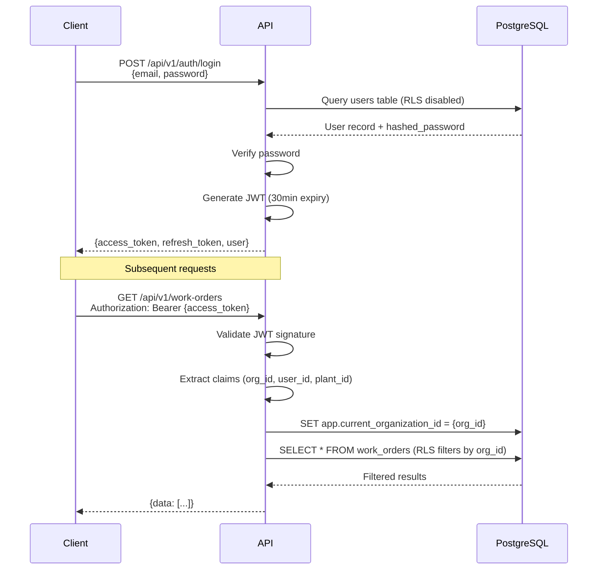

# API Design - RESTful Endpoints

**Version**: 3.0 (Added Onboarding Endpoints)
**Date**: 2025-11-08
**Base URL**: `/api/v1`
**Authentication**: JWT Bearer Token
**Architecture**: PostgreSQL-Native Stack

---

## Table of Contents

1. [API Principles](#api-principles)
2. [Authentication & Authorization](#authentication--authorization)
3. [API Endpoints (150+)](#api-endpoints-150)
4. [Request/Response Patterns](#requestresponse-patterns)
5. [Real-Time Updates](#real-time-updates)
6. [Error Handling](#error-handling)

---

## API Principles

### REST Guidelines

1. **Resource-based URLs**: `/api/v1/work-orders` not `/api/v1/getWorkOrders`
2. **HTTP Methods**: GET (read), POST (create), PUT (update), DELETE (delete)
3. **Stateless**: Each request contains all necessary information
4. **Idempotent Operations**: PUT and DELETE are idempotent
5. **HATEOAS**: Include links to related resources in responses

### PostgreSQL-Native Patterns

1. **Background Jobs**: Use PGMQ for async operations (barcode generation, SAP sync, reports)
2. **Real-Time Updates**: WebSocket with PostgreSQL LISTEN/NOTIFY
3. **Search**: BM25 full-text search via pg_search
4. **Analytics**: pg_duckdb for complex aggregations
5. **Caching**: PostgreSQL UNLOGGED tables (1-2ms latency)

### Versioning

- **Current**: `/api/v1/`
- **Future**: `/api/v2/` when breaking changes occur
- **Deprecation**: 6-month notice before removing old versions

---

## Authentication & Authorization

### JWT Authentication Flow



### JWT Claims Structure

```json
{
  "sub": "user_id_123",
  "organization_id": 1,
  "plant_id": 5,
  "roles": ["production_manager", "quality_inspector"],
  "permissions": ["work_order:create", "work_order:read", "ncr:create"],
  "exp": 1699520000,
  "iat": 1699518200
}
```

### RBAC with PyCasbin

**Policy Enforcement**:
```python
# app/infrastructure/security/rbac.py
from casbin import Enforcer

enforcer = Enforcer("model.conf", "policy.csv")

# Check permission
if enforcer.enforce(user_id, "work_orders", "create"):
    # Allow operation
    pass
else:
    raise HTTPException(status_code=403, detail="Forbidden")
```

**Policy Example** (`policy.csv`):
```csv
p, production_manager, work_orders, create
p, production_manager, work_orders, read
p, production_manager, work_orders, update
p, quality_inspector, ncr_reports, create
p, quality_inspector, inspections, read
```

---

## API Endpoints (150+)

### 1. Authentication & Multi-Tenancy

#### Authentication

```http
POST   /api/v1/auth/login               # Login with email/password
POST   /api/v1/auth/refresh             # Refresh access token
POST   /api/v1/auth/logout              # Logout (invalidate token)
GET    /api/v1/auth/me                  # Current user info
```

**Example: Login**

Request:
```http
POST /api/v1/auth/login
Content-Type: application/json

{
  "email": "supervisor@plant1.com",
  "password": "SecurePassword123!"
}
```

Response:
```json
{
  "access_token": "eyJhbGciOiJIUzI1NiIsInR5cCI6IkpXVCJ9...",
  "refresh_token": "eyJhbGciOiJIUzI1NiIsInR5cCI6IkpXVCJ9...",
  "token_type": "bearer",
  "expires_in": 1800,
  "user": {
    "id": 123,
    "email": "supervisor@plant1.com",
    "full_name": "John Supervisor",
    "organization_id": 1,
    "plant_ids": [5, 6],
    "roles": ["production_manager"]
  }
}
```

#### Onboarding

```http
POST   /api/v1/onboarding/signup            # Create account (Step 1)
POST   /api/v1/onboarding/organization      # Setup organization (Step 2)
POST   /api/v1/onboarding/plant             # Create first plant (Step 3)
POST   /api/v1/onboarding/invite-users      # Invite team members (Step 4)
POST   /api/v1/onboarding/complete          # Mark onboarding complete
POST   /api/v1/onboarding/sample-data       # Load sample data (optional)
DELETE /api/v1/onboarding/sample-data       # Delete all sample data
GET    /api/v1/onboarding/status            # Get onboarding progress
```

**Example: Signup (Step 1)**

Request:
```http
POST /api/v1/onboarding/signup
Content-Type: application/json

{
  "full_name": "John Smith",
  "email": "john@acme.com",
  "password": "SecurePass123",
  "company_name": "ACME Manufacturing",
  "agree_to_terms": true
}
```

Response (201 Created):
```json
{
  "user_id": 456,
  "organization_id": 123,
  "organization_name": "ACME Manufacturing",
  "subdomain": "acme",
  "access_url": "https://acme.unison.com",
  "trial_ends_at": "2025-11-21T23:59:59Z",
  "access_token": "eyJhbGciOiJIUzI1NiIsInR5cCI6IkpXVCJ9...",
  "next_step": "/onboarding/step2"
}
```

**Example: Organization Setup (Step 2)**

Request:
```http
POST /api/v1/onboarding/organization
Authorization: Bearer {token}
Content-Type: application/json

{
  "industry": "automotive",
  "company_size": "51-200",
  "primary_use_case": "all",
  "costing_method": "fifo"
}
```

Response (200 OK):
```json
{
  "organization_id": 123,
  "configuration_completed": true,
  "modules_enabled": [
    "materials", "projects", "production", "quality", 
    "logistics", "equipment", "shifts", "maintenance", 
    "inspection_plans", "traceability"
  ],
  "smart_defaults_applied": {
    "costing_method": "fifo",
    "currency": "USD",
    "timezone": "America/Detroit",
    "date_format": "YYYY-MM-DD"
  },
  "next_step": "/onboarding/step3"
}
```

**Example: First Plant Creation (Step 3)**

Request:
```http
POST /api/v1/onboarding/plant
Authorization: Bearer {token}
Content-Type: application/json

{
  "name": "Plant 1 - Main Facility",
  "plant_type": "fabrication",
  "city": "Detroit, MI",
  "address": "123 Industrial Blvd"
}
```

Response (201 Created):
```json
{
  "plant_id": 1,
  "name": "Plant 1 - Main Facility",
  "plant_type": "fabrication",
  "is_default": true,
  "departments_created": [
    {"id": 1, "name": "Cutting", "code": "CUT"},
    {"id": 2, "name": "Welding", "code": "WELD"},
    {"id": 3, "name": "Assembly", "code": "ASSY"},
    {"id": 4, "name": "Quality Control", "code": "QC"}
  ],
  "lanes_created": [
    {"id": 1, "name": "Lane 1 - Fabrication", "capacity": 1},
    {"id": 2, "name": "Lane 2 - Assembly", "capacity": 1},
    {"id": 3, "name": "Lane 3 - Testing", "capacity": 1}
  ],
  "shifts_created": [
    {
      "id": 1, 
      "name": "Day Shift", 
      "start_time": "06:00", 
      "end_time": "14:00",
      "active_days": ["monday", "tuesday", "wednesday", "thursday", "friday"]
    }
  ],
  "next_step": "/onboarding/step4"
}
```

**Example: Invite Team (Step 4)**

Request:
```http
POST /api/v1/onboarding/invite-users
Authorization: Bearer {token}
Content-Type: application/json

{
  "invitations": [
    {
      "email": "supervisor@acme.com",
      "role_code": "supervisor"
    },
    {
      "email": "operator@acme.com",
      "role_code": "operator"
    }
  ]
}
```

Response (200 OK):
```json
{
  "invitations_sent": 2,
  "invitations": [
    {
      "id": 1,
      "email": "supervisor@acme.com",
      "role_code": "supervisor",
      "invitation_url": "https://acme.unison.com/accept-invite/abc123xyz",
      "expires_at": "2025-11-14T23:59:59Z",
      "status": "sent"
    },
    {
      "id": 2,
      "email": "operator@acme.com",
      "role_code": "operator",
      "invitation_url": "https://acme.unison.com/accept-invite/def456uvw",
      "expires_at": "2025-11-14T23:59:59Z",
      "status": "sent"
    }
  ],
  "next_step": "/onboarding/complete"
}
```

**Example: Mark Onboarding Complete**

Request:
```http
POST /api/v1/onboarding/complete
Authorization: Bearer {token}
Content-Type: application/json

{
  "skipped_steps": ["invite_team"],
  "duration_seconds": 420
}
```

Response (200 OK):
```json
{
  "onboarding_completed": true,
  "completed_at": "2025-11-07T11:15:00Z",
  "organization": {
    "id": 123,
    "name": "ACME Manufacturing",
    "subdomain": "acme",
    "plant_count": 1,
    "user_count": 1,
    "trial_ends_at": "2025-11-21T23:59:59Z"
  },
  "setup_summary": {
    "departments": 4,
    "lanes": 3,
    "shifts": 1,
    "modules_enabled": 10
  },
  "quick_actions": [
    {"label": "Create Your First Material", "url": "/materials/new"},
    {"label": "Create Your First Project", "url": "/projects/new"},
    {"label": "Log a Work Order", "url": "/work-orders/new"},
    {"label": "Watch 2-Min Tutorial", "url": "/help/getting-started"}
  ],
  "redirect_url": "/dashboard"
}
```

**Example: Load Sample Data**

Request:
```http
POST /api/v1/onboarding/sample-data
Authorization: Bearer {token}
```

Response (202 Accepted - Async Job):
```json
{
  "status": "queued",
  "job_id": "sample_data_gen_789",
  "message": "Sample data generation queued",
  "estimated_completion": "10-15 seconds",
  "data_to_be_created": {
    "materials": 5,
    "projects": 2,
    "work_orders": 3,
    "production_logs": 3,
    "ncrs": 1,
    "demo_users": 3
  }
}
```

**Background Job Process** (PGMQ):
1. API enqueues job: `queue.send('sample_data_generation', {'organization_id': 123})`
2. PGMQ worker creates sample materials, projects, work orders, NCRs (all tagged `is_sample_data = true`)
3. Client polls `/api/v1/jobs/sample_data_gen_789` or receives WebSocket notification when complete

**Example: Delete Sample Data**

Request:
```http
DELETE /api/v1/onboarding/sample-data
Authorization: Bearer {token}
```

Response (200 OK):
```json
{
  "deleted": true,
  "items_deleted": {
    "materials": 5,
    "projects": 2,
    "work_orders": 3,
    "production_logs": 3,
    "ncrs": 1,
    "demo_users": 3
  },
  "message": "All sample data deleted successfully"
}
```

#### Organization Management

```http
GET    /api/v1/organizations            # List organizations (superadmin only)
POST   /api/v1/organizations            # Create organization
GET    /api/v1/organizations/{id}       # Get organization details
PUT    /api/v1/organizations/{id}       # Update organization
DELETE /api/v1/organizations/{id}       # Deactivate organization
```

#### Plant Management

```http
GET    /api/v1/plants                   # List plants (filtered by org context)
POST   /api/v1/plants                   # Create plant
GET    /api/v1/plants/{id}              # Get plant details
PUT    /api/v1/plants/{id}              # Update plant
DELETE /api/v1/plants/{id}              # Deactivate plant
```

**Query Parameters** (GET /api/v1/plants):
- `plant_type`: Filter by type (fabrication, production, assembly)
- `is_active`: Filter by active status (true/false)

#### User Management

```http
GET    /api/v1/users                    # List users
POST   /api/v1/users                    # Create user
GET    /api/v1/users/{id}               # Get user
PUT    /api/v1/users/{id}               # Update user
DELETE /api/v1/users/{id}               # Deactivate user
POST   /api/v1/users/{id}/assign-plant  # Assign user to plant
POST   /api/v1/users/{id}/assign-role   # Assign role to user
```

**Query Parameters** (GET /api/v1/users):
- `plant_id`: Filter by plant
- `role`: Filter by role code
- `search`: Full-text search (pg_search BM25) on name, email, employee_code

---

### 2. Material Management

```http
GET    /api/v1/materials                # List materials (with filters)
POST   /api/v1/materials                # Create material
GET    /api/v1/materials/{id}           # Get material
PUT    /api/v1/materials/{id}           # Update material
DELETE /api/v1/materials/{id}           # Deactivate material
GET    /api/v1/materials/{id}/barcode   # Generate barcode image (async PGMQ)
GET    /api/v1/materials/{id}/qrcode    # Generate QR code image (async PGMQ)
GET    /api/v1/materials/{id}/inventory # Get inventory by plant

POST   /api/v1/inventory/transactions   # Record material transaction
GET    /api/v1/inventory/summary        # Inventory summary by plant
```

**Query Parameters** (GET /api/v1/materials):
- `category_id`: Filter by category
- `search`: Full-text search (pg_search BM25) on name, description, material_code
- `is_active`: Filter by active status
- `min_stock_alert`: Only materials below reorder point

**Example: Create Material**

Request:
```http
POST /api/v1/materials
Authorization: Bearer {token}
Content-Type: application/json

{
  "material_code": "STL-304-25MM",
  "name": "Stainless Steel 304 - 25mm Plate",
  "description": "Food-grade stainless steel plate",
  "category_id": 5,
  "unit_of_measure": "kg",
  "standard_cost": 125.50,
  "minimum_stock_level": 500,
  "reorder_point": 750
}
```

Response:
```json
{
  "id": 456,
  "material_code": "STL-304-25MM",
  "name": "Stainless Steel 304 - 25mm Plate",
  "description": "Food-grade stainless steel plate",
  "category_id": 5,
  "unit_of_measure": "kg",
  "standard_cost": 125.50,
  "barcode_data": "STL-304-25MM-456",
  "qr_code_data": null,
  "is_active": true,
  "created_at": "2025-11-07T10:30:00Z"
}
```

**Example: Generate Barcode (PGMQ Async)**

Request:
```http
GET /api/v1/materials/456/barcode
Authorization: Bearer {token}
```

Response (202 Accepted - Job Queued):
```json
{
  "status": "queued",
  "job_id": "barcode_gen_789",
  "message": "Barcode generation queued, check /api/v1/jobs/barcode_gen_789 for status",
  "estimated_completion": "2-5 seconds"
}
```

**Background Job Process** (PGMQ):
1. API enqueues job: `queue.send('barcode_generation', {'material_id': 456})`
2. PGMQ worker picks up job, generates barcode PNG
3. Uploads to MinIO: `s3://unison-files/barcodes/material-456.png`
4. Updates `barcode_labels` table with file path
5. Client polls `/api/v1/jobs/barcode_gen_789` or receives WebSocket notification

---

### 3. Project Management

```http
GET    /api/v1/projects                 # List projects
POST   /api/v1/projects                 # Create project
GET    /api/v1/projects/{id}            # Get project
PUT    /api/v1/projects/{id}            # Update project
DELETE /api/v1/projects/{id}            # Cancel project
GET    /api/v1/projects/{id}/bom        # Get project BOM
POST   /api/v1/projects/{id}/bom        # Add BOM item
GET    /api/v1/projects/{id}/documents  # List documents
POST   /api/v1/projects/{id}/documents  # Upload document (to MinIO)
GET    /api/v1/projects/{id}/milestones # List milestones
POST   /api/v1/projects/{id}/milestones # Create milestone
```

**Query Parameters** (GET /api/v1/projects):
- `status`: Filter by status (draft, active, on_hold, completed, cancelled)
- `plant_id`: Filter by plant
- `search`: Full-text search (pg_search BM25) on project_number, name, customer_name, sap_sales_order
- `start_date_from`, `start_date_to`: Date range filters

#### RDA Drawing Management

```http
GET    /api/v1/rda-drawings             # List drawings
POST   /api/v1/rda-drawings             # Submit drawing
GET    /api/v1/rda-drawings/{id}        # Get drawing
PUT    /api/v1/rda-drawings/{id}        # Update drawing
POST   /api/v1/rda-drawings/{id}/approve   # Approve drawing
POST   /api/v1/rda-drawings/{id}/reject    # Reject drawing
```

---

### 4. Production Management

#### Work Order Management

```http
GET    /api/v1/work-orders              # List work orders
POST   /api/v1/work-orders              # Create work order
GET    /api/v1/work-orders/{id}         # Get work order
PUT    /api/v1/work-orders/{id}         # Update work order
DELETE /api/v1/work-orders/{id}         # Cancel work order
POST   /api/v1/work-orders/{id}/start   # Start work order
POST   /api/v1/work-orders/{id}/complete # Complete work order
GET    /api/v1/work-orders/{id}/operations # List operations
POST   /api/v1/work-orders/{id}/operations # Add operation
POST   /api/v1/work-orders/{id}/assign-manpower # Assign workers
```

**Query Parameters** (GET /api/v1/work-orders):
- `status`: Filter by status (planned, released, in_progress, completed, cancelled)
- `plant_id`: Filter by plant
- `project_id`: Filter by project
- `search`: Full-text search (pg_search BM25) on work_order_number, description, sap_production_order
- `priority`: Filter by priority (low, medium, high, urgent)
- `date_from`, `date_to`: Planned date range

**Example: Start Work Order**

Request:
```http
POST /api/v1/work-orders/789/start
Authorization: Bearer {token}
Content-Type: application/json

{
  "actual_start_date": "2025-11-07",
  "assigned_lane_id": 12,
  "notes": "Started on Lane A-12 with 3 operators"
}
```

Response:
```json
{
  "id": 789,
  "work_order_number": "WO-2025-00789",
  "status": "in_progress",
  "actual_start_date": "2025-11-07",
  "assigned_lane_id": 12,
  "updated_at": "2025-11-07T08:15:00Z"
}
```

**WebSocket Notification** (PostgreSQL LISTEN/NOTIFY):
```json
{
  "event": "work_order_status_changed",
  "data": {
    "id": 789,
    "work_order_number": "WO-2025-00789",
    "old_status": "released",
    "new_status": "in_progress",
    "plant_id": 5
  }
}
```

#### Lane Management

```http
GET    /api/v1/lanes                    # List lanes by plant
POST   /api/v1/lanes                    # Create lane
GET    /api/v1/lanes/{id}               # Get lane
PUT    /api/v1/lanes/{id}               # Update lane
DELETE /api/v1/lanes/{id}               # Deactivate lane
POST   /api/v1/lanes/{id}/assign        # Assign work order to lane
POST   /api/v1/lanes/{id}/release       # Release lane
GET    /api/v1/lanes/{id}/history       # Lane assignment history
```

#### Production Logging (PWA Mobile)

```http
POST   /api/v1/production-logs          # Create production log
GET    /api/v1/production-logs          # List logs (by work order, date)
GET    /api/v1/daily-work-logs          # Daily work summary
POST   /api/v1/daily-work-logs          # Create daily log
```

**Example: Create Production Log (Mobile PWA)**

Request:
```http
POST /api/v1/production-logs
Authorization: Bearer {token}
Content-Type: application/json

{
  "work_order_id": 789,
  "operation_id": 45,
  "lane_id": 12,
  "log_type": "complete",
  "quantity_completed": 25,
  "notes": "Batch completed successfully, 25 units passed inspection"
}
```

Response:
```json
{
  "id": 15678,
  "work_order_id": 789,
  "log_type": "complete",
  "quantity_completed": 25,
  "logged_by": 123,
  "logged_at": "2025-11-07T14:30:00Z"
}
```

**PostgreSQL Triggers**:
1. **LISTEN/NOTIFY**: Broadcasts real-time update to dashboard
2. **Update work_orders**: Increments `quantity_completed`
3. **Update material_inventory**: Issues materials (FIFO)
4. **timescaledb aggregate**: Updates `daily_production_summary` continuous aggregate

#### Scheduling (RBS/RPS)

```http
GET    /api/v1/rbs-schedules            # List schedules
POST   /api/v1/rbs-schedules            # Create schedule
GET    /api/v1/rbs-schedules/{id}       # Get schedule
PUT    /api/v1/rbs-schedules/{id}       # Update schedule
GET    /api/v1/rbs-schedules/calendar   # Calendar view

GET    /api/v1/rps-sheets               # List RPS sheets
POST   /api/v1/rps-sheets               # Create RPS sheet
GET    /api/v1/rps-sheets/{id}          # Get sheet
POST   /api/v1/rps-sheets/{id}/approve  # Approve sheet
```

---

### 5. Quality Management

#### NCR (Non-Conformance Reports)

```http
GET    /api/v1/ncr-reports              # List NCR reports
POST   /api/v1/ncr-reports              # Create NCR
GET    /api/v1/ncr-reports/{id}         # Get NCR
PUT    /api/v1/ncr-reports/{id}         # Update NCR
POST   /api/v1/ncr-reports/{id}/photos  # Upload NCR photo (to MinIO)
POST   /api/v1/ncr-reports/{id}/assign  # Assign NCR
POST   /api/v1/ncr-reports/{id}/resolve # Resolve NCR
POST   /api/v1/ncr-reports/{id}/close   # Close NCR
```

**Query Parameters** (GET /api/v1/ncr-reports):
- `status`: Filter by status (open, in_review, resolved, closed)
- `severity`: Filter by severity (minor, major, critical)
- `plant_id`: Filter by plant
- `project_id`: Filter by project
- `search`: Full-text search (pg_search BM25) on ncr_number, description, root_cause

**Example: Create NCR with Photo Upload**

Step 1: Create NCR
```http
POST /api/v1/ncr-reports
Authorization: Bearer {token}
Content-Type: application/json

{
  "work_order_id": 789,
  "plant_id": 5,
  "ncr_type": "process",
  "severity": "major",
  "description": "Welding defect found on joint #5, visible crack ~3cm length"
}
```

Response:
```json
{
  "id": 234,
  "ncr_number": "NCR-2025-00234",
  "status": "open",
  "created_at": "2025-11-07T15:00:00Z"
}
```

Step 2: Upload Photo (Multipart Form Data)
```http
POST /api/v1/ncr-reports/234/photos
Authorization: Bearer {token}
Content-Type: multipart/form-data

------WebKitFormBoundary
Content-Disposition: form-data; name="photo"; filename="defect.jpg"
Content-Type: image/jpeg

<binary data>
------WebKitFormBoundary--
```

Response:
```json
{
  "id": 567,
  "ncr_id": 234,
  "photo_name": "defect.jpg",
  "file_path": "s3://unison-files/ncr-photos/234/defect-567.jpg",
  "file_size": 245678,
  "uploaded_at": "2025-11-07T15:05:00Z"
}
```

#### Quality Inspections

```http
GET    /api/v1/quality-inspections      # List inspections
POST   /api/v1/quality-inspections      # Create inspection
GET    /api/v1/quality-inspections/{id} # Get inspection
```

---

### 6. Logistics & Tracking

#### Shipments

```http
GET    /api/v1/shipments                # List shipments
POST   /api/v1/shipments                # Create shipment
GET    /api/v1/shipments/{id}           # Get shipment
PUT    /api/v1/shipments/{id}           # Update shipment
POST   /api/v1/shipments/{id}/dispatch  # Dispatch shipment
POST   /api/v1/shipments/{id}/deliver   # Mark as delivered
```

#### QR/Barcode Scanning

```http
POST   /api/v1/qr-scans                 # Record QR scan
GET    /api/v1/qr-scans/history         # Scan history
GET    /api/v1/qr-scans/lookup/{code}   # Lookup by QR code
```

**Example: QR Scan Lookup**

Request:
```http
GET /api/v1/qr-scans/lookup/MAT-456-BATCH-001
Authorization: Bearer {token}
```

Response:
```json
{
  "qr_code_data": "MAT-456-BATCH-001",
  "entity_type": "material",
  "entity_id": 456,
  "entity_details": {
    "material_code": "STL-304-25MM",
    "name": "Stainless Steel 304 - 25mm Plate",
    "current_inventory": {
      "plant_id": 5,
      "quantity_on_hand": 1250.5,
      "quantity_available": 980.0
    }
  },
  "recent_scans": [
    {"scan_type": "material_receipt", "scanned_at": "2025-11-05T10:00:00Z"},
    {"scan_type": "work_order_issue", "scanned_at": "2025-11-06T08:30:00Z"}
  ]
}
```

#### Barcode Generation

```http
GET    /api/v1/barcodes/{type}/{id}     # Generate barcode image (async PGMQ)
                                         # type: material, work_order, shipment
                                         # Returns PNG image URL
```

---

### 7. Reporting & Analytics

```http
GET    /api/v1/reports                  # List available reports
POST   /api/v1/reports/{code}/execute   # Execute report (async PGMQ, returns CSV/PDF)
GET    /api/v1/reports/executions       # Report execution history

GET    /api/v1/dashboards               # List dashboards
GET    /api/v1/dashboards/{code}        # Get dashboard config
GET    /api/v1/dashboards/{code}/data   # Get dashboard data (pg_duckdb analytics)

# Pre-defined report endpoints
GET    /api/v1/reports/production-summary      # Production summary
GET    /api/v1/reports/otd-tracking            # On-time delivery
GET    /api/v1/reports/ncr-analysis            # NCR analysis
GET    /api/v1/reports/material-consumption    # Material usage
GET    /api/v1/reports/manpower-utilization    # Manpower report
```

**Example: Execute Report (Async PGMQ)**

Request:
```http
POST /api/v1/reports/production-summary/execute
Authorization: Bearer {token}
Content-Type: application/json

{
  "parameters": {
    "plant_id": 5,
    "date_from": "2025-11-01",
    "date_to": "2025-11-07",
    "format": "pdf"
  }
}
```

Response (202 Accepted - Job Queued):
```json
{
  "status": "queued",
  "job_id": "report_exec_890",
  "message": "Report generation queued, check /api/v1/jobs/report_exec_890 for status",
  "estimated_completion": "10-30 seconds"
}
```

**Background Process** (PGMQ):
1. API enqueues job: `queue.send('report_generation', {'report_code': 'production_summary', 'parameters': {...}})`
2. PGMQ worker generates report using pg_duckdb for analytics
3. Renders PDF with ReportLab
4. Uploads to MinIO: `s3://unison-files/reports/production-summary-890.pdf`
5. Updates `report_executions` table
6. Sends email notification (optional)

**Poll Status**:
```http
GET /api/v1/jobs/report_exec_890
Authorization: Bearer {token}
```

Response (Completed):
```json
{
  "job_id": "report_exec_890",
  "status": "completed",
  "file_url": "https://minio.example.com/unison-files/reports/production-summary-890.pdf",
  "file_size": 2456789,
  "completed_at": "2025-11-07T16:15:00Z"
}
```

---

### 8. SAP Integration

```http
GET    /api/v1/sap/sync-logs            # List sync logs
POST   /api/v1/sap/sync/sales-orders    # Trigger SO sync (async PGMQ)
POST   /api/v1/sap/sync/production-orders # Trigger PO sync (async PGMQ)
POST   /api/v1/sap/sync/materials       # Trigger material sync (async PGMQ)
GET    /api/v1/sap/mappings             # List entity mappings
POST   /api/v1/sap/mappings             # Create mapping
```

**Example: Trigger SAP Sync (Async PGMQ)**

Request:
```http
POST /api/v1/sap/sync/production-orders
Authorization: Bearer {token}
Content-Type: application/json

{
  "entity_ids": [789, 790, 791],
  "sync_direction": "outbound"
}
```

Response (202 Accepted - Jobs Queued):
```json
{
  "status": "queued",
  "job_ids": ["sap_sync_901", "sap_sync_902", "sap_sync_903"],
  "message": "3 SAP sync jobs queued",
  "estimated_completion": "5-15 seconds per job"
}
```

**Background Process** (PGMQ):
1. API enqueues 3 jobs to `sap_sync_jobs` queue
2. PGMQ worker picks up jobs (concurrency: 5)
3. Calls SAP REST API for each work order
4. Logs results in `sap_sync_logs` table
5. Retries on failure (up to 3 attempts)
6. Moves to dead letter queue (DLQ) if all retries fail

---

### 9. Notifications

```http
GET    /api/v1/notifications            # List user notifications
PUT    /api/v1/notifications/{id}/read  # Mark as read
PUT    /api/v1/notifications/read-all   # Mark all as read
```

**WebSocket Subscription** (Real-Time Notifications):
```javascript
const ws = new WebSocket('wss://api.example.com/ws/notifications');
ws.onmessage = (event) => {
  const notification = JSON.parse(event.data);
  // Display toast notification
  toast.info(notification.title, notification.message);
};
```

---

### 10. MES Modules

#### Equipment/Machine Management

```http
GET    /api/v1/machines                 # List machines
POST   /api/v1/machines                 # Create machine
GET    /api/v1/machines/{id}            # Get machine details
PUT    /api/v1/machines/{id}            # Update machine
DELETE /api/v1/machines/{id}            # Deactivate machine
PUT    /api/v1/machines/{id}/status     # Update machine status
GET    /api/v1/machines/{id}/utilization # Get utilization metrics (timescaledb)
GET    /api/v1/machines/{id}/history    # Get status history (timescaledb)
```

**Query Parameters** (GET /api/v1/machines):
- `plant_id`: Filter by plant
- `status`: Filter by status (available, running, idle, down, maintenance)
- `machine_type`: Filter by type (CNC, Lathe, Press, etc.)
- `search`: Full-text search (pg_search BM25) on machine_code, name, manufacturer, serial_number

**Example: Get Machine Utilization (timescaledb)**

Request:
```http
GET /api/v1/machines/34/utilization?from=2025-11-01&to=2025-11-07
Authorization: Bearer {token}
```

Response (powered by timescaledb continuous aggregate):
```json
{
  "machine_id": 34,
  "machine_code": "CNC-001",
  "period": {
    "from": "2025-11-01",
    "to": "2025-11-07"
  },
  "utilization": {
    "total_hours": 168,
    "running_hours": 142.5,
    "idle_hours": 15.0,
    "down_hours": 8.5,
    "maintenance_hours": 2.0,
    "utilization_percent": 84.82,
    "availability_percent": 94.94,
    "oee_percent": 78.5
  },
  "daily_breakdown": [
    {"date": "2025-11-01", "utilization_percent": 85.2, "oee_percent": 79.1},
    {"date": "2025-11-02", "utilization_percent": 82.5, "oee_percent": 76.8},
    ...
  ]
}
```

#### Shift Management

```http
GET    /api/v1/shifts                   # List shift patterns
POST   /api/v1/shifts                   # Create shift
GET    /api/v1/shifts/{id}              # Get shift details
PUT    /api/v1/shifts/{id}              # Update shift
DELETE /api/v1/shifts/{id}              # Deactivate shift
POST   /api/v1/shift-handovers          # Log shift handover
GET    /api/v1/shift-handovers          # List handovers
GET    /api/v1/shift-performance        # Get shift performance metrics
```

#### Maintenance Management

```http
GET    /api/v1/pm-schedules             # List PM schedules
POST   /api/v1/pm-schedules             # Create PM schedule
GET    /api/v1/pm-schedules/{id}        # Get PM schedule
PUT    /api/v1/pm-schedules/{id}        # Update PM schedule
DELETE /api/v1/pm-schedules/{id}        # Deactivate PM schedule
GET    /api/v1/pm-work-orders           # List PM work orders
POST   /api/v1/pm-work-orders           # Create PM work order (auto-generated by pg_cron)
GET    /api/v1/pm-work-orders/{id}      # Get PM work order
PUT    /api/v1/pm-work-orders/{id}      # Update PM work order
POST   /api/v1/pm-work-orders/{id}/start  # Start PM work
POST   /api/v1/pm-work-orders/{id}/complete # Complete PM work
POST   /api/v1/downtime-events          # Log downtime event
GET    /api/v1/downtime-events          # List downtime events
GET    /api/v1/maintenance-metrics      # Get MTBF, MTTR, PM compliance (pg_duckdb)
```

**Example: Get Maintenance Metrics (pg_duckdb)**

Request:
```http
GET /api/v1/maintenance-metrics?plant_id=5&from=2025-10-01&to=2025-11-07
Authorization: Bearer {token}
```

Response (powered by pg_duckdb analytics):
```json
{
  "plant_id": 5,
  "period": {
    "from": "2025-10-01",
    "to": "2025-11-07"
  },
  "metrics": {
    "mtbf_hours": 245.5,
    "mttr_hours": 3.2,
    "total_downtime_hours": 48.5,
    "pm_compliance_percent": 92.5,
    "overdue_pm_count": 3,
    "downtime_by_category": [
      {"category": "equipment", "hours": 28.5, "percent": 58.8},
      {"category": "material", "hours": 12.0, "percent": 24.7},
      {"category": "setup", "hours": 8.0, "percent": 16.5}
    ],
    "top_failure_reasons": [
      {"reason_code": "mechanical_failure", "occurrences": 12, "total_hours": 18.5},
      {"reason_code": "material_shortage", "occurrences": 8, "total_hours": 12.0}
    ]
  }
}
```

**pg_cron Auto-Generation** (PM Work Orders):
```sql
-- Scheduled daily at 6 AM
SELECT cron.schedule(
    'pm-work-order-generation',
    '0 6 * * *',
    $
    INSERT INTO pm_work_orders (organization_id, work_order_number, pm_schedule_id, machine_id, scheduled_date)
    SELECT ps.organization_id, 'PM-' || TO_CHAR(NOW(), 'YYYY-MM-DD') || '-' || ps.id,
           ps.id, ps.machine_id, ps.next_due_date
    FROM pm_schedules ps
    WHERE ps.is_active = TRUE
    AND ps.next_due_date <= CURRENT_DATE + ps.lead_time_days
    AND NOT EXISTS (
        SELECT 1 FROM pm_work_orders pwo
        WHERE pwo.pm_schedule_id = ps.id AND pwo.status IN ('planned', 'in_progress')
    );
    $
);
```

#### Visual Production Scheduling

```http
GET    /api/v1/schedule/gantt           # Get Gantt chart data (frappe-gantt format)
PUT    /api/v1/work-orders/{id}/reschedule # Reschedule work order (drag-and-drop)
PUT    /api/v1/work-orders/{id}/reassign-lane # Reassign to different lane
POST   /api/v1/schedule/validate        # Validate schedule conflicts
POST   /api/v1/schedule/auto-schedule   # Auto-generate optimal schedule
```

**Example: Get Gantt Chart Data**

Request:
```http
GET /api/v1/schedule/gantt?plant_id=5&from=2025-11-01&to=2025-11-30
Authorization: Bearer {token}
```

Response (frappe-gantt compatible format):
```json
{
  "tasks": [
    {
      "id": "WO-789",
      "name": "WO-2025-00789 - Pump Assembly",
      "start": "2025-11-07",
      "end": "2025-11-10",
      "progress": 45,
      "dependencies": "WO-788",
      "custom_class": "lane-12",
      "lane_id": 12,
      "lane_name": "Assembly Lane A-12",
      "status": "in_progress"
    },
    {
      "id": "WO-790",
      "name": "WO-2025-00790 - Valve Testing",
      "start": "2025-11-10",
      "end": "2025-11-12",
      "progress": 0,
      "dependencies": "WO-789",
      "custom_class": "lane-15",
      "lane_id": 15,
      "lane_name": "Testing Lane T-15",
      "status": "planned"
    }
  ],
  "lanes": [
    {"id": 12, "name": "Assembly Lane A-12", "capacity": 5, "status": "occupied"},
    {"id": 15, "name": "Testing Lane T-15", "capacity": 3, "status": "available"}
  ]
}
```

#### Inspection & Quality (SPC)

```http
GET    /api/v1/inspection-plans         # List inspection plans
POST   /api/v1/inspection-plans         # Create inspection plan
GET    /api/v1/inspection-plans/{id}    # Get inspection plan
PUT    /api/v1/inspection-plans/{id}    # Update inspection plan
POST   /api/v1/inspection-logs          # Log inspection results
GET    /api/v1/inspection-logs          # List inspection logs
GET    /api/v1/inspection-logs/{id}     # Get inspection log details
GET    /api/v1/spc-charts               # Get SPC control chart data (timescaledb)
GET    /api/v1/spc-charts/{characteristic_id}/capability # Get Cp/Cpk (timescaledb)
```

**Example: Get SPC Control Chart (timescaledb)**

Request:
```http
GET /api/v1/spc-charts?characteristic_id=67&from=2025-11-01&to=2025-11-07
Authorization: Bearer {token}
```

Response (powered by timescaledb continuous aggregate):
```json
{
  "characteristic_id": 67,
  "characteristic_name": "Shaft Diameter",
  "specification": "25mm",
  "usl": 25.1,
  "lsl": 24.9,
  "tolerance": "±0.1mm",
  "period": {
    "from": "2025-11-01",
    "to": "2025-11-07"
  },
  "statistics": {
    "mean": 25.02,
    "std_dev": 0.035,
    "cp": 0.95,
    "cpk": 0.89,
    "sample_count": 245
  },
  "control_limits": {
    "ucl": 25.125,
    "lcl": 24.915,
    "center_line": 25.02
  },
  "data_points": [
    {"measured_at": "2025-11-01T08:00:00Z", "measured_value": 25.01, "within_tolerance": true},
    {"measured_at": "2025-11-01T10:00:00Z", "measured_value": 25.03, "within_tolerance": true},
    {"measured_at": "2025-11-01T12:00:00Z", "measured_value": 25.12, "within_tolerance": false},
    ...
  ]
}
```

#### Traceability (Lot & Serial Numbers)

```http
POST   /api/v1/lot-numbers              # Generate lot number
GET    /api/v1/lot-numbers              # List lot numbers
GET    /api/v1/lot-numbers/{lot_number} # Get lot details
POST   /api/v1/serial-numbers/generate  # Generate serial numbers
GET    /api/v1/serial-numbers           # List serial numbers
GET    /api/v1/serial-numbers/{serial_number} # Get serial details
GET    /api/v1/traceability/forward     # Forward trace (lot → customers)
GET    /api/v1/traceability/backward    # Backward trace (customer → lots)
POST   /api/v1/recall-reports           # Generate recall report
GET    /api/v1/recall-reports/{id}      # Get recall report
```

**Example: Forward Traceability**

Request:
```http
GET /api/v1/traceability/forward?lot_number=STL001-20251106-001
Authorization: Bearer {token}
```

Response (genealogy graph):
```json
{
  "lot_number": "STL001-20251106-001",
  "material_id": 456,
  "material_name": "Stainless Steel 304 - 25mm Plate",
  "genealogy": {
    "consumed_by_work_orders": [
      {
        "work_order_id": 789,
        "work_order_number": "WO-2025-00789",
        "quantity_used": 125.5,
        "produced_serial_numbers": [
          {"serial_number": "PUMP-2511-00001", "customer": "ABC Corp", "shipped_date": "2025-11-10"},
          {"serial_number": "PUMP-2511-00002", "customer": "XYZ Ltd", "shipped_date": "2025-11-12"}
        ]
      },
      {
        "work_order_id": 790,
        "work_order_number": "WO-2025-00790",
        "quantity_used": 85.0,
        "produced_serial_numbers": [
          {"serial_number": "VALVE-2511-00005", "customer": "DEF Inc", "shipped_date": "2025-11-15"}
        ]
      }
    ]
  },
  "recall_scope": {
    "total_customers_affected": 3,
    "total_units_affected": 3,
    "customer_list": ["ABC Corp", "XYZ Ltd", "DEF Inc"]
  }
}
```

---

## Request/Response Patterns

### Pagination

All list endpoints support pagination with query parameters:

```http
GET /api/v1/work-orders?page=2&page_size=50
```

Response:
```json
{
  "data": [...],
  "pagination": {
    "page": 2,
    "page_size": 50,
    "total_items": 1247,
    "total_pages": 25,
    "has_next": true,
    "has_prev": true
  }
}
```

### Filtering & Search

**Filter by specific fields**:
```http
GET /api/v1/work-orders?status=in_progress&plant_id=5&priority=high
```

**Full-text search** (pg_search BM25):
```http
GET /api/v1/materials?search=stainless steel 304
```

### Sorting

```http
GET /api/v1/work-orders?sort_by=planned_start_date&sort_order=asc
```

### Field Selection

Request only specific fields to reduce payload size:

```http
GET /api/v1/work-orders?fields=id,work_order_number,status,quantity_completed
```

---

## Real-Time Updates

### WebSocket Connection (PostgreSQL LISTEN/NOTIFY)

**Client Connection**:
```javascript
const token = localStorage.getItem('access_token');
const ws = new WebSocket(`wss://api.example.com/ws?token=${token}`);

ws.onopen = () => {
  console.log('WebSocket connected');
  // Subscribe to specific channels
  ws.send(JSON.stringify({
    action: 'subscribe',
    channels: ['work_order_updates', 'production_logs', 'ncr_updates']
  }));
};

ws.onmessage = (event) => {
  const update = JSON.parse(event.data);
  console.log('Real-time update:', update);

  switch(update.event) {
    case 'work_order_status_changed':
      updateWorkOrderUI(update.data);
      break;
    case 'production_log_created':
      refreshProductionDashboard(update.data);
      break;
    case 'ncr_created':
      showNotification('New NCR Created', update.data);
      break;
  }
};
```

**Backend WebSocket Handler** (FastAPI + PostgreSQL LISTEN/NOTIFY):
```python
# app/presentation/api/v1/websocket.py
from fastapi import WebSocket
import asyncpg

@app.websocket("/ws")
async def websocket_endpoint(websocket: WebSocket, token: str):
    await websocket.accept()

    # Validate JWT
    user = validate_jwt(token)

    # Connect to PostgreSQL
    conn = await asyncpg.connect(DATABASE_URL)

    # Subscribe to PostgreSQL notifications
    await conn.add_listener('work_order_status_changed', lambda conn, pid, channel, payload:
        asyncio.create_task(websocket.send_text(payload))
    )
    await conn.add_listener('production_log_created', lambda conn, pid, channel, payload:
        asyncio.create_task(websocket.send_text(payload))
    )

    # Keep connection alive
    try:
        while True:
            await websocket.receive_text()
    except WebSocketDisconnect:
        await conn.close()
```

**PostgreSQL Trigger** (LISTEN/NOTIFY):
```sql
CREATE OR REPLACE FUNCTION notify_work_order_status_change() RETURNS TRIGGER AS $$
BEGIN
    IF OLD.status IS DISTINCT FROM NEW.status THEN
        PERFORM pg_notify('work_order_status_changed',
            json_build_object(
                'event', 'work_order_status_changed',
                'data', json_build_object(
                    'id', NEW.id,
                    'work_order_number', NEW.work_order_number,
                    'old_status', OLD.status,
                    'new_status', NEW.status,
                    'plant_id', NEW.plant_id
                )
            )::text
        );
    END IF;
    RETURN NEW;
END;
$$ LANGUAGE plpgsql;

CREATE TRIGGER work_order_status_notify
AFTER UPDATE ON work_orders
FOR EACH ROW EXECUTE FUNCTION notify_work_order_status_change();
```

---

## Error Handling

### Standard Error Response

```json
{
  "error": {
    "code": "RESOURCE_NOT_FOUND",
    "message": "Work order with ID 999 not found",
    "details": {
      "resource": "work_order",
      "id": 999
    },
    "timestamp": "2025-11-07T16:45:00Z",
    "request_id": "req_abc123xyz"
  }
}
```

### HTTP Status Codes

| Code | Meaning | Usage |
|------|---------|-------|
| 200 | OK | Successful GET, PUT, DELETE |
| 201 | Created | Successful POST |
| 202 | Accepted | Async operation queued (PGMQ) |
| 204 | No Content | Successful DELETE with no response body |
| 400 | Bad Request | Invalid request parameters |
| 401 | Unauthorized | Missing or invalid JWT token |
| 403 | Forbidden | User lacks permission (RBAC) |
| 404 | Not Found | Resource not found or RLS filtered |
| 409 | Conflict | Duplicate resource or constraint violation |
| 422 | Unprocessable Entity | Validation error |
| 429 | Too Many Requests | Rate limit exceeded |
| 500 | Internal Server Error | Server error |
| 503 | Service Unavailable | Database connection failed |

### Error Codes

| Error Code | HTTP Status | Description |
|------------|-------------|-------------|
| `INVALID_CREDENTIALS` | 401 | Invalid email or password |
| `TOKEN_EXPIRED` | 401 | JWT token expired |
| `INSUFFICIENT_PERMISSIONS` | 403 | User lacks required permission |
| `RESOURCE_NOT_FOUND` | 404 | Requested resource not found |
| `DUPLICATE_RESOURCE` | 409 | Resource already exists (unique constraint) |
| `VALIDATION_ERROR` | 422 | Request validation failed |
| `BUSINESS_RULE_VIOLATION` | 422 | Business rule validation failed |
| `DATABASE_ERROR` | 500 | PostgreSQL query failed |
| `QUEUE_ERROR` | 500 | PGMQ enqueue failed |
| `SAP_SYNC_ERROR` | 500 | SAP API call failed |

### Validation Error Example

```json
{
  "error": {
    "code": "VALIDATION_ERROR",
    "message": "Request validation failed",
    "details": {
      "fields": [
        {
          "field": "quantity_ordered",
          "message": "Must be a positive integer",
          "value": -5
        },
        {
          "field": "planned_start_date",
          "message": "Cannot be in the past",
          "value": "2025-10-01"
        }
      ]
    }
  }
}
```

---

## Cross-References

- **Database Schema**: `docs/02-architecture/DATABASE_SCHEMA.md`
- **Technology Stack**: `docs/02-architecture/TECH_STACK.md`
- **PostgreSQL Extensions**: `docs/03-postgresql/EXTENSIONS.md`
- **Architecture Overview**: `docs/02-architecture/OVERVIEW.md`
- **Domain Models**: `docs/04-domains/*.md`
