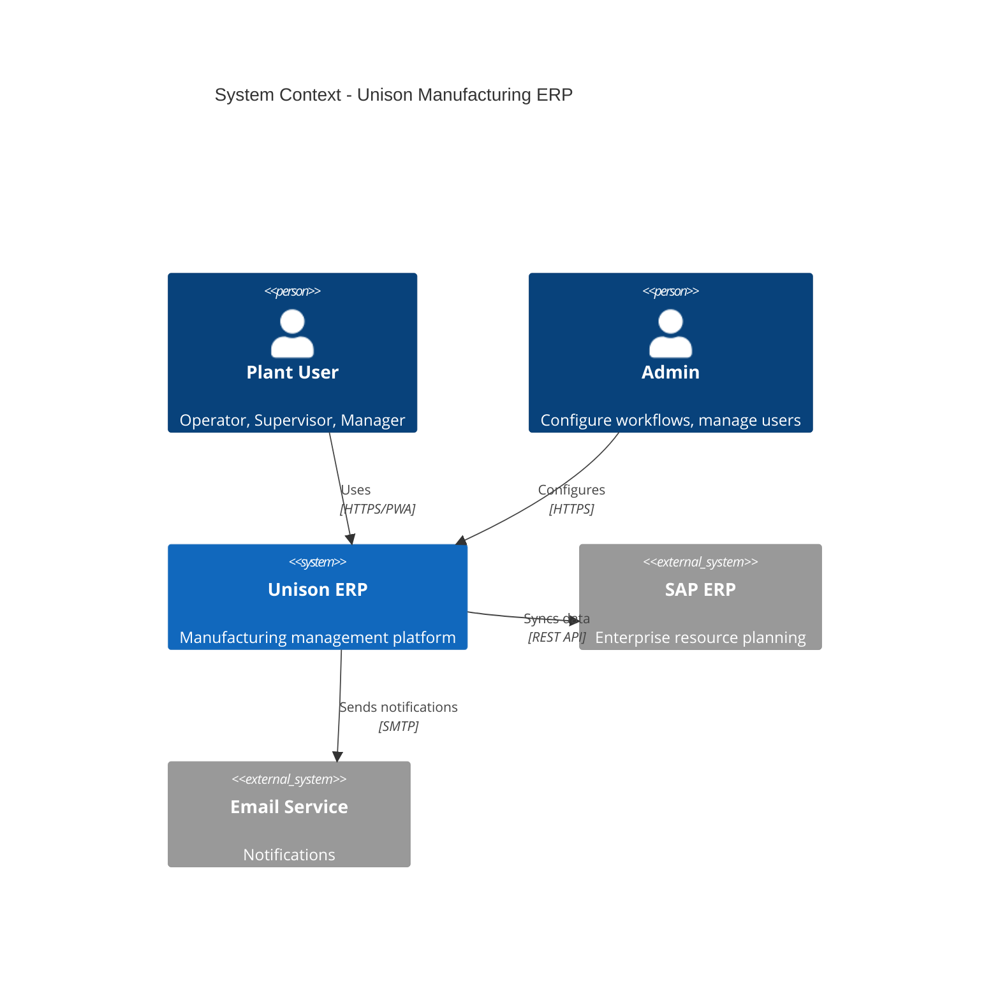
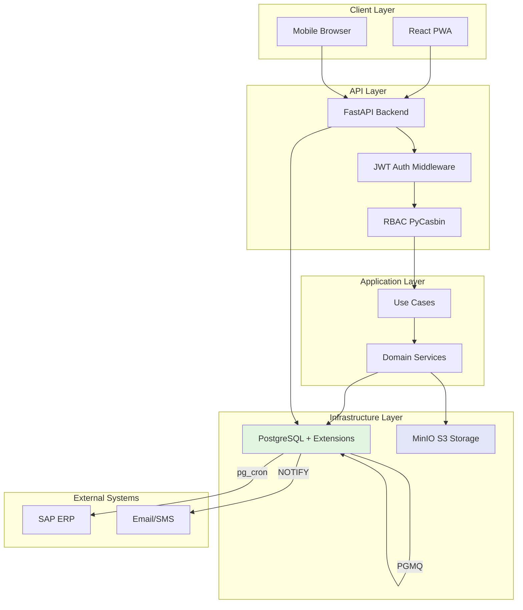
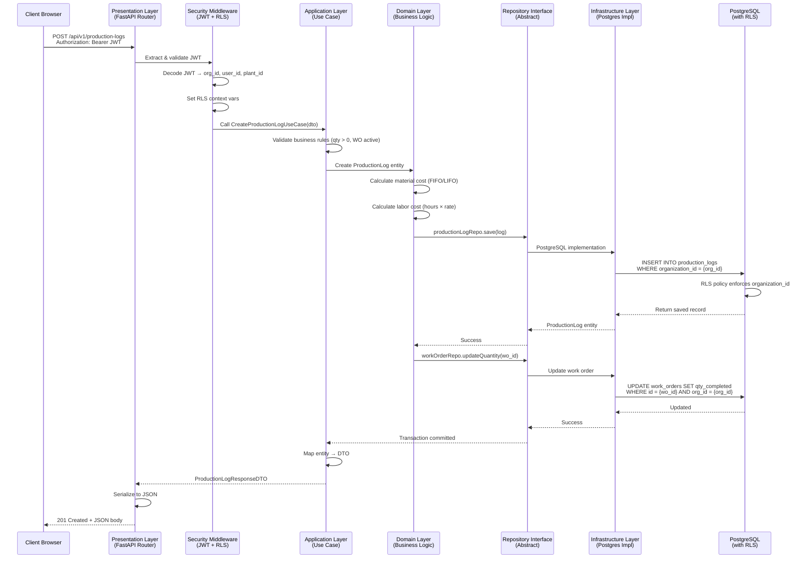
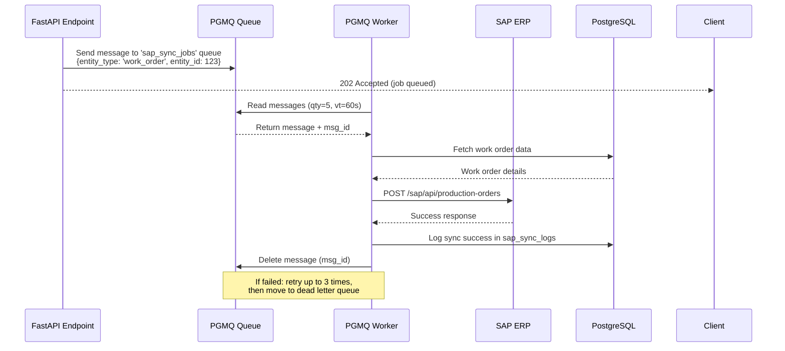

# Architecture Overview

**Version**: 2.0
**Date**: 2025-11-07
**System**: Unison Manufacturing ERP
**Architecture**: Domain-Driven Design (DDD) with PostgreSQL-Native Stack

---

## Table of Contents

1. [System Overview](#system-overview)
2. [Technical Architecture](#technical-architecture)
3. [DDD Layers](#ddd-layers)
4. [Data Flow](#data-flow)
5. [Design Principles](#design-principles)

---

## System Overview

### Business Context

**Unison Manufacturing ERP** is a B2B SaaS platform for manufacturing management targeting MSME manufacturers (50-500 employees, $10M-$100M revenue).

**Target Market**:
- Manufacturing companies with 2-5 jobs per customer (low job volume)
- Need for Manufacturing Execution System (MES) capabilities
- Both on-premise and cloud deployment options
- Teams with minimal technical expertise

**Core Value Proposition**:
- **83%+ MES Coverage**: Equipment management, shift tracking, visual scheduling, maintenance, inspection plans, traceability
- **60% Lower Infrastructure Costs**: PostgreSQL-native stack eliminates Redis, Celery, RabbitMQ, Elasticsearch
- **Simplified Operations**: 3-4 containers vs 8-10 traditional stack
- **Production-Ready PWA**: Offline-capable mobile production logging with camera integration

### System Context Diagram



**External Integrations**:
- **SAP ERP**: Sales orders, production orders, material master, goods movements
- **Email (SMTP)**: NCR notifications, inventory alerts, workflow approvals
- **MinIO (S3-compatible)**: Document storage, barcodes, reports, photos

---

## Technical Architecture

### High-Level Architecture



### PostgreSQL-Native Stack

**Traditional Stack (Eliminated)**:
- ❌ Redis (cache + message broker)
- ❌ Celery (task queue + worker)
- ❌ RabbitMQ (message queue)
- ❌ Elasticsearch (full-text search)

**PostgreSQL-Native Stack (Simplified)**:
- ✅ **pgmq**: Message queue (30K msgs/sec) - replaces Celery + RabbitMQ
- ✅ **pg_cron**: Scheduled tasks (replaces Celery Beat)
- ✅ **pg_search (ParadeDB)**: Full-text search with BM25 ranking (replaces Elasticsearch)
- ✅ **pg_duckdb**: Analytics engine (10-1500x faster OLAP queries)
- ✅ **timescaledb**: Time-series optimization (75% compression)
- ✅ **UNLOGGED tables**: High-speed cache (replaces Redis)
- ✅ **LISTEN/NOTIFY**: Pub/sub messaging for real-time updates

**Architecture Benefits**:

| Metric | Traditional Stack | PostgreSQL-Native | Improvement |
|--------|-------------------|-------------------|-------------|
| **Containers** | 8-10 | 3-4 | **60% reduction** |
| **Services to Monitor** | 5 separate | 1 database + 2 apps | **80% simpler** |
| **Backup Operations** | 5 separate backups | 1 database backup | **80% simpler** |
| **Message Queue Throughput** | Celery ~500 jobs/hour | PGMQ 30K msgs/sec | **300x faster** |
| **Full-Text Search** | tsvector 100ms | pg_search 5ms | **20x faster** |
| **Analytics Queries** | Standard 5s | pg_duckdb 50ms | **100x faster** |
| **Infrastructure Cost** | High (5 services) | Low (1 database) | **40-60% reduction** |

---

## DDD Layers

### Layer Structure

Domain-Driven Design with clear separation of concerns and dependency inversion.

```
app/
├── domain/                 # Pure business logic (no framework dependencies)
│   ├── entities/          # Business entities (User, WorkOrder, Material, etc.)
│   ├── value_objects/     # Immutable value objects (Email, MaterialCode, etc.)
│   ├── repositories/      # Repository interfaces (abstractions)
│   ├── services/          # Domain services (business logic)
│   └── exceptions/        # Domain-specific exceptions
│
├── application/           # Use cases & orchestration
│   ├── use_cases/        # Business operations (CreateWorkOrder, LogProduction, etc.)
│   ├── dtos/             # Data Transfer Objects
│   └── services/         # Application services
│
├── infrastructure/        # External concerns (frameworks, databases, I/O)
│   ├── persistence/      # Database, repositories implementation
│   ├── security/         # JWT, RBAC, RLS
│   ├── storage/          # MinIO client
│   ├── queue/            # PGMQ client (replaces Celery)
│   ├── cache/            # PostgreSQL UNLOGGED table cache (replaces Redis)
│   ├── sap/              # SAP adapter
│   └── barcode/          # Barcode generation
│
└── presentation/          # API layer (HTTP concerns)
    └── api/
        └── v1/           # Versioned endpoints
            ├── auth.py
            ├── materials.py
            ├── work_orders.py
            ├── production.py
            └── ...
```

### Dependency Direction

**Key Principle**: Dependencies point inward → Outer layers depend on inner layers, never reverse.

```
Presentation Layer (FastAPI)
        ↓
Application Layer (Use Cases)
        ↓
Domain Layer (Business Logic)
        ↑
Infrastructure Layer (Postgres, MinIO, etc.)
```

**Example Flow**:
```python
# Presentation → Application
@router.post("/api/v1/production-logs")
def create_production_log(dto: ProductionLogCreateDTO):
    use_case = CreateProductionLogUseCase(repo, work_order_repo)
    return use_case.execute(dto)

# Application → Domain
class CreateProductionLogUseCase:
    def execute(self, dto):
        # Business validation
        work_order = self.work_order_repo.get(dto.work_order_id)
        if not work_order.can_log_production():
            raise BusinessRuleViolation("Work order not active")

        # Create domain entity
        log = ProductionLog.create(work_order, dto.quantity, dto.user_id)

        # Persist through repository interface
        return self.repo.save(log)

# Domain (pure business logic)
class ProductionLog:
    @classmethod
    def create(cls, work_order, quantity, user_id):
        if quantity <= 0:
            raise ValueError("Quantity must be positive")
        # Create entity
        return cls(...)
```

---

## Data Flow

### Request → Response Path

**Complete request flow** from client to database and back:



**Key Flow Characteristics**:

1. **Authentication**: JWT validated at middleware layer before reaching use case
2. **Multi-Tenancy**: RLS context variables set from JWT claims (organization_id, plant_id)
3. **Layer Separation**: Each layer has single responsibility:
   - **Presentation**: HTTP concerns, validation, serialization
   - **Application**: Use case orchestration, DTO mapping
   - **Domain**: Pure business logic, no framework dependencies
   - **Infrastructure**: External services, database, I/O
4. **Database Security**: RLS policies automatically filter queries by organization_id
5. **Transaction Management**: Use cases manage transaction boundaries
6. **Dependency Direction**: Outer layers depend on inner (Infrastructure → Domain, not reverse)

### Background Job Flow (PGMQ)

**Example**: SAP sync triggered from API endpoint



**PGMQ Operations**:
```python
# Enqueue job
queue.send('sap_sync_jobs', {'entity_type': 'work_order', 'entity_id': 123})

# Worker: Read and process
messages = queue.read('sap_sync_jobs', vt=60, qty=5)  # vt = visibility timeout
for msg in messages:
    try:
        process_sap_sync(msg['message'])
        queue.delete('sap_sync_jobs', msg['msg_id'])
    except Exception as e:
        # Automatic retry with exponential backoff
        if msg['read_ct'] >= 3:
            queue.archive('sap_sync_jobs', msg['msg_id'])  # Move to DLQ
```

### Real-Time Updates (LISTEN/NOTIFY)

**Example**: Work order status change notifications

```python
# Database trigger (in PostgreSQL)
CREATE OR REPLACE FUNCTION notify_work_order_status_change() RETURNS TRIGGER AS $$
BEGIN
    PERFORM pg_notify('work_order_status_changed',
        json_build_object(
            'id', NEW.id,
            'work_order_number', NEW.work_order_number,
            'new_status', NEW.status,
            'plant_id', NEW.plant_id
        )::text
    );
    RETURN NEW;
END;
$$ LANGUAGE plpgsql;

# Backend listener (FastAPI + WebSocket)
async def listen_for_updates():
    async with engine.connect() as conn:
        await conn.execute(text("LISTEN work_order_status_changed"))
        while True:
            notification = await conn.receive()
            await broadcast_to_websocket_clients(notification.payload)

# Frontend (React)
const ws = new WebSocket('ws://localhost:8000/ws');
ws.onmessage = (event) => {
    const update = JSON.parse(event.data);
    // Update UI in real-time
    updateWorkOrderStatus(update.id, update.new_status);
};
```

---

## Design Principles

### SOLID Principles

#### Single Responsibility Principle (SRP)
Each class/module has one reason to change.

**Example**:
```python
# ❌ Bad: Multiple responsibilities
class WorkOrderService:
    def create_work_order(self, data): ...
    def send_to_sap(self, wo): ...
    def generate_barcode(self, wo): ...
    def send_email_notification(self, wo): ...

# ✅ Good: Single responsibility
class WorkOrderService:
    def create_work_order(self, data): ...

class SAPSyncService:
    def sync_work_order(self, wo): ...

class BarcodeService:
    def generate_barcode(self, entity): ...

class NotificationService:
    def send_notification(self, user, message): ...
```

#### Open/Closed Principle (OCP)
Open for extension, closed for modification.

**Example**: Repository pattern with PostgreSQL-native caching
```python
# Base repository (closed for modification)
class BaseRepository(ABC):
    @abstractmethod
    def save(self, entity): ...

    @abstractmethod
    def get(self, id): ...

# Extended with caching (open for extension)
class CachedRepository(BaseRepository):
    def __init__(self, base_repo, cache):
        self.base_repo = base_repo
        self.cache = cache  # PostgreSQL UNLOGGED table cache

    def get(self, id):
        cached = self.cache.get(f"entity:{id}")
        if cached:
            return cached
        entity = self.base_repo.get(id)
        self.cache.set(f"entity:{id}", entity, ttl=600)
        return entity

    def save(self, entity):
        result = self.base_repo.save(entity)
        self.cache.delete(f"entity:{entity.id}")
        return result
```

#### Liskov Substitution Principle (LSP)
Derived classes must be substitutable for base classes.

**Example**: All repositories implement same interface
```python
class IWorkOrderRepository(ABC):
    @abstractmethod
    def save(self, work_order: WorkOrder) -> WorkOrder: ...

    @abstractmethod
    def get(self, id: int) -> Optional[WorkOrder]: ...

# PostgreSQL implementation
class PostgresWorkOrderRepository(IWorkOrderRepository):
    def save(self, work_order: WorkOrder) -> WorkOrder:
        # PostgreSQL implementation with RLS
        ...

    def get(self, id: int) -> Optional[WorkOrder]:
        # PostgreSQL implementation with RLS
        ...

# Use case doesn't care about implementation
class CreateWorkOrderUseCase:
    def __init__(self, repo: IWorkOrderRepository):
        self.repo = repo  # Can be Postgres, In-Memory, etc.

    def execute(self, dto):
        work_order = WorkOrder.create(dto)
        return self.repo.save(work_order)
```

#### Interface Segregation Principle (ISP)
Don't depend on unused interfaces.

**Example**: Separate interfaces for read and write operations
```python
# ❌ Bad: Fat interface
class IRepository:
    def save(self, entity): ...
    def delete(self, id): ...
    def get(self, id): ...
    def list(self, filters): ...
    def search(self, query): ...
    def export_csv(self, filters): ...

# ✅ Good: Segregated interfaces
class IReadRepository:
    def get(self, id): ...
    def list(self, filters): ...

class IWriteRepository:
    def save(self, entity): ...
    def delete(self, id): ...

class ISearchRepository:
    def search(self, query): ...  # pg_search BM25

# Use cases depend only on what they need
class GetWorkOrderUseCase:
    def __init__(self, repo: IReadRepository):
        self.repo = repo  # Only read methods
```

#### Dependency Inversion Principle (DIP)
Depend on abstractions, not concretions.

**Example**: Domain depends on repository interface, not PostgreSQL
```python
# Domain layer (abstract)
class IWorkOrderRepository(ABC):
    @abstractmethod
    def save(self, work_order: WorkOrder) -> WorkOrder: ...

# Domain service (depends on abstraction)
class WorkOrderService:
    def __init__(self, repo: IWorkOrderRepository):
        self.repo = repo  # Depends on interface, not implementation

    def create_work_order(self, project, plant):
        work_order = WorkOrder.create(project, plant)
        return self.repo.save(work_order)

# Infrastructure layer (concrete implementation)
class PostgresWorkOrderRepository(IWorkOrderRepository):
    def __init__(self, db: Session):
        self.db = db

    def save(self, work_order: WorkOrder) -> WorkOrder:
        # PostgreSQL-specific implementation
        db_work_order = WorkOrderModel(**work_order.to_dict())
        self.db.add(db_work_order)
        self.db.commit()
        return work_order
```

### Other Key Principles

#### DRY (Don't Repeat Yourself)
Abstract common functionality, eliminate duplication.

**Example**: Base entity class for common fields
```python
class BaseEntity:
    def __init__(self, organization_id, created_at=None, updated_at=None):
        self.organization_id = organization_id
        self.created_at = created_at or datetime.utcnow()
        self.updated_at = updated_at

    def _update_timestamp(self):
        self.updated_at = datetime.utcnow()

# All entities inherit common behavior
class WorkOrder(BaseEntity):
    def __init__(self, organization_id, work_order_number, ...):
        super().__init__(organization_id)
        self.work_order_number = work_order_number
        ...
```

#### KISS (Keep It Simple, Stupid)
Prefer simplicity over complexity.

**Example**: PostgreSQL-native stack is simpler than traditional stack
```python
# ❌ Complex: Redis + Celery for caching and queuing
redis_client = Redis(host='redis', port=6379)
celery_app = Celery('tasks', broker='redis://redis:6379')

@celery_app.task
def sync_to_sap(entity_id):
    ...

# ✅ Simple: PostgreSQL UNLOGGED table + PGMQ
cache = PostgresCache(db)  # UNLOGGED table
queue = PGMQueue(db)        # PGMQ extension

queue.send('sap_sync_jobs', {'entity_id': entity_id})
```

#### YAGNI (You Aren't Gonna Need It)
Implement current requirements only, avoid speculation.

**Example**: Start with essential MES modules, not all possible features
```python
# ✅ Good: Implement what's needed for MSME manufacturers
- Equipment tracking (OEE, utilization)
- Shift management (handovers, performance)
- Visual scheduling (Gantt chart)
- Preventive maintenance (PM schedules, MTBF/MTTR)
- Inspection plans (SPC, Cp/Cpk)
- Traceability (lot/serial numbers, genealogy)

# ❌ Bad: Speculative features not requested
- Advanced scheduling algorithms (not needed for 2-5 jobs/customer)
- Real-time IoT machine monitoring (MSME don't have sensors)
- AI-powered predictive maintenance (insufficient data volume)
- Complex multi-level BOM explosion (simple manufacturing processes)
```

---

## Cross-References

- **Database Schema**: `docs/02-architecture/DATABASE_SCHEMA.md`
- **Technology Stack**: `docs/02-architecture/TECH_STACK.md`
- **PostgreSQL Extensions**: `docs/03-postgresql/EXTENSIONS.md`
- **API Design**: `docs/02-architecture/API_DESIGN.md` (to be created)
- **Domain Models**: `docs/04-domains/*.md` (to be created)
- **Implementation Phases**: `docs/05-implementation/PHASE_*.md` (to be created)
